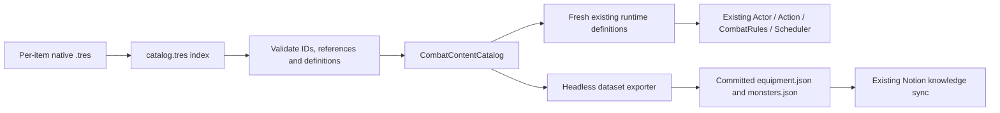

# Combat content authoring (M029)

## Authority and choice

`content/` owns authored weapons, armor, natural attacks and hostile actor
values. Each item is a native `.tres` Resource. `catalog.tres` is an ordered index
of references, not a second table of numbers. No balance change is intended by M029.

- `weapons/*.tres`: WeaponDefinition, nested AttackDefinition/DamageDice and sparse WeaponActionDefinition resources.
- `armor/*.tres`: ArmorDefinition values, coverage and profile reference.
- `attacks/*.tres`: natural AttackDefinition resources; `resource_name` is the catalog key because attack IDs such as `bite` are intentionally shared.
- `actors/*.tres`: CombatActorContent with body template ID/size and an embedded ActorDefinition. Equipment and attacks reference their existing files.

Godot Resources were chosen over JSON and executable data factories because the
existing model is already typed/exported Resource data. The Inspector exposes
numbers and references directly; text editors can edit the same files. JSON would
need a parallel conversion schema, validation and packaging rules. GDScript data
factories retain executable-code authoring. No new package is required.

Omitted properties use the existing Resource class default, rather than a second
per-monster defaults table. Set an override in the Inspector or add its property
inside the relevant `[sub_resource]`/`[resource]` block. For example, add `aggression
= 65` to an actor's ActorDefinition sub-resource. Its default remains 50. Fear and
unused personality fields are deliberately not introduced.

## Runtime and compatibility

`weapon`, `armor`, `natural_attack`, `actor`, `all_weapons`, `all_armor`,
`all_natural_attacks`, `all_hostiles` and `HOSTILE_IDS` remain available. Unknown
IDs return null. The original hostile listing/order is preserved; `actor("rat")`
also works. Rat's `list_in_hostiles = false` preserves existing roster semantics.
`ActorDefinition.rat_common()` and `CombatSpecies.rat()` are compatibility wrappers.
The legacy `TimeCostGame` HP/movement aliases are read-only getters derived from
content, so they cannot preserve obsolete balance constants. They are no longer
compile-time constants; there are no compile-time uses in the repository.

CombatActorContent resolves the existing BodyTemplate factories and species size;
it does not copy anatomy into content files. Validation rejects duplicate/empty
IDs, missing resources, unregistered equipment/attack references, unknown body,
coverage or AI policy, invalid definitions, unusable attack capabilities and
nonfinite penetration. Failed catalogs are rejected as a whole.

The source catalog is cached for the process; callers receive full nested copies
using `duplicate_deep(Resource.DEEP_DUPLICATE_ALL)`. Ordinary `duplicate(true)`
retains external-resource references and is insufficient at this boundary. The
internal `content()` method is for validation/export and must be treated as read-only.
Restart a running game/headless process after editing a source; hot reload is not
part of this task.

## Editing and document workflow

1. Edit one item's `.tres` in Godot Inspector or a text editor. For actors, expand
   `definition`. Do not author `definition.combat_species`; use `body_template_id`
   and `body_size` on the outer resource. A new item must also be referenced by
   `catalog.tres` (membership metadata only).
2. Regenerate derived data:
   `godot --headless --path . --script res://tools/export_combat_datasets.gd`.
3. Check exact regeneration:
   `godot --headless --path . --script res://tools/export_combat_datasets.gd -- --check`.
4. Run `bash tools/check_godot.sh` in the existing WSL environment. It includes
   exact dataset checking. Commit the source, generated JSON and manifest together.
5. Existing `python tools/sync_notion_knowledge.py --check` validates offline.
   Existing main-only CI continues to publish after a future approved merge.

The equipment v4 and monsters v3 envelopes/IDs remain compatible with
`docs/notion-knowledge-config.json`. Dataset files stay committed because Notion CI
runs Python without Godot and Git readers need the rendered data. CI validates
source/output SHA-256 fingerprints before any sync. The source inventory lives in
`tools/combat_dataset_sources.json`; content directory discovery includes new
`.tres`/`.gd` files. Hashing normalizes CRLF. A stale source or hand-edited generated
JSON fails until the exporter is run. Fingerprints are freshness evidence, not a
replacement for executing Godot's semantic validation.

The exporter gets equipment, actor defaults, aggression, profiles, costs and damage
from runtime definitions/constants. Threat Ratings remain null. Do not manually
edit generated gameplay data; new taxonomy/measurement authoring is outside this
migration and must get its own explicit authority when needed.

## Validation boundaries and future moves

`tools/validate_combat_tuning.py --godot <executable> --project <path seen by Godot>`
temporarily changes Boar HP, Longsword penetration/die size and Iron Helmet armor,
one file per scenario. It runs the unchanged entire Godot test suite per scenario,
checks generated values and stale detection, and restores original bytes in
`finally`. Run it only in an idle task checkout. Forced process termination cannot
execute `finally`; use the worktree diff to recover in that case.

Tests compare propagated values with authoritative resources. Historical scheduler/replay tests
use explicit frozen synthetic combatants so content balance does not require new
algorithm hashes. Synthetic armor/dice/time inputs remain appropriate for fixed
algorithm assertions. Large changes that intentionally alter AI choices or remove
capabilities may require corresponding behavioral scenarios to be redesigned;
this is separate from duplicated balance constants.

Folder moves are easier because authoring lives under one boundary and the facade
API is unchanged. A later rename must update `.tres` `res://` references, the
catalog path, exporter source inventory, CI path filters and documentation links.
BodyTemplate and ArmorProfileCatalog remain their existing authorities; their own
content migration and a generic body/AI registry are intentionally out of scope.
Exported packages were not tested; selected-resource export presets must include
the catalog and its referenced `.tres` resources.
GUI Inspector usability, manual play/visual feel and final balance acceptance are
not established by headless tests.
