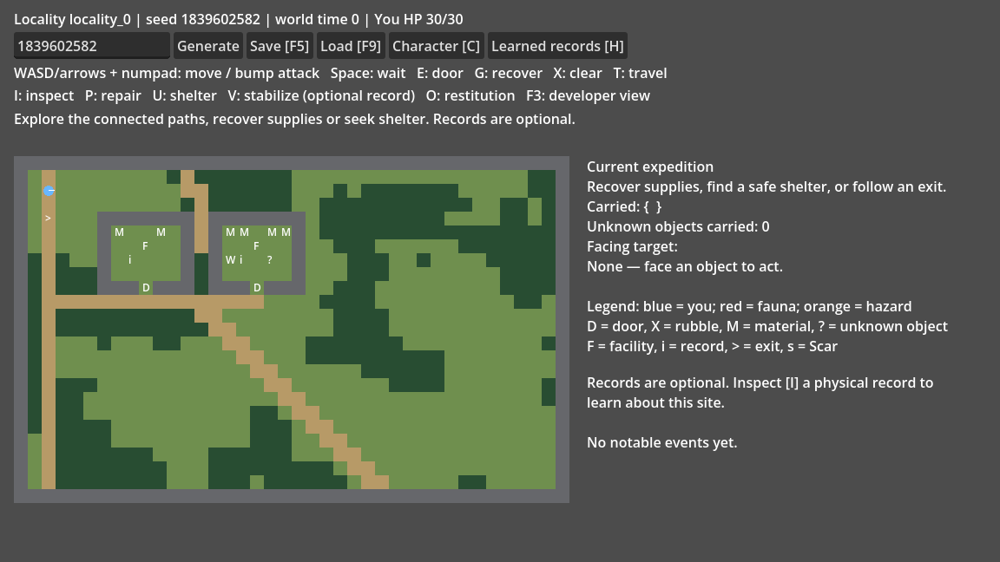

# M048 History v6 Phase C — 통합 결과

기준은 원격에서 확인한 Phase B 정정 커밋
`12f48bae75636782005a05a08742a0bd6412fee8`이다.
전용 브랜치 `codex/history-v6-phase-c-playable-world`, 독립 작업트리
`C:\GameDev\history-v6-phase-c-playable-world`에서 작업했다.
Phase B는 M047, 비용 질의 최적화는 기존 M046이며 이번 작업만 M048이다.

## 실제 구현과 구조

역사 생성부터 현재 세 지역의 탐험·전투·회수·상호작용·지역 이동·재방문·
Save/Load까지 실행할 수 있는 opt-in 씬을 구현했다. JSON 변환이나 정적 맵
프리뷰만으로 끝내지 않았다. 기존 기본 F5와 전투 테스트룸은 그대로다.

Phase B의 Engine·WorldState·Event Log·Manifest·Canon과 생성 코드는 변경하지
않았다. 새로운 `HistoryWorldRealization`이 검증된 Manifest에서 실제 연결 세
Locality를 선택하고 기본 지형, 시설 구조, 정확한 잔존 자산, 위험, 출입구와
진행 중 사업 작업 공간을 배치한다. 지형에는 기존 SimpleMapGenerator의
noise/path 및 독립 SeedDeriver를 재사용하고 고정 유적 stamp는 생략한다.

`HistoryPlayableGame`은 GeneratedMapCombatGame/TimeCostGame을 확장한다.
이동, 공격, 신체, 비용 resolver, Scheduler, Rat AI를 새로 만들지 않았다.
InteractAction은 공통 가용성/실행 계약으로 확장했으며 TimeCostGame의 기본
구현은 기존 고정 문이다. 추가 runtime 책임은 객체 override·실제 물건 소유권,
현재 Actor의 freeze/restore, 버전 있는 저장으로 한정했다.

새 production GDScript는 게임 모델·Runtime·Actor codec·Realization·씬 UI의
다섯 파일/767행이며 기존 네 파일의 계약을 확장했다. 별도의 전체 history,
combat 또는 턴 Manager를 추가하지 않았다.

권위 있는 알고리즘·순서·18필드 저장 계약과 다이어그램은
[명세](../../specs/history_playable_world.md)에 있다. 작업 경과와 재개 위치는
[M048](../../milestones/M048_history_v6_phase_c.md)에 기록했다.

| Manifest 입력 | 실제 플레이 결과 |
| --- | --- |
| 실제 Locality neighbors | 세 지역 선택, 상호 참조하는 이동 출입구; 임의 연결 없음 |
| intact/damaged/ruined | 문 있는 보존 구조 / 제거할 잔해 / 파손 벽과 옛 기능 상실 |
| actual_quantity, actually_present | 실제 재고만 회수, 고유 객체 한 소유자; 가능한 생존만으로 loot 생성 안 함 |
| current owner, current need | 무단 회수 후 시설 이용 제한; 현재 생존/사업 유지 필요에 따른 자재 배상량 |
| current hazard, passage | 실제 HP 피해와 지역 이동 제한, 자재/시간을 쓴 개방·안정화 |
| facility dependency/function | 발전 시설 장애·장비 회수에 따른 실제 이용 불가, 제한적 shelter 회복 |
| active/paused Project | 작업 구역의 물리적 장애 여부와 ongoing 시설 사용 제한 |
| Orbital Fall | 손상/폐허의 충돌 흔적·벽 틈·현재 위험; 기존 재고에 포함된 잔해만 회수 |
| Infrastructure Cascade | 현재 폐쇄 통로·손상 구조·실제 의존 기능 상실과 제한적 복구 |
| Failed Exodus | 실제 발사 관련 구조의 손상·잔존 일반 장비·선택적 기록; 성공 탈출 추정 없음 |

Phase B의 ruined/accessibility=false는 옛 기능에 대한 접근 불가를 뜻한다.
Phase C에서는 파손된 껍질을 제한적으로 탐험할 수 있다. 명시적으로 폐쇄된
intact/damaged 시설은 sealed로 표시하고 실제로 막는다. 일반 자재 수리는
구조만 바꾸며 미지 기계의 이해/작동, 장비·샘플·기록을 재생성하지 않는다.

## 실행과 조작

Godot에서 `scenes/debug/history_world_playground.tscn`을 열고 **F6**로 실행한다.
기본 검토 Seed는 `1839602582`; 입력칸과 Generate 버튼으로 바꿀 수 있다.
직접 실행: `godot --path . scenes/debug/history_world_playground.tscn`.

| 조작 | 결과 |
| --- | --- |
| WASD/방향키, 숫자패드 1–9 | 4/8방향 이동; Actor에 부딪히면 기존 공격 |
| Space / 숫자패드 5 | 기존 대기 |
| E / G / X | 바라보는 문 개폐 / 실제 자산 회수 / 잔해·지역 통로 제거 |
| P / U / V | 자재를 쓴 일반 구조 수리 / 안전한 shelter 사용 / 습득 기록 기반 안정화 |
| I / H | 대상 관찰·실제 기록 습득 / 습득한 지역 정보 패널 |
| T | 현재 또는 앞의 실제 연결 출입구로 지역 이동 |
| O | 관리 공동체에 회수 자재 기여, 한 차례 보관권 위반 해소 |
| C / F3 | 기존 Character Overview / 명시적 개발자 진단 |
| 씬 안의 F5 / F9, Save / Load 버튼 | `user://history_world_slice.json` 저장·복원 |

일반 문·회수·조사는 500, 잔해 제거는 1,500, 구조 수리와 이동은 2,000의
기본 microtime을 기존 resolver로 처리한다. 지역 통로 제거·수리·안정화에는
실제 회수 자재를 쓴다. 무효 행동은 이유를 표시하고 시간을 소비하지 않는다.
진행 중 사업, 안전/설비 조건, 현재 보관권은 실제 가용성에 영향을 준다.

역사 패널은 기본 탐험의 필수 관문이 아니다. 지도·위험·자산을 관찰해 바로
탐험할 수 있고 실제 기록 또는 회수한 기록은 추가 정보와 안전한 개입을 준다.
Claims의 해석이나 고대 운영 의도를 객관 사실로 표시하지 않는다.

Character Overview도 기존 씬 그대로 재사용했다([캡처](character.png)).
기존 전투 debug panel의 실험용 조정 UI는 여기서는 붙이지 않았으며, 기존
전투룸에서 계속 사용할 수 있다. F3는 활성 Actor의 실제 이벤트 진단을 보여준다.

## 행동 시나리오와 영속성 검증

`tests/test_history_playable_world.gd`는 production Game/Actor/Action을 사용한다.
경로 helper는 실제 MoveAction, 문/잔해 행동과 NPC 응답을 실행하며 테스트 전용
순간이동 또는 전투 mock으로 완료를 대신하지 않는다. 상태별 비교 fixture는
명시적인 synthetic 테스트이고 허가된 Phase B initial state와 Manifest projector로
만들어, shipping 세계에 임의 사건이나 Canon을 추가하지 않았다.

1. 폐허 탐험: 실제 경로/벽 틈·잔해를 지나 재고와 확인된 고유 물건을 회수한다.
   문 열림, 사라진 재고, 단일 물건 소유권을 지역 이동·재방문에서 확인했다.
2. 환경 변화: 잔해 제거와 자재/시간을 쓴 구조 복구를 실행했다. 실제 passability,
   구조 condition과 안정화 상태가 재방문/저장 후 유지된다.
3. 같은 지형, 다른 역사: 같은 terrain Seed `1234`에서 intact와 ruined/hazard 상태를
   투영했다. 실제 벽 틈/위험 셀과 시설 이용 가능성이 달라지고, 동일한 door 행동이
   성공/실패로 갈렸다. 기록을 읽기 전에도 회수 가능하며, 기록 후 안정화가 가능하다.
4. 시간/Actor: 기존 Rat 응답과 실제 신체 전투로 NPC를 처치했다. 돌아와도 부활하지
   않고 Save/Load 후에도 죽어 있다. 비활성 NPC 상태는 다른 지역에서 시간이 지나도
   변하지 않는다. 실제 플레이어 패배도 현재 시간·남은 준비 지연·사망 상태로 저장한다.

Save/Load는 플레이어 위치·HP/절대 피해·신체 부위·속성·무기·이미 적용된 효과와
그 출처, NPC 상태/AI caution/남은 지연, 지역별 combat RNG, 시간, 문·재고·수리·
지식·소유권을 보존했다. 정상 JSON 왕복은 authoritative snapshot의 문자열까지
일치했다. 실제 파일 교체/읽기도 검사했다. 손상, 호환 불가 버전, 없는 객체,
중복 Actor, 잘못된 위치/음수 재고/고유 소유권은 활성 세계를 바꾸지 않고 거부했다.

## Seed 통계와 성능

[100개 집중 corpus](stats_100.json) 후 [500개 corpus](stats_500.json)를 검사했다.
지역 생성/논리 접근 검사와 실제 tactical 행동/렌더 입력 검사는 별개다.
corpus BFS는 문 개방·느슨한 잔해 제거를 허용하고 sealed/active 작업 공간은
차단한다. 이 수치를 전 지형 안전성, 무자원 통행 또는 실제 플레이 재미로 해석하지 않는다.

| 지표 | 100 worlds | 500 worlds |
| --- | --- | --- |
| 생성 실패 / 의도하지 않은 접근 불가 | 0 / 0 | 0 / 0 |
| 실제 연결 Zone / 유효 스폰 | 300 / 300 | 1,500 / 1,500 |
| 실제 시설 | 534 | 2,624 |
| intact / damaged / ruined | 414 / 97 / 23 | 2,105 / 429 / 90 |
| 배치 자산 객체 / 실제 수량 | 1,202 / 4,519 | 6,036 / 22,763 |
| 확인된 고유 객체 | 164 | 829 |
| 현재 위험 셀 | 127 | 575 |
| active / paused 작업 공간 | 79 / 16 | 377 / 60 |
| Orbital / Cascade / Failed Exodus 공간 흔적 | 91 / 5 / 13 | 424 / 17 / 55 |
| 현재 상태 차이를 동반한 미회수 Scar 사례 | 84 | 366 |
| 이름·ID 제외 공간/행동 서명 | 300 | 1,500 |

전 객체의 참조와 이동 목표를 검사했고, 500개에서 16,033개 객체는 cardinal 인접
도달 또는 셀 도달이 가능했다. 의도적 sealed 내부는 corpus에서 0개였으므로
별도 synthetic 폐쇄 시설 테스트로 검증했다. 안전한 스폰과 reciprocal edge가
모든 Seed에서 유효했다. 500세트는 1–500의 자동 기능 corpus이며 무작위 품질
심사나 이름 고유성의 증거로 주장하지 않는다. 서명은 실제 타일·위험 셀·객체
종류/위치/양/문 상태를 사용한다.

동일 호스트에서의 단순 CPU 측정(500 generation/realization, 최초 50 save/restore/
성공 travel; 디스크/GUI frame time 제외):

| 연산 | 평균 ms | p95 ms |
| --- | --- | --- |
| Phase B history generation | 58.110 | 86.264 |
| 3-zone realization | 3.022 | 3.365 |
| scheduled travel + source NPC 응답/동결/목적지 복원 | 4.293 | 23.301 |
| JSON save encoding | 2.118 | 2.380 |
| JSON validate + realization + Actor restore | 6.440 | 7.032 |

이동의 max는 31.721ms였다. 비활성 지역 전술 시뮬레이션이나 매 이동 Manifest
재분석은 없지만, 거대 월드/장기 저장 크기까지 측정한 결과는 아니다.

## 검증 기록

- Phase C 최종 집중 **613개** 검증 통과: 50 Seed 결정론/참조와 위 실제 시나리오,
  실제 파일 I/O, 실패 시 원자성, 8방향 비용, 효과 중복 방지와 최종 패배 복원 포함.
- 이전 Phase B 코드 checkout에서 캡처한 16 Seed × Phase A/B/Manifest **48개 SHA**
  일치. 기존 역사 코드와 기존 테스트/fixtures는 변경하지 않았다.
- 실제 NVIDIA OpenGL Compatibility renderer에서 input dispatch로 이동·지역
  전환·Save/Load를 실행하고 1152×648 월드/정보/Character 화면 세 장을 캡처했다.
  최종 캡처 스크립트가 통과했고 이미지를 직접 확인했다. 인간 수동 조작·재미 평가와
  고해상도/좁은 창 전체 시각 승인은 하지 않았다.
- Layout/UID **272 resources / 224 script UIDs / 7 scenes** 통과. 기존 main scene 유지.
  Wiki metadata 22 pages 통과. 최종 `bash tools/check_godot.sh`의 editor/startup,
  **전체 42 test scripts** 및 combat dataset 검사 통과
  (`C:\GameDev\m048-full-final.log`). Phase A 8,516 / Phase B 893 검증과 기존
  v2–v5 48 기준 출력도 통과했다. `git diff --check` 통과.
- 첫 전체 실행은 모든 test script를 통과한 뒤 dataset source hash의 stale 상태로
  실패했다. 공식 `tools/export_combat_datasets.gd`로 manifest hash만 갱신했다.
  장비·몬스터 값이나 전투 공식/AI/RNG/ActionCostResolver를 변경하지 않았다.

## 완료 질문에 대한 답

1. 역사 상태가 공간을 바꾸는가: 벽/문/잔해·현재 위험·stock·의존 기능·사업 작업 공간이
   실제 passability/피해/행동 가용성을 바꾼다. 이름이나 JSON 차이만 비교하지 않았다.
2. 기록 없이 목적 있는 탐험인가: 자재 회수, 위험 회피, 안전 shelter, 다른 지역 이동은
   기록 없이 실행했다. 이 기능적 증거가 20–30분 재미를 입증하지는 않는다.
3. 기존 전투/시간인가: 기존 Actions/Actor/body/combat/AI/resolver/Scheduler를 사용한다.
   별도 턴 시스템이 없고 기존 고정 문 계약을 유지한다.
4. 행동이 실제 세계를 바꾸는가: 구조/접근/HP·stock·소유권·custody 제한·지식이 바뀐다.
5. 재방문·저장 후 유지되는가: actual action 시나리오와 JSON/파일 snapshot 동일성으로 확인했다.
6. 소유권이 명확한가: 과거 Manifest 불변, 이후 Runtime overrides, 활성 Actor registry와
   frozen snapshots, 단일 item holder 및 Scheduler 시간으로 나뉜다.
7. 큰 월드 확장 가능한가: stable Site IDs·Zone content·override와 version 경계가 있다.
   지금은 Locality당 하나의 Zone/총 셋이며, 다중 Zone mapping·선택 범위 확대와 세이브
   migration 및 메모리 비용은 향후 별도 작업이 필요하다. 규모 확장 성능은 미검증이다.
8. 실제 플레이 vs 계획인가: 위 세 지역과 조작/전투/자원/수리/정보/영속성은 실행 가능하다.
   완전한 외교·NPC 사회·퀘스트·장비 제작·대규모 월드·광역/비활성 경제는 구현하지 않았다.

## 알려진 제한과 후속 권고

- 현재 geometry는 공통 방 slot을 사용한다. 서로 다른 상태의 경로 차이는 있지만
  최종 아트, 복잡한 다층 던전이나 모든 Project/Scar의 전용 공간을 제공하지 않는다.
  제한적 구조 수리는 현재 condition과 시설 이용 조건을 바꾸며, 파손 벽의 모든
  타일을 재건축하는 편집 시스템은 아니다. 경로 변화는 문·잔해·지역 통로 개방으로 검증했다.
- 기록 기반 안정화·자재 배상·한 번의 shelter 회복은 제한된 gameplay 규칙이다.
  genotype/기술 이해, 광역 사회 판단 또는 풍부한 대화 시스템을 구현한 것이 아니다.
- 모든 중요한 테스트 fauna를 persistent로 취급한다. 일반 fauna 재생/자원 regrowth,
  장기 inactive effects와 background journeys는 없다. 전체 가시 prototype이며 fog of war 없음.
- 세이브는 schema/version을 고정하고 호환 불가를 거부한다. migration·cloud save·
  암호학적 인증·임의 개조 Actor/armor·전체 runtime editor mutation 저장은 범위 밖이다.
- 좁은 창 UI/최종 localization, 자동 이동, 풍부한 인벤토리·시설 선택 메뉴는 후속이다.
- Phase B의 Orbital Fall 빈도는 수정하지 않았다. 500개 선택 지역에서 424개 공간 흔적이
  있다는 진단을 남긴다. 효과가 실제로 남은 trace와 단지 회수된 기록을 구분해야 하며,
  이후 희귀 재난이라는 Canon 방향에 맞춘 빈도 진단은 별도 요청으로 진행한다.

다음 단계는 콘텐츠 양 확대보다 실제 20–30분 self-directed 탐험에서 보상·전투 회피·
시설 접근·세력 비용·다음 목표가 명료한지 검토하는 것이다. 살아 있는 이 slice의
수동 결과를 바탕으로 zone selection/공간 구조/상호작용 선택 UI를 보완할 것을 권고한다.

## 사용자 수동 체크리스트

- F6 실행 후 Seed를 바꾸고 세 지역의 구조·재고·위험 차이를 확인한다.
- 기록 패널을 열지 않고 회수·잔해 제거·전투 또는 회피·지역 이동을 시도한다.
- 자재가 요구되는 수리/통로 개방을 하고, 선택적 기록 후 안정화와 비교한다.
- 관리 물건 회수 후 실제 시설 이용 제한과 O 자재 기여의 차이를 확인한다.
- 문·자재·물건·수리·Rat 사망을 바꾼 뒤 재방문, 저장하고 씬 재실행 후 Load한다.
- H와 F3의 정보 구분, C overview, 작은/큰 화면의 읽기와 키 조작을 확인한다.
- 20–30분 탐험의 재미·긴장·보상·다음 목적과 반복성은 직접 평가한다.

## Git / 원본 보존

초기 origin/main `e83da36818cbb23e69e4e16297ac4332885658f1`을 확인했다.
Phase B base와 이 main 사이의 기존 TimeCostGame/Actor/Action/terrain/generated-room
소스 차이는 없었으며, v6 additions와 문서 차이가 있다. 본 작업은 main을 합치지
않았고, 미래 통합 시 역사/wiki/roadmap 문서의 branch status를 다시 조정해야 한다.
현재 main의 무관한 후속 변경까지 자동 병합/충돌 검증했다고 주장하지 않는다.

원본 보존 snapshot은 `C:\GameDev\m048-preservation.json`; 최종 post-push ref/SHA와
보존 결과는 마일스톤 및 `C:\GameDev\m048-history-phase-c-handoff.md`에 기록한다.
원본 HEAD/브랜치/local main과 14개 파일 해시를 재확인했다. 기존 미커밋
`project.godot`/`body_templates.json` 및 미추적 import 12개는 커밋 대상이 아니다.
Phase A/B 원본 작업트리도 수정하지 않았다. 큰 JSON 덤프는 추가하지 않고
요약 통계·작은 기준 해시 fixture·두 장의 최종 렌더 증거만 보존한다.
