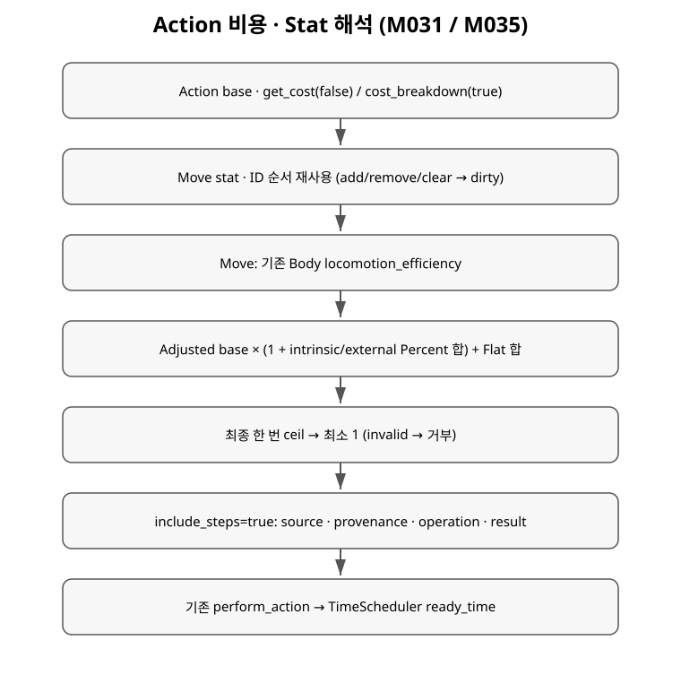

+++
status = "구현 완료"
areas = ["시간/액션", "코어"]
type = "알고리즘"
systems = "ActionCostResolver / StatResolver"
milestones = "M031 (task branch)"
code_paths = ["game/actions/action_cost_resolver.gd", "game/effects/", "game/actors/actor.gd"]
diagram = "docs/diagrams/action_cost_resolution.svg"
+++
# Action 비용 · Stat 해석

M031 task branch의 query API다. main 통합은 별도다.
`actor.stat_breakdown(stat)`은 base와 effect FLAT/PERCENT를 해석한다.
`action.cost_breakdown(game, actor_id)`는 `get_cost`와 같은 경로다.
결과는 저장/cache하지 않는다. 조회는 RNG, event, 시간을 소비하지 않는다.

Ownership은 Actor → EffectStore → ActiveEffect → GameplayEffectDefinition이다.
StatResolver는 Store 계산에 delegate하고, ActionCostResolver는 Actor를 통해 값만 받는다.
Store 내부에서 live Definition/modifier를 읽으며 외부로 raw 참조를 반환하지 않는다.
삽입 시 격리 복사, 공개 조회 시 깊은 snapshot, 계산 시 Resource 복사 없음.
같은 Definition ID는 source가 달라도 한 instance만 허용한다. add/remove/clear 직후
다음 query는 새 상태를 계산한다. StatCatalog의 정확히 7개 ID만 modifier 대상이다.

## 비용 순서

1. Action base: Move 직선 1000/대각선 1400, melee 1000, Interact 500, Wait 1000.
2. Move는 resolved movement_speed와 기존 Body locomotion_efficiency로 나눠 adjusted_base를 만든다.
3. intrinsic Weapon Action cost_percent와 필요한 tags를 모두 만족하는 외부 Percent를 합산한다.
4. adjusted_base × (1 + percent_total)에 flat_total을 더한다.
5. 한 번 ceil 후 최소 1. 정수 경계의 8 machine-epsilon 이내 부동소수 오차만
   최종 단계에서 정수로 맞춘다. 중간 반올림은 없다.
6. 기존 perform_action이 정수 cost를 Scheduler에 전달한다.

Stat은 **Base × (1 + Σ Percent) + Σ Flat**, Cost는 **Adjusted Base × (1 + Σ Percent) + Σ Flat**.
Percent들은 서로 합산하며 base/adjusted base에만 적용한다. Flat은 Percent로 증폭되지 않는다.
STR 10, +20%, +30%, flat +2는 17이다. Attack 1000, intrinsic -25%, external -20%는 550이다.
Percent delta를 저장하며 실제 배율을 저장하지 않는다. 공통 ModifierOperation.Kind가 FLAT/PERCENT를 정의한다.
Stat trace는 BASE → 각 PERCENT → 각 FLAT이고 top-level value가 final이다.
두 계산의 phase마다 문자열 effect ID 사전순, 같은 effect 배열 선언순으로 계산한다.
빈 cost selector는 거부한다. MOVE/PHYSICAL,
ATTACK/MELEE/PHYSICAL, INTERACT/PHYSICAL, WAIT만 있다. Wait는 PHYSICAL이 아니다.

## 계산 근거 예

| source | operation | value | result |
| --- | --- | ---: | ---: |
| move:cardinal | BASE | 1000 | 1000 |
| movement_speed | DIVIDE | 1.3333333333333333 | 750 |
| body:locomotion | DIVIDE | 0.75 | 1000 |
| travel (effect) | PERCENT | -0.2 | 800 |
| final_rounding | CEIL | 800 | 800 |
| minimum_cost | MAX | 1 | 800 |

speed step에 species base와 stat modifier의 nested breakdown이 있다.
모든 step은 source, operation, value, result를 가지며 effect step은 effect_id도 있다.
Effect step의 추가 source_id는 ActiveEffect origin(예: skill:rapid_strike)이다.
effect_id는 Definition identity, 기존 source는 authored modifier label이다.
source_id는 계산/정렬에 사용하지 않으며 기존 breakdown 필드와 순서는 유지한다.
두 결과는 percent_total/flat_total/unrounded를 가진다. Modifier step에도 running totals가 있다.
비용 결과에는 valid/base/adjusted_base/cost/rounded/unrounded, stat 결과에는 valid/stat/base/value가 있다.
Weapon Action step은 source=weapon_action:id, operation=PERCENT, value=delta를 기록하며
external과 pool만 공유한다. 역사적 event cost_multiplier는 1+cost_percent로 유도하는 replay 호환 telemetry다.
event schema는 바꾸지 않는다.

## 거부와 한계

없는 Actor, invalid intrinsic, 비양수 speed/Body 효율, 비유한 값,
최종 절대값 > 2^31-1은 valid=false/cost=0/reason으로 반환한다.
거부된 Action은 기존 pipeline에서 시간/RNG/event를 소비하지 않는다.
Body 불능을 최소 1로 되살리지 않는다. Effect 제거는 다음 query에 반영된다.
Percent/discount cap은 없다. -100% 이하 Action reduction도 finite면 authoring을 허용하고
최종 ceil/minimum 1을 적용한다. Stat movement_speed <=0은 Move를 거부한다.
Rare/legible/strong action-time 조절을 지원하되 현재 신규 balance effect는 추가하지 않는다.
비용 query는 legality 전체를 검사하지 않는다. 실제 실행은 can_execute/차례를
먼저 검증한다. 새 gameplay 연결은 movement_speed뿐이다.
[설계/미룬 기능](../decisions/attributes_effects.md).
