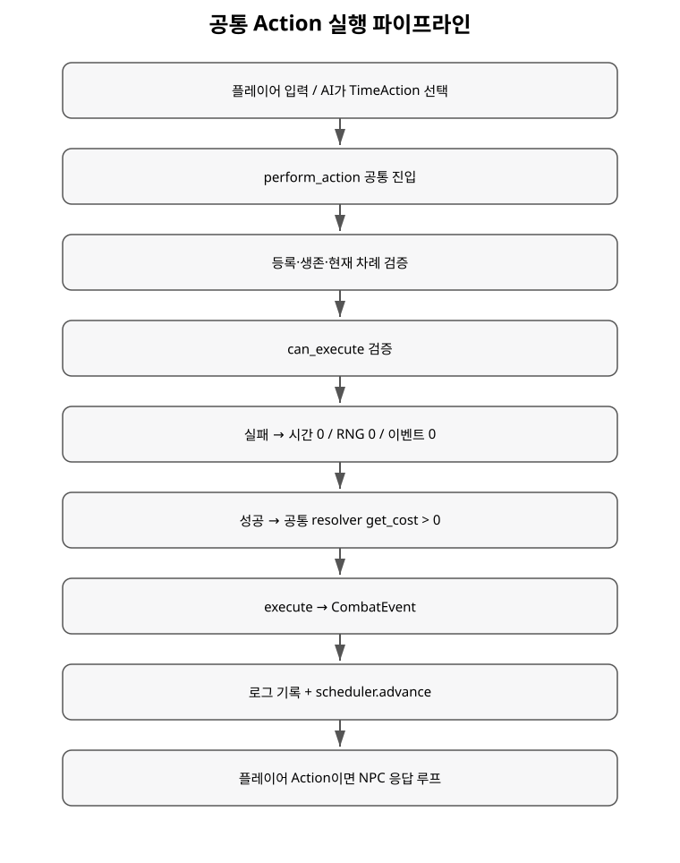

+++
status = "구현 완료"
areas = ["시간/액션", "코어", "전투"]
type = "파이프라인"
systems = "TimeAction / perform_action"
milestones = "M014"
code_paths = ["time_cost/actions/", "time_cost/time_cost_game.gd"]
diagram = "docs/diagrams/action_pipeline.svg"
+++
# 공통 Action 실행 파이프라인 상세

## 목적

플레이어 입력과 NPC AI가 서로 다른 규칙을 직접 호출하지 않고 모든 실제 행동을 같은 실행 경로로 통과시킨다.

## TimeAction 계약

모든 Action은 세 책임을 가진다.

- `can_execute(game, actor_id)`: 현재 상태에서 합법적인가.
- `get_cost(game, actor_id)`: 성공 시 소비할 시간.
- `execute(game, actor_id, cost)`: 원자적 상태 변화를 적용하고 `CombatEvent`를 반환.

현재 구체 Action은 Move, Attack, Interact, Wait다.

## perform_action 순서

1. game over / simulation error를 검사한다.
2. Action과 Actor, scheduler 등록, 생존 여부를 검사한다.
3. Actor ready time이 현재 world time인지 검사한다.
4. NPC라면 Player보다 이른 시각인지 검사한다.
5. `can_execute`를 검사한다.
6. `get_cost > 0`인지 검사한다.
7. `execute`가 실제 CombatEvent를 반환해야 한다.
8. reason code와 AI trace를 이벤트에 복사한다.
9. 로그에 기록하고 scheduler ready time을 증가시킨다.
10. Player Action이면 NPC 응답 루프를 실행한다.

어느 검증 단계에서 실패하더라도 **시간 0 / 이벤트 0**이다.

## 설계 효과

Player와 AI의 차이는 “어떤 Action을 고르는가”까지만이다. 선택 뒤의 legality, 시간, 전투 규칙, 이벤트는 동일하다. 새 Action을 추가해도 TimeScheduler 자체를 수정할 필요가 없어야 한다.

## 현재 한계

Action이 데이터 기반 Skill/Ability 정의와 직접 연결되어 있지 않다. wind-up, interrupt, channeling, cooldown은 후속 범위다.
