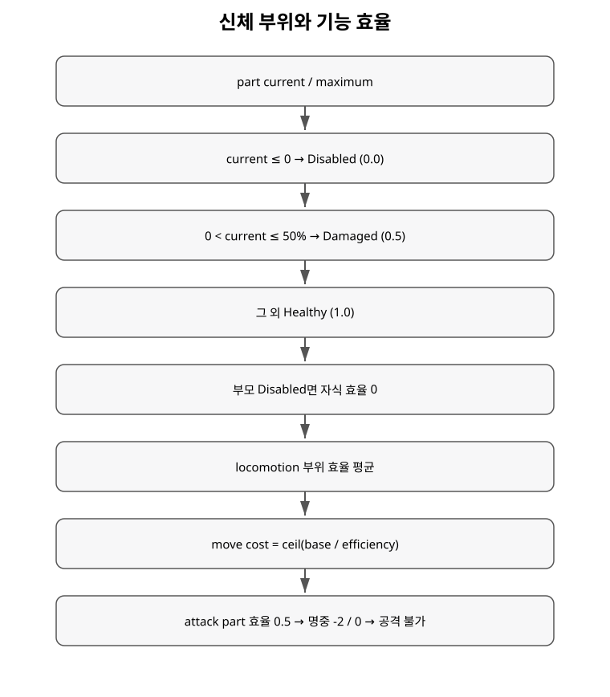

+++
status = "구현 완료"
areas = ["전투", "코어"]
type = "상태 모델"
systems = "BodyTemplate / BodyInstance / capability"
milestones = "M017, M024"
code_paths = ["game/combat/body_template.gd", "game/combat/body_instance.gd", "game/combat/combat_species.gd"]
diagram = "docs/diagrams/body_injury.svg"
+++
# 신체 부위 · 부상 · 기능 효율 상세

## 부위 상태

각 부위는 maximum/current integrity를 가진다.

- current <= 0: disabled, 기본 효율 0.
- 0 < current <= maximum×0.5: damaged, 기본 효율 0.5.
- 그보다 큼: healthy, 기본 효율 1.

자기 자신이 살아 있어도 parent chain 중 하나가 disabled면 실제 효율은 0이다.

## Locomotion

`capability("locomotion")`은 locomotion 기능을 가진 원래 모든 부위의 효율 평균이다.

`actual_move_cost = ceil(base_move_cost / locomotion_efficiency)`

현재 예시:

- Human 한 다리 damaged: 평균 0.75 → 직선 1334 / 대각선 1867.
- Rat 한 다리 damaged: 평균 0.875 → 직선 858 / 대각선 1200.
- 효율이 0이면 이동 자체가 불가능하다.

## 공격 capability와 사용 부위

공격은 특정 `right_arm` 같은 부위 이름에 고정되지 않고 `AttackDefinition.required_capability`와 요구 수량으로 판정한다.

`BodyInstance.selected_functional_parts(capability, required_count)`는 현재 기능하는 후보를 효율이 높은 순서로 고르고, `attack_efficiency()`는 필요한 수를 채우지 못하면 0을 반환한다. 선택된 부위들의 효율 중 최솟값이 공격 효율이 된다.

- 한손 무기: `weapon_manipulation x1`. 한 팔이 disabled되어도 다른 팔이 기능하면 자동으로 대체한다.
- Maul: `weapon_manipulation x2`. 두 팔 중 하나를 잃으면 공격 불가다.
- Rat/Dog/Wolf 등의 Bite: `bite x1`.
- Giant Crab의 Claw: `claw x1`. 두 집게 중 하나가 기능하면 공격할 수 있다.

선택된 공격 효율이 0.5면 명중 situation -2, 0이면 공격 불가다. `attack_part`는 UI/기존 fixture 호환용 현재 선택 부위 snapshot으로 유지된다.

## Human 템플릿

Torso integrity 40 / weight 45. Head 20/15. 양팔 20/10 `weapon_manipulation`. 양다리 25/10 `locomotion`.

BodyTemplate 자체에는 기본 armor가 없다. 자연 방어 또는 장비 coverage가 Actor 생성 시 실제 BodyInstance 부위에 적용된다.

## Quadruped Canine 템플릿

Rat, Feral Dog, Wolf가 공유한다.

Torso 16/45. Head 8/15/`bite`. Foreleg 두 개 각 6/10/`locomotion`. Hindleg 두 개 각 8/10/`locomotion`. Tail 4/0.

M024부터 Beetle, Lizard, Spider, Crab 등의 별도 BodyTemplate도 같은 capability/state 규칙을 사용한다.

## 현재 한계

절단, 출혈, 통증, 의수/의족, vital organ, 런타임 신체 구조 변형은 아직 없다. 현재 장비 적용은 prototype loadout 기반이며 인벤토리/장착 UI와 다층 방어구는 별도 후속 작업이다.
