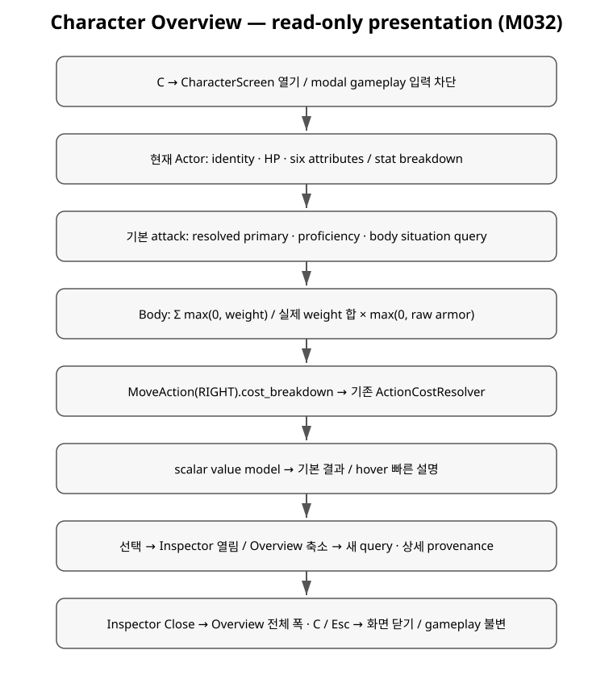

+++
status = "구현 완료"
areas = ["UI/로그", "코어", "전투"]
type = "상태 모델"
systems = "CharacterScreen / CharacterOverviewQuery / BodyInstance"
milestones = "M032 (task branch)"
code_paths = ["game/ui/", "game/combat/body_instance.gd", "game/time_cost_game.gd", "scenes/ui/character_screen.tscn"]
diagram = "docs/diagrams/character_overview.svg"
+++
# Character Overview · 조회 및 Inspector

M032 task branch 구현이다. 새로운 gameplay rule/stat/Effect 기능은 없다.

## Query 경계

`CharacterOverviewQuery.read(game, actor_id)`는 호출 때마다 현재 Actor를 찾아
scalar/Dictionary/Array만 반환한다. Resource/Actor 참조를 반환하거나 값 캐시를
유지하지 않는다. 반환값을 변경해도 gameplay에 전파되지 않는다. UI는 결과를
Label에 표현하고 반환 모델을 버린다. Inspector 선택 key만 presentation state다.

- Identity: Actor.display_name / definition.display_name.
- Attributes: Actor.stat_breakdown(stat), AbilityScores.modifier(int(value)).
  M031 공식 Base × (1 + Σ Percent) + Σ Flat/ordered steps를 그대로 읽는다.
  UI에서 percent/flat을 재해석해 최종 stat을 계산하지 않는다.
- Health: Actor.hp/max_hp. 새 건강 등급 또는 CON-MaxHP 규칙이 없다.
- Attack: TimeCostGame.attack_breakdown(). 기본 attack만 표시하고 target은 없다.
- Armor: BodyInstance.average_armor_breakdown().
- Move: MoveAction(RIGHT).cost_breakdown(), 기존 M031 schema를 그대로 표시한다.
- State: 감소한 body integrity 및 Actor.active_effect_instances()의 안전한 snapshot.
  Effect ID를 읽기 쉬운 label로 바꾸고 provenance는 상세 Inspector에 둔다.
  새 status/classification/Effect display-name 데이터는 추가하지 않는다.

## Average Armor

`w_i = max(0, part.weight)`, `W = Σ w_i`, `a_i = max(0, part.armor)`.
`W > 0`이면 `p_i = w_i/W`, `W = 0`이면 `p_i = 0`.
`Average Armor = Σ p_i × a_i`.

`select_part()`와 같은 모든 부위를 같은 순서로 읽는다. Disabled/부모 disabled도
여전히 피격 대상이다. Armor -1은 unarmored이므로 0, weight 0/음수는 확률 0이다.
전체 합이 100이라고 가정하지 않는다. 결과는 value/total_weight/parts이며 각 part는
id/name/weight/probability/armor/armor_id/contribution scalar로 구성한다.
Query는 RNG/select_part를 호출하거나 body 상태를 변경하지 않는다.

합성 예: weight 2/6/0, raw armor 4/12/1000이면 `(2×4 + 6×12)/8 = 10`.
Human torso만 6이면 45%×6=2.7. Penetration/profile/type은 입력이 아니다.
Overview는 한 자리 소수로 표시하며 계산 내부 값은 반올림하지 않는다.

## Attack 설명과 기존 runtime 보존

`TimeCostGame.attack_breakdown()`은 기존 selected_functional_parts/efficiency로
요구 capability 수량과 효율을 읽는다. `attack_efficiency()`는 legacy attack_part를
쓰므로 조회에서는 호출하지 않는다. 기존 injury situation -2, Weapon Action의
situation/damage delta, attack.ability_for(base AbilityScores), proficiency를 공유한다.
`CombatRules.check(d20=0)`의 total은 설명용 Attack Bonus다. 명중률/특정 defender
예측이나 독립 stat을 만들지 않는다. Damage는 definition dice notation와 실제
combat modifier를 표시하며 실제 roll/최소 0 rule을 변경하지 않는다.

`resolve_attack()`은 기존 attack_efficiency 호출과 RNG/event 순서를 유지한 채
이 pure query의 modifier 값을 읽는다. M027/M024 replay 및 M031 golden이 기존
결과 보존을 검증한다. 특수 Weapon Action도 query/runtime 동등성 테스트에 포함한다.
Primary attribute Effects는 아직 공격에 연결되지 않았으므로 Overview resolved
stat과 실제 attack base modifier의 차이를 Inspector에서 명시한다.

## UI 및 입력

CharacterScreen → inspectable Button rows → CharacterInspector(title/value/body).
Margin/VBox/HBox(BoxContainer)/Panel/ScrollContainer가 viewport anchors에 배치된다.
1080p~4K는 Identity/Overview/Inspector 세 영역, 작은 창은 세로 배치 및 outer scroll.
Inspector 본문은 별도 scroll이다. Typography/양옆 폭은 viewport 높이에 따라 조절한다.
Prototype fallback font와 기존 색상을 재사용하며 별도 전역 Theme 변경은 없다.

C action은 프로젝트 InputMap에 추가했다. CharacterScreen._input은 C/Esc를 처리하고
열려 있을 때 비-GUI 키를 소비한다. host _unhandled_input은 visible이면 반환하여
GUI navigation key도 gameplay로 새지 않는다. 전체화면 Control은 mouse 입력을
차단해 아래 CombatDebugPanel 변경을 막는다. simulation clock에는 손대지 않는다.
선택/닫기에 keyboard focus를 지원하며 close 시 화면 안의 focus를 해제한다.

## 검증 경계

`test_character_overview.gd`: armor coverage/다양한 값/weight0/음수/비인간/합8,
stat/cost/attack/Inspector query 일치, 모델 Resource 부재 및 mutation 격리,
RNG/time/event/body/attack_part/Actor 보존, live requery.
`test_character_screen.gd`: 양쪽 production scene input, click/Enter, modal,
reset/regeneration, 1080p/1440p/4K/1152×648/640×480 Control geometry.
Headless 물리 window resize는 dummy display가 무시하므로 logical canvas size도 설정한다.
`tools/capture_character_overview.gd`: 실제 renderer에서 네 해상도 PNG 생성.
스크린샷/geometry 검증은 수동 interaction/가독성/플레이감 승인을 대체하지 않는다.
