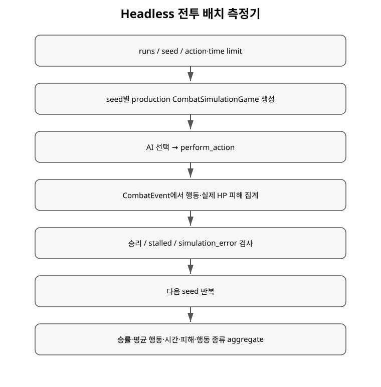

+++
status = "구현 완료"
areas = ["시뮬레이션", "전투", "AI"]
type = "파이프라인"
systems = "CombatBatchRunner / CombatSimulationGame"
milestones = "M022"
code_paths = ["game/simulation/combat_batch_runner.gd", "game/simulation/combat_simulation_game.gd", "tools/run_combat_batch.gd"]
diagram = "docs/diagrams/combat_batch.svg"
+++
# Headless 전투 배치 측정기 상세

## 목적

밸런스 측정용 별도 간이 규칙을 만들지 않고 production Action, AI, scheduler, combat rules를 그대로 반복 실행한다.

## 기본 설정

scenario `rat_vs_rat`, 1000 runs, base seed 0, max actions 500, max world time 500000이다. encounter seed는 `base_seed + run_index`다.

## Encounter loop

각 seed에서 CombatSimulationGame을 reset하고 terminal/error/limit을 검사한다. Side A가 production AI로 Action을 고르고 `perform_action`을 호출하면 scheduler가 Side B 응답까지 실제 게임 경로로 처리한다. 발생한 CombatEvent를 소비한 뒤 로그를 비워 presentation log의 128-entry 제한이 통계를 잘라먹지 않게 한다.

## 피해 집계

nominal damage가 아니라 이전 known HP와 이벤트의 remaining_hp 차이를 사용한다.

`actual_damage = max(0, before_hp - after_hp)`

그래서 overkill을 과대 집계하지 않는다.

## 결과와 aggregate

side_a_win / side_b_win / stalled / simulation_error를 구분하고 승률, 평균 행동 수, 평균 world time, 실제 피해, move/attack/interact/wait 종류별 총합과 평균을 계산한다.

## 해석 주의

현재 시나리오와 scheduler 우선순위가 완전 대칭이 아니므로 A/B 승률을 바로 절대 Threat Rating으로 해석하면 안 된다.

## 현재 한계

side swap, exact per-action stepping, 다양한 지형/장비/개체 조합, 신뢰구간과 자동 Threat Rating 산정은 후속 범위다.
