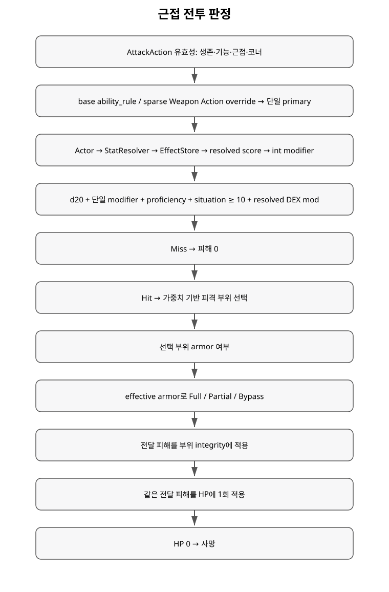

+++
status = "구현 완료"
areas = ["전투", "코어"]
type = "알고리즘"
systems = "D20 hit / hit location / armor / damage"
milestones = "M017, M018"
code_paths = ["time_cost/combat/combat_rules.gd", "time_cost/time_cost_game.gd", "time_cost/actions/attack_action.gd"]
diagram = "docs/diagrams/combat_resolution.svg"
+++
# 근접 전투 판정 알고리즘 상세

## 전체 흐름

공격 유효성 → D20 명중 → 피격 부위 → 선택 부위 방어구 → 부위 integrity → 전체 HP → 사망 순서다.

## 명중

`total = d20 + ability_mod + proficiency + situation`

`hit = total >= difficulty`

현재 Human melee는 STR, Rat bite는 DEX를 사용한다. proficiency는 0이며 공격 부위가 damaged면 situation -2다. 대상 difficulty는 `10 + target DEX modifier`다. 능력 수정치는 `floor((score - 10) / 2)`다.

자연 1 자동 실패 / 자연 20 자동 성공 규칙은 현재 없다.

## 피격 부위

명중했을 때 각 신체 부위 weight의 누적 분포에서 한 부위를 고른다. integrity 0인 disabled 부위도 물리적으로 존재하므로 피격 가능하고, weight 0 부위는 선택되지 않는다.

## 방어구

선택 부위에 armor 값이 있을 때만 추가 roll을 쓴다.

- `effective = clamp(armor - penetration, 0, 200)`
- `full% = min(effective / 2, 100)`
- `partial% = min(effective / 2, 100 - full%)`
- 나머지가 bypass.

Full은 피해 0, Partial은 `ceil(damage/2)`이며 Sharp가 Blunt로 바뀐다. Bypass는 기본 피해를 유지한다.

## 피해 소유권

전달 피해를 해당 부위 integrity에 적용한 뒤 **같은 전달 피해량을 HP에서 한 번만** 뺀다. 부위 손상 총합을 다시 HP로 합산하지 않는다. 사망 권위는 HP 0 하나다.

## 현재 기본값

- Human melee: STR / cost 1250 / damage 5 / penetration 20 / Sharp.
- Rat bite: DEX / cost 1000 / damage 5 / penetration 20 / Sharp.

## RNG 소비

D20은 항상 소비한다. hit-location roll은 명중했을 때만, armor roll은 실제 선택 부위에 armor가 있을 때만 소비한다. 이 조건부 순서를 테스트가 재현성 계약으로 검증한다.

## 현재 한계

무기별 피해, 치명타, 조준 부위, 다층 방어구, 저항/취약성, 상처·치유·절단은 아직 없다.

선택된 후속 설계에서는 일반 무기 공격의 기본 시간비용을 무기마다 세분화하지 않는다. 시간 차이는 Actor speed와 Quick/Normal/Heavy 같은 Action 계층에서 표현하고, 무기는 피해 주사위·피해 유형·관통·손 요구조건 등의 성질을 담당한다. 현재 `ActorDefinition.attack_cost` 값은 아직 이 설계로 마이그레이션되지 않은 기존 구현이다. [결정 기록](../decisions/normal_weapon_attack_time.md).
