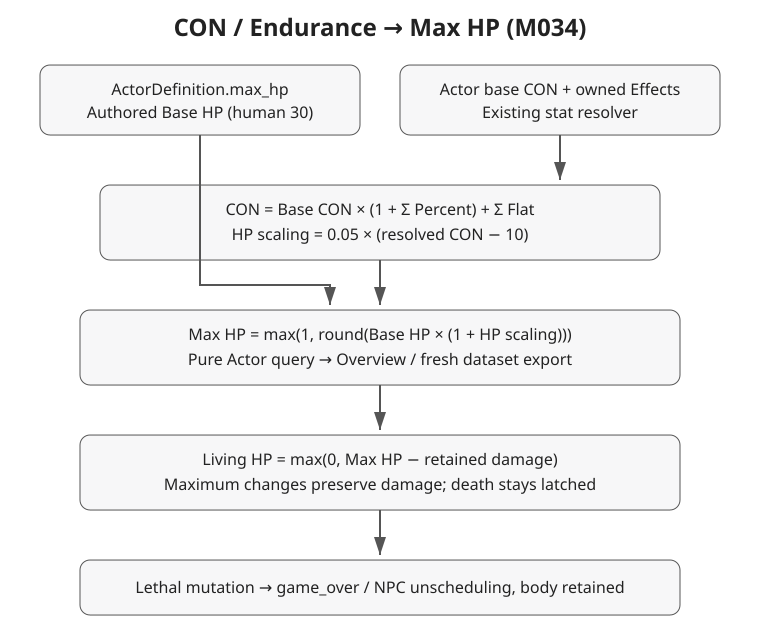
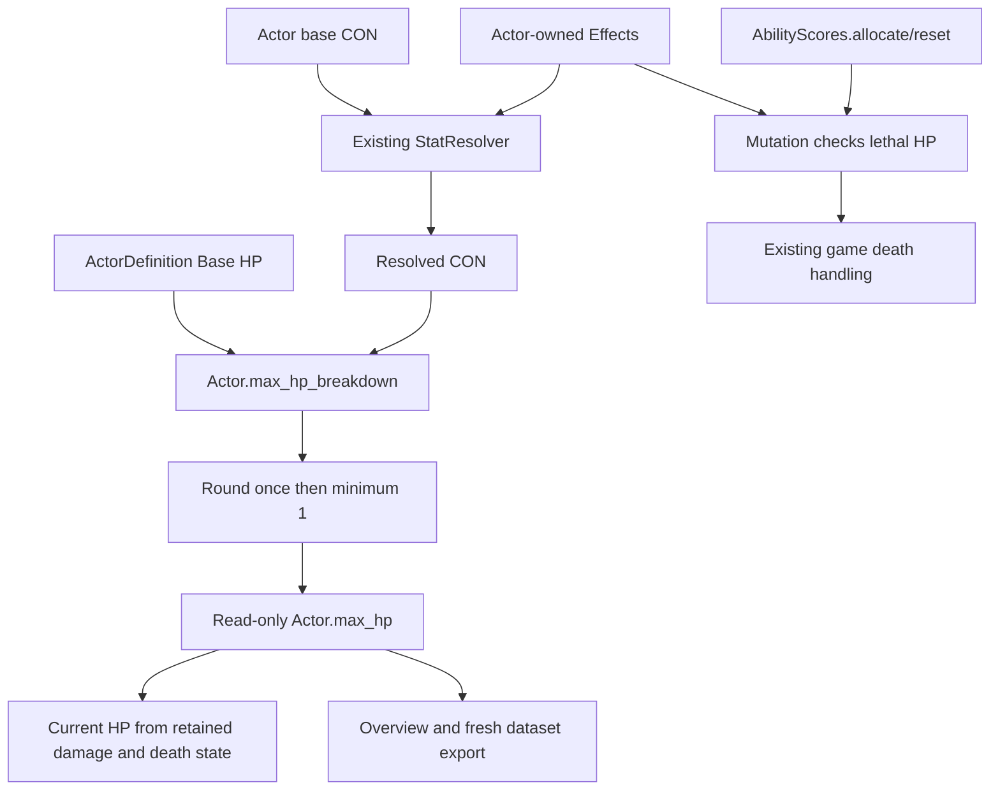

+++
status = "구현 완료"
areas = ["코어", "전투"]
type = "상태 모델"
systems = "Actor / AbilityScores / TimeCostGame"
milestones = "M034"
code_paths = ["game/actors/actor.gd", "game/actors/actor_definition.gd", "game/combat/ability_scores.gd", "game/time_cost_game.gd"]
diagram = "docs/diagrams/con_max_hp.svg"
+++
# CON-derived Max HP

1. CON = Base CON × (1 + Σ Percent) + Σ Flat via the existing stat resolver.
2. HP percentage = 0.05 × (CON − 10), with fractional CON preserved.
3. Max HP = max(1, roundi(Base HP × (1 + HP percentage))).
4. Living HP = max(0, Max HP − stored damage); dead HP = 0.
5. Explicit hp writes clamp to [0, Max HP] and update damage/death state.

Spawn starts full after initial attributes are copied; Effect store is empty.
Successful Effect add/remove/clear and AbilityScores.allocate/reset check HP immediately.
A living → zero transition latches death before notifying TimeCostGame. A later increase
leaves death latched. Player depletion sets game_over; NPC depletion unschedules it;
registry retains the body and frees occupancy. Reset recreates actors and their HP state.
Rejected mutations leave HP untouched. Queries, including Inspector and fear/AI condition,
do not mutate HP, effects, Body, time, events or RNG.

Content ActorDefinition.max_hp is Base HP. monsters.json.hp is fresh no-Effect runtime
Max HP, not Base HP and not a snapshot of an in-progress encounter. CON 10 content has
identical base/resolved numbers. Dataset tests instantiate authoritative Resources;
synthetic score cases test non-neutral/fractional CON independently.

[Durable decision and policy](../decisions/con_max_hp.md).
