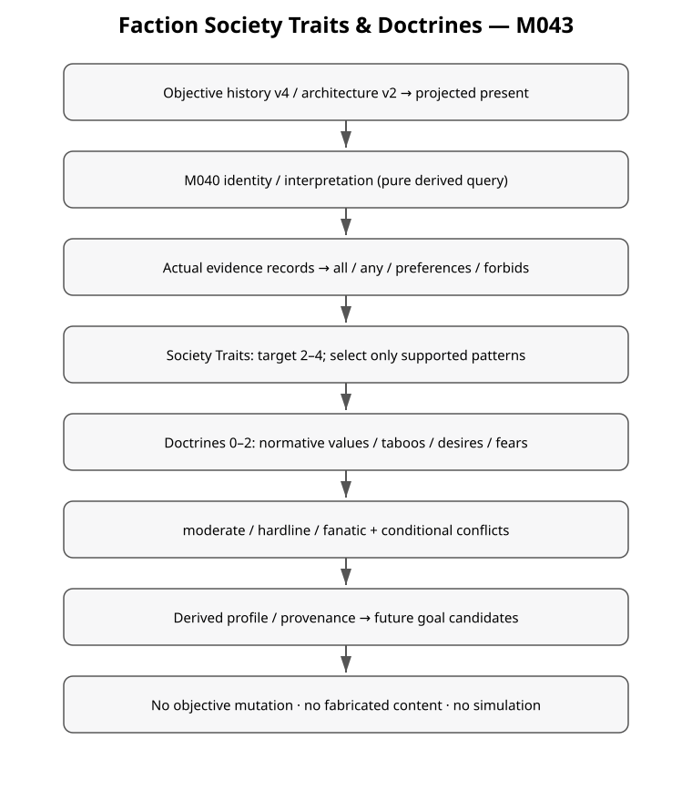
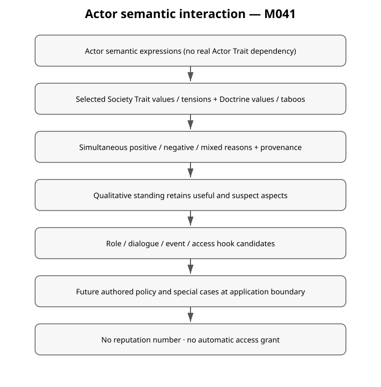

+++
status = "구현 완료"
areas = ["코어", "월드 생성"]
type = "알고리즘 / 데이터 모델"
systems = "FactionCultureCatalog / CultureEvidence / CultureRules / FactionCultureResolver / SocietyActorInteraction / CultureGoalQuery"
milestones = "M041 foundation / M042 — codex/history-social-incidents-v1; main 미병합"
code_paths = ["content/culture/faction_culture_v1.json", "game/history/culture_evidence.gd", "game/history/culture_rules.gd", "game/history/faction_culture_catalog.gd", "game/history/faction_culture_resolver.gd", "game/history/society_actor_interaction.gd", "game/history/culture_goal_query.gd", "tools/analyze_social_incidents.gd"]
diagram = "docs/diagrams/faction_culture.svg"
+++
# Faction Society Traits & Doctrines — M042 current contract

Implemented over exact M041 base `ef18814f34abfa7ab278c0914ae289806b22dc12`,
isolated `codex/history-social-incidents-v1`; not merged main.
Authored authority: `content/culture/faction_culture_v1.json`, revision
`faction-culture-v1-authored-2`. M041 milestone/review artifacts remain historical
evidence of the earlier intensity enum and dormant count; this is the current contract.

## Responsibilities and state ownership

Objective history → projected present → M040 identity/interpretation → Society
Traits → Doctrines → values/taboos/desires/fears → future goal candidates.
Claims remain perceived accounts, never truth inputs. Culture profiles are detached
pure queries, not serialized objective state; recomputation mutates no entity,
event, effect, present record or Claim. No global resolved-profile cache/autoload.
Generation3 remains architecture2; legacy generation2 remains architecture1.

History creates what happened. Culture interprets what it means. See the
[social incident contract](social_historical_incidents.md) for the new objective
layer and all14previously dormant Doctrine activation paths.

| Source | Responsibility |
| --- | --- |
| FactionCultureCatalog | Copy/validate authored20traits and33Doctrines |
| CultureEvidence | Trace real events, projected current/historical facts, authored population and M040 identity |
| CultureRules | Common requirements/preferences/vetoes, selection, intensity and conflicts |
| FactionCultureResolver | Compose detached profile with support and choice provenance |
| SocietyActorInteraction | Simultaneous semantic reasons and prospective application hooks |
| CultureGoalQuery | Candidate intentions plus verifiable historical reference IDs |

## Evidence contract

Evidence is `{tag:[{source_event_ids,source_path,detail,scope,...}]}`.
Scopes distinguish faction, regional and derived_identity; free synthetic fixture
records are explicitly labelled synthetic. Social records also retain
`reference_ids` and `content_ids`. All shipping evidence cites actual objective
events. Local loss/contact/capability is never inferred from region-wide scars.

Existing formation/lifestyle/role, political continuity, actual signed relation,
population donor/join and reuse/discovery evidence remains. New capability and
institution tags come from **current established** social facts. Historical
harm/loss/residence/testing tags come from the objective social ledger. Abolition
removes current institutions while preserving history. The extractor does not
read Claim prose, names, locale or anonymous artifact Origin guesses.

Political merge does not imply lineage plurality. Different approved resident
templates/lineage records can establish plurality; cloning does not. Actual Deep
residence/loss establishes return eligibility without changing human Origin.
Generic Core tunnel closure cannot establish residence, machine presence cannot
establish cooperation, Observer malfunction cannot establish machine war, modified
human lifestyle cannot establish local biotech, and migration cannot establish a
lost identifiable home. Ordinary reproduction cannot establish heredity design.

## Definition and selection contracts

Definitions have stable ID/name/category/explanation, requires_all/any, prefers,
forbids and positive integer base_weight. All requires_all must match; any requires_any
needs one match; forbids vetoes. Preferences affect weight only. At least one real
requirement is mandatory. Traits add values/tensions and optional family exclusion.
Doctrines add semantic values/taboos/desires/fears, candidates, intensities,
reinforcement rules and symmetric conditional conflict checks.

Pools are sorted by ID; eligible weight is base_weight +2×matched_preferences.
The nine newly reachable local-incident Doctrines use base_weight10, uniformly
emphasizing the salience of actual local history over generic norms at5. This is
not a guarantee of selection: prerequisite gates, count draws and conflicts still
apply. The5000 corpus raised Designed Kinship from0.70% to1.28% of worlds and
fanatic exposure from24.10% to29.86% without changing incident frequencies or
inventing evidence. See the [full audit](../reviews/social_incidents_v1/delivery.md).
Trait target is2–4; Doctrine target0/1/2 uses20%/65%/15%. Select without replacement,
reject conflicting second choices. Sparse truthful evidence may return below the
target (including one Trait); no unsupported padding. Normally shipping factions
have several independent everyday-pattern supports.

Culture streams remain `SeedDeriver(seed,[history,3,culture,1,faction_id,axis])`,
separate for counts and selection. Intensity is evidence-driven, so its old lottery
stream is no longer consumed. Catalog order is irrelevant; expansion can affect
culture selection but cannot alter topology/names/objective history.

Adaptive Customs is the renamed Society Trait for flexible everyday practices.
Doctrine Practical Heresy retains its normative meaning. Truth Through Trial now
requires research reuse or recorded testing; facility/technical lifestyle is only
a preference. Ritual interpretation can still select it. Hazard Memory combines
regional pressure with warning memory, relevant shelter/border role or actual
local hazard response. Local Mandate combines owned settlement with locality
anchor, village/commune organization or actual rotating offices.

## Moderate / hardline / fanatic

| Level | Meaning | Prospective consumer severity |
| --- | --- | --- |
| moderate / 온건 | Clear preference; disagreement and violation generally tolerated | preference / dialogue reaction / soft bias |
| hardline / 강경 | Important social norm, with authored reinforcement | restriction_candidate for role/access/office/membership review |
| fanatic / 광신 | Core uncompromising identity norm | enforcement_candidate / strong taboo / major membership conflict / goal pressure |

The strongest satisfied authored rule wins. Fanatic always requires at least3
relevant reinforcement tags and2different objective source events. Several aliases
of one event cannot suffice. There is no additional12% or other small independent
roll after evidence gates. This is a semantic intensity, never a stat multiplier.
Debug output pairs every Doctrine name with its intensity explanation, so a strong
name at moderate level means a tolerated preference rather than automatic prohibition.

Some strong norms use institutional/role history plus a second relation event;
machine/Deep/homeland fanatic paths use actual incident and later review/memory
events. Corpus measures world exposure, independently of faction-level counts.
Evidence must remain correct even if the25–40% initial target is not attained.

Conflict records specify both minimum levels. Pure Flesh vs Machine Kinship/
Revelation, Last Human Measure vs Many Bodies, Depth Taboo vs Return to Deep,
and Closed Sky vs Skyward Hunger remain hard conflicts. Mutable Human vs Ancestral
Genome and Unspoiled Ground vs New Ecology conflict at mutual hardline or above.
Continuity vs Radical Impermanence conflict at mutual fanatic. Lesser tensions
remain possible; interpretation mode imposes no ideological veto.

## Profiles, gated content and candidates

Profile contains faction_id/revision/unchanged identity, selected rows, intensity
map, aggregated semantic tags, support and weighted-choice reasons, all evidence,
eligible lists and selection targets. Each row separates required/preferred tags
and exact reinforcement records. Validator independently checks support/conflicts/
intensity and equality with authoritative recomputation.

Nine previously dormant Doctrines have shipping local-history paths: Pure Flesh,
Machine Kinship, Silent Circuit, Bounded Automation, Mutable Human, Ancestral Genome,
Designed Kinship, Reclamation, Return to the Deep. Rotating Stewardship is reachable.
Five remain gated: Ecological Communion (approved adapted lineage), Last Human
Measure/Many Bodies (approved distinct lineages), Thinking Threshold/Kin Beyond
Thought (approved historical semi-sapient contacts). Many Forms, One Hearth is
also gated. Empty shipping contact content is explicit; authoring no invented
species/physiology is preferred over forcing doctrine rates. Objective injected
fixtures validate all5paths and default validator rejects their content identity.

`CultureGoalQuery.candidates(profile)` returns only selected Doctrine desires,
`status=candidate`, intensity, explanation, provenance and
`historical_reference_ids`. The latter is supporting history, **not target acquisition**.
No actual capacity, territory, war, migration, research, biotech, quest or AI action
follows. Future consumers independently verify current target/capability/world facts.

## Actor semantic interaction

`resolve(profile,{expresses:[...]})` returns positive_reasons, negative_reasons,
mixed_reasons, standing and role/dialogue/event/access hooks. Strongest negative
sets qualitative standing, while usefulness remains: moderate taboo → watched,
hardline → disfavored, fanatic → taboo. Positive-only → welcomed, no match → accepted.
Reasons preserve severity and culture provenance. Hooks remain review candidates.
**standing != final decision**: no universal rejection based on a taboo label.
Maintenance Covenant + Pure Flesh fanatic can value technical competence and
craftsmanship while opposing augmentation. Workshop work, membership, political
office and repair requests must use their own relevant reasons/hooks.

Future semantic vocabulary includes clone_born, natural_born, founder_template,
batch_sibling, genetically_divergent, designed and inherited_modification.
It creates no Actor Resource/real Trait/NPC system. Existing art/knowledge/office
hooks remain; this milestone implements no access enforcement or dialogue UI.

## Verification and future boundary

`test_faction_culture.gd` retains rule/selection/conflict/interaction checks and exact
v2 baseline. `test_social_incidents.gd` adds causal negative tests, actual5gated
fixture paths, physical/source checks, pure candidates, multi-event fanatic gates,
catalog order, preexisting topology/formation/naming/relation component baselines.
Old v3 full hashes intentionally change; prior v2 hashes remain exact.

`tools/analyze_social_incidents.gd -- 5000 OUTPUT_DIRECTORY` measures family/subtype
world/conditional exposure, all trait/Doctrine eligibility/selection, intensity,
dead content, duplicates and zero-safety counters with replay. Raw-source reviews
are separate from structural tests. [Statistics](../reviews/social_incidents_v1/statistics.json),
[samples](../reviews/social_incidents_v1/samples.md), [work log](../reviews/social_incidents_v1/WORK_LOG.md).
Run full `bash tools/check_godot.sh`; GUI/play/package/balance/literary quality and
live Notion acceptance remain outside automated validation.
