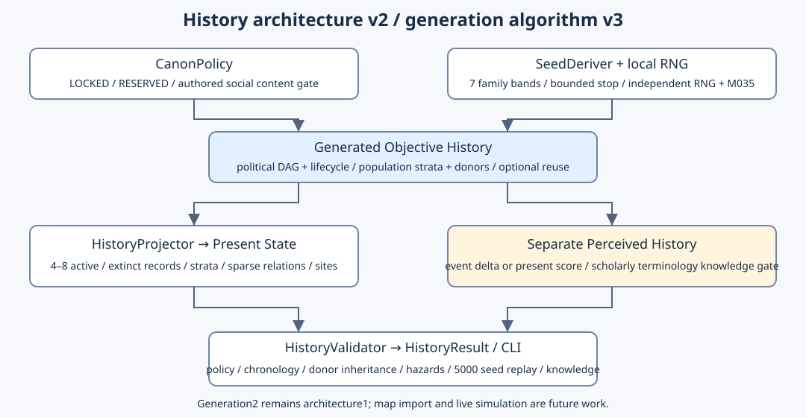

+++
status = "구현 완료"
areas = ["코어", "월드 생성"]
type = "알고리즘 / 데이터 모델"
systems = "HistoryGenerator / HistoryTopology / FactionIdentityResolver / HistoryProjector / HistoryValidator"
milestones = "M036 architecture / M037 v2 / M038 initial v3 / M039 contract fixup / M040 identity / M041 culture / M042 social incidents — codex/history-social-incidents-v1; main 미병합"
code_paths = ["game/history/history_generator.gd", "game/history/history_topology.gd", "game/history/faction_identity_resolver.gd", "game/history/history_sites.gd", "game/history/history_projector.gd", "game/history/history_validator.gd", "game/history/history_claim_builder.gd", "game/history/population_origins.gd", "game/history/social_population_catalog.gd", "game/history/origin_catalog.gd", "game/history/social_incident_planner.gd", "tools/analyze_social_incidents.gd", "tools/analyze_history.gd"]
diagram = "docs/diagrams/history_generator.svg"
+++
# History Generator v0.3 — topology and population contracts



## Version and scope

History revision is now `history-v3-authored-4`; frozen M039/M040 corpus paragraphs below describe their older structural validation, which remains protected by component regressions.

Default generation **3 uses architecture2**; explicit generation **2 uses architecture1**.
M039 corrects M038's exact6..8 planning, flattened Origin sets and implicit social content.
It preserves seven families, the political DAG, transformations, lifecycle, donors,
optional compatible reuse, event/present Claim evidence, M035 naming and rare budgets.
Base `f65702590254245163d3bcd357445783050bb15a`, isolated
`codex/history-generator-v0.3-fixup`; no main merge. M038's
[initial review](../reviews/2026-10-06-history-generator-v0_3.md) remains a historical record.

V2 independently varied local events but had the repeated A/B/C succession tree and
mandatory pressure-site reuse. V3 varies canonical political ancestry before rendering.
The six-event local precursor/pressure/collapse prelude remains bounded regional history;
it does not resolve the global collapse or any LOCKED/RESERVED mystery.

## Bounded topology, historical count and current count

`target_factions` is absent from configuration and rejected by the closed schema.
Current count is an observed result of political activation/retirement, **4..8** globally.
Families constrain bands and structural anchors, never draw a particular terminal count.

| Family | Current band | Required structure / bias |
| --- | --- | --- |
| polycentric_succession | 5..8 | Several initial institutional heirs; split-heavy |
| remnant_mosaic | 4..8 | Independently organized/inherited roots, optional older enclave |
| late_fragmentation | 4..8 | Long-lived 1..2 successors, recent first split |
| consolidation_resplit | 4..6 | Actual merge, protected until its resplit; later operations vary |
| layered_migration | 5..8 | At least two other-region newcomer layers |
| no_direct_heir | 4..7 | Failed institutional heirs retire; no current institutional continuation |
| enclave_continuity | 4..8 | Parentless pre-collapse enclave remains active |

All families use the same split/merge/migration/newcomer/join/reorganization/extinction
implementation. Roots, participants, operation order, split size, retained parent and
donors vary. After5 meaningful transformations (4 for late fragmentation), an in-band
history may stop with55% probability from an independent per-step namespace. Maximum
11 transformations (8 for late fragmentation) bounds the planner. In-band state stops
at the last available decision. Legal choices preserve actors and anchors, reserve growth
capacity for the minimum band, and never grow beyond the family upper bound.
Consolidation reserves space for its mandatory resplit. If still below the band, remaining
legal transformations must leave a route into the band, rather than any exact endpoint.
There is no post-processing padding, exact count input, retry loop or cleanup extinction.
The final capacity filter may restrict a growth operation when below the minimum; this is
a bounded feasibility constraint, not unrestricted random history or a count balance promise.

Political `parent_ids` represent historical polities and form a DAG. Formation time must
follow parent formation. Transformation actors must be alive before acting; dead polities
can remain documentary predecessors/population sources but cannot merge/split again.
`formation_origin`, `ancestry_kind`, `political_continuity`, `way_of_life`, `regional_roles`
and M035 naming contexts have independent meanings. Reorganization breaks office
continuity; a population can survive without retaining the old institutional lineage.

`present.historical_factions` includes the precursor, current and extinct polities with
formation/dissolution times, founding/last profile and event provenance. Only
`present.active_factions` is the current4..8 political projection. Transient bodies and
arrival cohorts do not increase that political count.

## Authoritative Origin IDs and social content gate

`content/population/origins.json` is the small shared vocabulary/display authority read
by `OriginCatalog` and the offline monster taxonomy checker. Canonical IDs:
`planetary`, `human_derived`, `observer`, `innerworld`, `outerworld`, `unknown`.
English/Korean labels are presentation only. Neither `composite` nor `Composite` is an
Origin. Unknown stands alone within a stratum; it requires an authored social source,
not a mystery filler draw. Artifact discoveries retain their existing `origin=unknown`.

`SocialPopulationCatalog` loads `content/population/social_templates.json` outside the
generator. Templates carry stable ID, canonical origins, integer selection weight and
independent random-generation/membership/newcomer permissions. Roots and arrivals
select only authorized sources. The catalog must supply the authorized `human_baseline`
for the human precursor. Its stable catalog ID is configuration provenance, not an Origin.

Repo Canon authorizes humans/modified human lineages. Taxonomy and unclassified
monster records do not authorize nonhuman sapient societies. Shipping catalog therefore
contains only `human_baseline=[human_derived]`, weight100, all three permissions enabled.
No Planetary/Innerworld/Observer/Outerworld/Unknown social template ships. This does not
deny those Origin categories exist; it preserves the boundary between taxonomy and
authored population content. No automatic Origin-based hostility is introduced.

Injected tests use `tests/fixtures/social_population_templates.json`, explicitly marked
`test_synthetic_only`; it is never loaded by default generation. Fixtures exercise every
Origin, an authored hybrid, disabled populations and membership without newcomer permission.
Fixtures are software evidence, not new Canon. Validators receive the same injected
catalog; the shipping validator rejects fixture histories.

## Population strata and provenance

The compact canonical profile is a Dictionary, not a census or flat Origin union:

```json
{"strata":[
  {"template_id":"human_baseline","origins":["human_derived"],"prevalence":"majority"},
  {"template_id":"fixture_innerworld","origins":["innerworld"],"prevalence":"minor"}
]}
```

The example's second stratum is **test-only**. Multiple strata express social co-residence.
Mixed-Origin society means different single-Origin strata coexist. A **multi-Origin lineage**
is one authored stratum with multiple origins, such as `[human_derived,innerworld]` in the
test hybrid. Those cases serialize and render differently; merge never invents a hybrid.

Strata sort by template ID. Origins sort by catalog order, with no duplicates, empty set
or unknown+known combination. Prevalence is `majority/major/minor/trace`, never converted
to percentages. At most one majority is allowed; a profile needs majority or major residents.
Templates act as coarse lineage identity; identical template strata collapse deterministically.

Each `population` effect has `entity_id`, structured `profile`, population `source_ids`
and `mode`. Political parents and actual population donors remain separate.

| Mode | Contract |
| --- | --- |
| seed / arrival | Authorized initial stock, no donors; newcomer arrival additionally requires newcomer permission |
| inherit | Exactly preserve one donor's whole profile |
| subset | Nonempty donor stratum subset, preserving each complete template/origins; prevalence may rebalance |
| co_residence | Union donor strata, never fuse their internal origins; one survivor stratum majority, multiple major |
| join | Retain existing strata/prevalence, add new arrival strata as minor; repeated template does not imply a new species |

`population_history` replays every source/mode/event/year. Founding profiles are immutable
entity metadata; changes project into last/current profiles. At political retirement a
`population_fate` effect records `absorbed` with actual same-event donor successors or
`untracked` without successor claims, plus `untracked_template_ids` for donor strata absent
from all recorded successors. The projector retains this separate disposition
ledger. Neither disposition asserts all residents died or an Origin/species vanished.
An untracked historical stock can remain a later recorded population source.

## Derived Faction identity and cultural interpretation

M040 adds a deliberately thin read-only lens between projected history and Claim wording.
`FactionIdentityResolver` derives five axes for each current faction from existing
formation, political continuity, lifestyle, regional role and recorded scars:

- continuity stance: `heir/reformer/breakaway/new_foundation/outsider`
- social anchor: `kin/locality/institution/craft/ritual/exchange/refuge`
- adaptive stance: `preserve/adapt/rebuild/exploit/withdraw`
- interpretation mode: `pragmatic/skeptical/technical/ritual`
- memory frame: `continuity/rupture/grievance/debt/warning/opportunity`

This is **not** another objective-history layer or culture simulator. The resolver is a pure
deterministic query over already generated data. It neither emits events/effects nor mutates
`HistoricalEntity` or `HistoryState`, so generation3 remains architecture2. The profile is
not serialized as objective state; it can always be recomputed. Debug output shows the lens
and the small provenance set used to explain it.

Axes are weighted rather than mapped 1:1. A direct political heir strongly favors `heir`,
a fragmentation favors `breakaway`, an authorized newcomer favors `outsider`, but current
lifestyle/role and other history can produce different present identities. Memory frames are
evidence-backed: grievance/debt require actual signed relation events; warning can cite the
regional pressure or rare legacy event; opportunity comes from reuse/discovery or an
adaptive rebuild/exploitation stance. Identity therefore compresses scars rather than adding
new lore facts.

The Claim builder uses the profile only as a **wording lens**. The same objective pressure,
discovery, relation or legacy event can be described pragmatically, skeptically, technically
or ritually while retaining its event evidence and Canon limits. Positive/negative relation
Claims still preserve the recorded delta; present Claims still use accumulated score. Core
purpose, Observer activation/target selection and discovery Origin remain unresolved.
Identity means "how this faction frames itself"; interpretation means "how it habitually
reads evidence"; an individual Claim remains the statement about one event/state.

## Canonical projection, renderer, claims and sites

M042 inserts an objective social incident layer after topology/faction formation and before recent relations. It retains generation3/architecture2 and exact legacy v2. See [Social incident contract](social_historical_incidents.md) for families, prerequisites, clone chains, content gates and projected records.

M041/M042 add a further pure culture query over the M040 layer:
Society Traits (structural patterns), Doctrines (normative desires), qualitative
intensity, values/taboos and future Actor/goal hooks. It is not serialized into
objective history and cannot rewrite Claims or activate unsupported future content.
See [Faction culture contract](faction_culture.md) for the dedicated catalog,
evidence gates, dormant definitions, Actor interactions and candidate boundaries.

Entity/event/effect data creates history; `HistoryProjector` replays the present.
`HistoryDebugFormatter` only reads it, including donor provenance and strata semantics.
Claims are perceived accounts and cannot alter objective state. Event relation Claims use
their event's `{a,b,delta}`; present Claims use accumulated `{a,b,score}` without a past
event ID. Exact duplicate Claim evidence is suppressed/rejected. Observer terminology
still needs `observer_scholarly_term` knowledge. M035 names retain authored en/ko forms.

Recent diplomacy selects2..N-2 pairs besides an excluded actor; split/migration relations
survive only with active endpoints. Relations are sparse; scores accumulate chronologically
and clamp to[-100,100]. Opposite-sign past and present facts remain valid without narrative reversal.
Pairs represent bounded local encounters, not a territory/economic simulation.

Ruin reuse keeps its independent40% attempt and reviewed compatibility. Chemical,
ordnance and restricted hazards cannot be reused. Type, hazard, faction lifestyle and
purpose must agree; pressure sites can remain abandoned. Ownership transfers are
canonical `site_owner` effects; no demographic count logic influences site selection.

## RNG domains, versions and rarity

SeedDeriver rules are unchanged. Version3 namespaces separate topology family/plan/stop,
population template selection/contributors/inheritance, lifestyle/role, naming, dates,
knowledge, recent relations, sites, discovery, rare budgets and claims. Catalog expansion
cannot consume plan draws or change precursor, pressure or topology; displays never
participate in canonical Origin identity or political structure.

Generation2 retains architecture1, original effects and serialized shape; version3 uses
architecture2, structured strata/lowercase IDs and expanded semantics. Validator checks
the explicit mapping. No save migration or external snapshot ingestion is implemented.
JSON diagnostic round-trip tests compare all values semantically (Godot decodes numeric
values as floats). Runtime seed is64-bit; transport consumers must preserve integer precision.

Rarity is unchanged: primary45% natural/45% human/8% Core/2% Observer; optional Core3%
and Observer2% if absent, maximum one event of each domain. Existing bounded physical
mechanisms and unknown activation/intent/target reasons are preserved. No new civilization
is introduced by a legacy machine consequence. Generic discovery remains optional60%.

## Validation and observations

Validator checks closed configuration/effect schemas, Canon, version mapping, references,
chronology/lifecycle, family bands/anchors/bounded steps, population authorization and
donor explainability, formation semantics, retirement disposition, projection equality,
claim evidence, safe ownership/reuse, sparse relations and deterministic replay.

M039 structural corpus and numerical results remain applicable to topology/population because M040 does not alter objective history: [follow-up completion review](../reviews/2026-10-06-history-generator-v0_3-fixup.md),
[5000-seed statistics](../reviews/history_v3_fixup/diversity.json),
[readable histories](../reviews/history_v3_fixup/samples.md),
[canonical snapshots](../reviews/history_v3_fixup/samples.json). Those saved readable histories predate M040 Claim wording; M040 validation and sample inspection are recorded in its milestone.
Initial M038's "multi-origin histories334" measured flat category co-residence; it is
not evidence of hybrid lineage. New statistics separate mixed society and multi-Origin
lineage and explicitly report their zero shipping frequency under the conservative gate.

CLI: `tools/preview_history.gd -- SEED [--json] [--v2]`;
`tools/analyze_history.gd -- 5000 OUTPUT_DIRECTORY` (explicit `--v2` retains its older path).
The signature normalizes birth-ordered political adjacency, formation and active flags;
it excludes names/IDs/dates/seed/population/relations, and is not a general unlabeled
graph-isomorphism proof. Distributions describe observed seeds, not gameplay balance.

## Limits and next boundary

One abstract region, qualitative strata and finite family anchors remain intentional.
No population numbers/births/deaths/breeding/species simulation, economy, territory/map
placement, personal genealogy/leaders, language/religion/quest generator or
post-start simulation/save migration. No new sapient species is authored here.
Next integration should consume projected IDs, event provenance, profiles and M035
names through a player-knowledge/world import boundary; claims must remain separate
from truth. Actual nonhuman social content requires independent authored authorization
before catalog registration. Headless evidence does not cover manual GUI/play/package
acceptance or literary quality.
