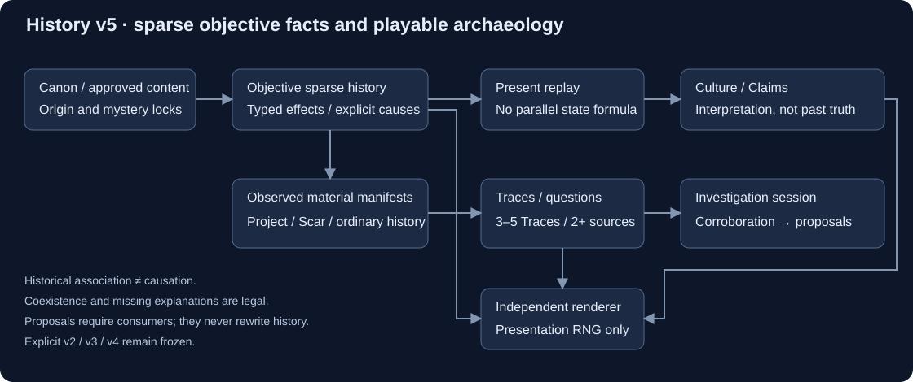
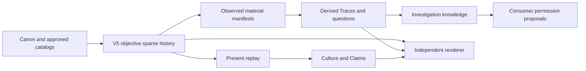

+++
status = "구현 완료"
areas = ["코어", "월드 생성"]
type = "알고리즘 / 데이터 모델"
systems = "HistoryGenerator / HistoryTopology / FactionIdentityResolver / HistoryProjector / HistoryValidator"
milestones = "M036–M043 foundation / M044 generation5 architecture3 sparse archaeology — branch implementation and validation complete; codex/history-generator-v5; main 미병합"
code_paths = ["game/history/history_v4_catalog.gd", "game/history/history_v4_compatibility.gd", "game/history/history_v4_planner.gd", "game/history/history_v4_validator.gd", "game/history/history_v4_claims.gd", "tools/analyze_history_v4.gd", "game/history/history_generator.gd", "game/history/history_topology.gd", "game/history/faction_identity_resolver.gd", "game/history/history_sites.gd", "game/history/history_projector.gd", "game/history/history_validator.gd", "game/history/history_claim_builder.gd", "game/history/population_origins.gd", "game/history/social_population_catalog.gd", "game/history/origin_catalog.gd", "game/history/social_incident_planner.gd", "tools/analyze_social_incidents.gd", "tools/analyze_history.gd"]
diagram = "docs/diagrams/history_generator_v5.svg"
+++
# History Generator — sparse archaeology and preserved historical algorithms



## Version and scope

The task branch now defaults to generation5 / architecture3. Generation4 below is
an explicit preserved algorithm, protected with128 exact-output hashes in addition
to its original fixtures. Generation2 and3 each have128 corresponding hashes.

V5 uses `HistoryV5Scaffold → HistoryV5Topology → SocialIncidentPlanner →
HistoryV5Planner` for canonical facts, `HistoryProjector` for the present and
`HistoryArchaeology` for derived evidence contracts. It uses the v4 compatibility
query lens for existing identity/culture only. This lens is not v5's objective
history, validator or renderer. No save migration or main merge is implied.

### V5 operation probability

Let O be the set of legal operations after anchor/band feasibility checks. Draw
`P(op)=weight_family(op)/sum(weight_family(o), o in O)` once. Then draw uniformly
from that operation's legal parameter rows with a separate stream. Duplicating
split parameter rows cannot change the operation draw. Feasibility and mandatory
anchors may alter O; this is a structural condition, not combinatorial weighting.

### V5 causal and evidence contracts

- `cause_event_ids`: explicit documented causation/prerequisite evidence. Project
  and Scar internals retain chronological typed capability/population sources.
- `historical_associations`: referenced observations/custody without asserting a
  global cause. Coexistence without either relation is legal.
- Lifecycle/population parent and donor references remain authoritative, distinct
  from lifestyle, motives and current interpretation.
- Material manifests are authored objective `history_record` effects. Traces
  derive only from these manifests, with exact source assertions and references.
- Questions use3–5 distinct Trace IDs, at least two sources and two access
  contexts. Questions are questions, never extra objective facts or ethical truth.
- Hooks name target Trace, context, required runtime tags, access modes and source
  evidence gain. Requirements are consumer obligations, not proof that a hostile
  Actor, gate, machine or map has been instantiated.
- Investigation knowledge is session state; corroboration unlocks consumer action
  proposals. Executing proposals requires integration. Historical truth remains
  unchanged. Current operation of a historical living/machine Trace is unverified.
- Renderer RNG uses `history-renderer/5`; content changes cannot write canonical
  facts, objectives, culture, Claims or investigation state.

Revision2 (`history-v5-authored-2 / history-v5-archaeology-2`) adds typed stage
manifests and exact social-event gates. Trace assertion paths retain source-effect
indices and record IDs. Questions require an actually asserted anchor record,
same-subject evidence (or an explicit plural regional comparison) and3–5 Traces
across two events/contexts. Investigation permissions additionally require learning
an anchor. Specific hook variants filter by category and material archetype.
Consequences preserve subject/current custodians, role-based issue candidates,
existing relationship evidence and current execution prerequisites. Current need
candidates do not establish historical motives or automatically select policy.

The archaeology catalog has116 Trace definitions,40 Questions,60 interaction
variants in20 families and21 consequence types. Actual corpus reachability is
reported separately.34 Project phase keys have two renderer-only complete factual
alternatives; political/custody/relation prose also varies. Grouped identical
Claims retain every claimant/confidence and their original event reference.

Six independently chosen regional episode patterns coexist with gaps: acute
breakdown, managed retreat, political bifurcation, slow erosion, partial
stabilization and displacement. No episode is required to explain the polity's
documented retirement. Density/scar-coverage rules from older algorithms do not
require every v5 event to explain another event.



Final branch validation:39-script full Godot gate,9068 v5 checks/0 failures,
5000 matching canonical replays,384 frozen2/3/4 hashes. Two disjoint OS20 full
raw reviews surround the general revision. Non-Repetition6.990 and Gameplay
Potential7.725 miss8.0 targets. Generic contexts/menus, weak present stakes and
duplicate political dossiers remain; engine-bound Questions/world actions0.
Detailed results are under `docs/reviews/history_v5/delivery.md`. The original
v4 pipeline below remains version-scoped. No main integration is claimed.

The preserved v4 civilizational revision is `history-v4-authored-2`; its structural/social revision is `history-v3-authored-4`. Frozen M039/M040 corpus paragraphs below describe their older structural validation, which remains protected by component regressions.

Explicit historical **4 and3 use architecture2**; **2 uses architecture1**.
M039 corrects M038's exact6..8 planning, flattened Origin sets and implicit social content.
It preserves seven families, the political DAG, transformations, lifecycle, donors,
optional compatible reuse, event/present Claim evidence, M035 naming and rare budgets.
Base `f65702590254245163d3bcd357445783050bb15a`, isolated
`codex/history-generator-v0.3-fixup`; no main merge. M038's
[initial review](../reviews/2026-10-06-history-generator-v0_3.md) remains a historical record.

V2 independently varied local events but had the repeated A/B/C succession tree and
mandatory pressure-site reuse. V3 varies canonical political ancestry before rendering.
The six-event local precursor/pressure/collapse prelude remains bounded regional history;
it does not resolve the global collapse or any LOCKED/RESERVED mystery.

## Bounded topology, historical count and current count

`target_factions` is absent from configuration and rejected by the closed schema.
Current count is an observed result of political activation/retirement, **4..8** globally.
Families constrain bands and structural anchors, never draw a particular terminal count.

| Family | Current band | Required structure / bias |
| --- | --- | --- |
| polycentric_succession | 5..8 | Several initial institutional heirs; split-heavy |
| remnant_mosaic | 4..8 | Independently organized/inherited roots, optional older enclave |
| late_fragmentation | 4..8 | Long-lived 1..2 successors, recent first split |
| consolidation_resplit | 4..6 | Actual merge, protected until its resplit; later operations vary |
| layered_migration | 5..8 | At least two other-region newcomer layers |
| no_direct_heir | 4..7 | Failed institutional heirs retire; no current institutional continuation |
| enclave_continuity | 4..8 | Parentless pre-collapse enclave remains active |

All families use the same split/merge/migration/newcomer/join/reorganization/extinction
implementation. Roots, participants, operation order, split size, retained parent and
donors vary. After5 meaningful transformations (4 for late fragmentation), an in-band
history may stop with55% probability from an independent per-step namespace. Maximum
11 transformations (8 for late fragmentation) bounds the planner. In-band state stops
at the last available decision. Legal choices preserve actors and anchors, reserve growth
capacity for the minimum band, and never grow beyond the family upper bound.
Consolidation reserves space for its mandatory resplit. If still below the band, remaining
legal transformations must leave a route into the band, rather than any exact endpoint.
There is no post-processing padding, exact count input, retry loop or cleanup extinction.
The final capacity filter may restrict a growth operation when below the minimum; this is
a bounded feasibility constraint, not unrestricted random history or a count balance promise.

Political `parent_ids` represent historical polities and form a DAG. Formation time must
follow parent formation. Transformation actors must be alive before acting; dead polities
can remain documentary predecessors/population sources but cannot merge/split again.
`formation_origin`, `ancestry_kind`, `political_continuity`, `way_of_life`, `regional_roles`
and M035 naming contexts have independent meanings. Reorganization breaks office
continuity; a population can survive without retaining the old institutional lineage.

`present.historical_factions` includes the precursor, current and extinct polities with
formation/dissolution times, founding/last profile and event provenance. Only
`present.active_factions` is the current4..8 political projection. Transient bodies and
arrival cohorts do not increase that political count.

## Authoritative Origin IDs and social content gate

`content/population/origins.json` is the small shared vocabulary/display authority read
by `OriginCatalog` and the offline monster taxonomy checker. Canonical IDs:
`planetary`, `human_derived`, `observer`, `innerworld`, `outerworld`, `unknown`.
English/Korean labels are presentation only. Neither `composite` nor `Composite` is an
Origin. Unknown stands alone within a stratum; it requires an authored social source,
not a mystery filler draw. Artifact discoveries retain their existing `origin=unknown`.

`SocialPopulationCatalog` loads `content/population/social_templates.json` outside the
generator. Templates carry stable ID, canonical origins, integer selection weight and
independent random-generation/membership/newcomer permissions. Roots and arrivals
select only authorized sources. The catalog must supply the authorized `human_baseline`
for the human precursor. Its stable catalog ID is configuration provenance, not an Origin.

Repo Canon authorizes humans/modified human lineages. Taxonomy and unclassified
monster records do not authorize nonhuman sapient societies. Shipping catalog therefore
contains only `human_baseline=[human_derived]`, weight100, all three permissions enabled.
No Planetary/Innerworld/Observer/Outerworld/Unknown social template ships. This does not
deny those Origin categories exist; it preserves the boundary between taxonomy and
authored population content. No automatic Origin-based hostility is introduced.

Injected tests use `tests/fixtures/social_population_templates.json`, explicitly marked
`test_synthetic_only`; it is never loaded by default generation. Fixtures exercise every
Origin, an authored hybrid, disabled populations and membership without newcomer permission.
Fixtures are software evidence, not new Canon. Validators receive the same injected
catalog; the shipping validator rejects fixture histories.

## Population strata and provenance

The compact canonical profile is a Dictionary, not a census or flat Origin union:

```json
{"strata":[
  {"template_id":"human_baseline","origins":["human_derived"],"prevalence":"majority"},
  {"template_id":"fixture_innerworld","origins":["innerworld"],"prevalence":"minor"}
]}
```

The example's second stratum is **test-only**. Multiple strata express social co-residence.
Mixed-Origin society means different single-Origin strata coexist. A **multi-Origin lineage**
is one authored stratum with multiple origins, such as `[human_derived,innerworld]` in the
test hybrid. Those cases serialize and render differently; merge never invents a hybrid.

Strata sort by template ID. Origins sort by catalog order, with no duplicates, empty set
or unknown+known combination. Prevalence is `majority/major/minor/trace`, never converted
to percentages. At most one majority is allowed; a profile needs majority or major residents.
Templates act as coarse lineage identity; identical template strata collapse deterministically.

Each `population` effect has `entity_id`, structured `profile`, population `source_ids`
and `mode`. Political parents and actual population donors remain separate.

| Mode | Contract |
| --- | --- |
| seed / arrival | Authorized initial stock, no donors; newcomer arrival additionally requires newcomer permission |
| inherit | Exactly preserve one donor's whole profile |
| subset | Nonempty donor stratum subset, preserving each complete template/origins; prevalence may rebalance |
| co_residence | Union donor strata, never fuse their internal origins; one survivor stratum majority, multiple major |
| join | Retain existing strata/prevalence, add new arrival strata as minor; repeated template does not imply a new species |

`population_history` replays every source/mode/event/year. Founding profiles are immutable
entity metadata; changes project into last/current profiles. At political retirement a
`population_fate` effect records `absorbed` with actual same-event donor successors or
`untracked` without successor claims, plus `untracked_template_ids` for donor strata absent
from all recorded successors. The projector retains this separate disposition
ledger. Neither disposition asserts all residents died or an Origin/species vanished.
An untracked historical stock can remain a later recorded population source.

## Derived Faction identity and cultural interpretation

M040 adds a deliberately thin read-only lens between projected history and Claim wording.
`FactionIdentityResolver` derives five axes for each current faction from existing
formation, political continuity, lifestyle, regional role and recorded scars:

- continuity stance: `heir/reformer/breakaway/new_foundation/outsider`
- social anchor: `kin/locality/institution/craft/ritual/exchange/refuge` — `ritual` is a legacy serialized ID; canonical/player-facing term is **Faith / 신앙**.
- adaptive stance: `preserve/adapt/rebuild/exploit/withdraw`
- interpretation mode: `pragmatic/skeptical/technical/ritual` — `ritual` is retained for replay compatibility; display/semantic term is **faith-based / 신앙적**.
- memory frame: `continuity/rupture/grievance/debt/warning/opportunity`

This is **not** another objective-history layer or culture simulator. The resolver is a pure
deterministic query over already generated data. It neither emits events/effects nor mutates
`HistoricalEntity` or `HistoryState`, so generation3 remains architecture2. The profile is
not serialized as objective state; it can always be recomputed. Debug output shows the lens
and the small provenance set used to explain it.

Axes are weighted rather than mapped 1:1. A direct political heir strongly favors `heir`,
a fragmentation favors `breakaway`, an authorized newcomer favors `outsider`, but current
lifestyle/role and other history can produce different present identities. Memory frames are
evidence-backed: grievance/debt require actual signed relation events; warning can cite the
regional pressure or rare legacy event; opportunity comes from reuse/discovery or an
adaptive rebuild/exploitation stance. Identity therefore compresses scars rather than adding
new lore facts.

The Claim builder uses the profile only as a **wording lens**. The same objective pressure,
discovery, relation or legacy event can be described pragmatically, skeptically, technically
or through a faith-based interpretation while retaining its event evidence and Canon limits. Positive/negative relation
Claims still preserve the recorded delta; present Claims still use accumulated score. Preservator-era
purpose, Observer activation/target selection and discovery Origin remain unresolved.
Identity means "how this faction frames itself"; interpretation means "how it habitually
reads evidence"; an individual Claim remains the statement about one event/state.

## Canonical projection, renderer, claims and sites

M042 inserts an objective social incident layer after topology/faction formation and before recent relations. It retains generation3/architecture2 and exact legacy v2. See [Social incident contract](social_historical_incidents.md) for families, prerequisites, clone chains, content gates and projected records.

M041/M042 add a further pure culture query over the M040 layer:
Society Traits (structural patterns), Doctrines (normative desires), qualitative
intensity, values/taboos and future Actor/goal hooks. It is not serialized into
objective history and cannot rewrite Claims or activate unsupported future content.
See [Faction culture contract](faction_culture.md) for the dedicated catalog,
evidence gates, dormant definitions, Actor interactions and candidate boundaries.

Entity/event/effect data creates history; `HistoryProjector` replays the present.
`HistoryDebugFormatter` only reads it, including donor provenance and strata semantics.
Claims are perceived accounts and cannot alter objective state. Event relation Claims use
their event's `{a,b,delta}`; present Claims use accumulated `{a,b,score}` without a past
event ID. Exact duplicate Claim evidence is suppressed/rejected. Observer terminology
still needs `observer_scholarly_term` knowledge. M035 names retain authored en/ko forms.

Recent diplomacy selects2..N-2 pairs besides an excluded actor; split/migration relations
survive only with active endpoints. Relations are sparse; scores accumulate chronologically
and clamp to[-100,100]. Opposite-sign past and present facts remain valid without narrative reversal.
Pairs represent bounded local encounters, not a territory/economic simulation.

Ruin reuse keeps its independent40% attempt and reviewed compatibility. Chemical,
ordnance and restricted hazards cannot be reused. Type, hazard, faction lifestyle and
purpose must agree; pressure sites can remain abandoned. Ownership transfers are
canonical `site_owner` effects; no demographic count logic influences site selection.

## RNG domains, versions and rarity

SeedDeriver rules are unchanged. Version3 namespaces separate topology family/plan/stop,
population template selection/contributors/inheritance, lifestyle/role, naming, dates,
knowledge, recent relations, sites, discovery, rare budgets and claims. Catalog expansion
cannot consume plan draws or change precursor, pressure or topology; displays never
participate in canonical Origin identity or political structure.

Generation2 retains architecture1, original effects and serialized shape; version3 uses
architecture2, structured strata/lowercase IDs and expanded semantics. Validator checks
the explicit mapping. No save migration or external snapshot ingestion is implemented.
JSON diagnostic round-trip tests compare all values semantically (Godot decodes numeric
values as floats). Runtime seed is64-bit; transport consumers must preserve integer precision.

Rarity is unchanged: primary45% natural/45% human/8% Preservator/Planetary Regulation Network activity/2% Observer; optional Preservator-network3%
and Observer2% if absent, maximum one event of each domain. Existing bounded physical
mechanisms and unknown activation/intent/target reasons are preserved. No new civilization
is introduced by a legacy machine consequence. Generic discovery remains optional60%.

## Validation and observations

Validator checks closed configuration/effect schemas, Canon, version mapping, references,
chronology/lifecycle, family bands/anchors/bounded steps, population authorization and
donor explainability, formation semantics, retirement disposition, projection equality,
claim evidence, safe ownership/reuse, sparse relations and deterministic replay.

M039 structural corpus and numerical results remain applicable to topology/population because M040 does not alter objective history: [follow-up completion review](../reviews/2026-10-06-history-generator-v0_3-fixup.md),
[5000-seed statistics](../reviews/history_v3_fixup/diversity.json),
[readable histories](../reviews/history_v3_fixup/samples.md),
[canonical snapshots](../reviews/history_v3_fixup/samples.json). Those saved readable histories predate M040 Claim wording; M040 validation and sample inspection are recorded in its milestone.
Initial M038's "multi-origin histories334" measured flat category co-residence; it is
not evidence of hybrid lineage. New statistics separate mixed society and multi-Origin
lineage and explicitly report their zero shipping frequency under the conservative gate.

CLI: `tools/preview_history.gd -- SEED [--json] [--v2]`;
`tools/analyze_history.gd -- 5000 OUTPUT_DIRECTORY` (explicit `--v2` retains its older path).
The signature normalizes birth-ordered political adjacency, formation and active flags;
it excludes names/IDs/dates/seed/population/relations, and is not a general unlabeled
graph-isomorphism proof. Distributions describe observed seeds, not gameplay balance.

## Limits and next boundary

One abstract region, qualitative strata and finite family anchors remain intentional.
No population numbers/births/deaths/breeding/species simulation, economy, territory/map
placement, personal genealogy/leaders, language/religion/quest generator or
post-start simulation/save migration. No new sapient species is authored here.
Next integration should consume projected IDs, event provenance, profiles and M035
names through a player-knowledge/world import boundary; claims must remain separate
from truth. Actual nonhuman social content requires independent authored authorization
before catalog registration. Headless evidence does not cover manual GUI/play/package
acceptance or literary quality.

## M043 initial revision1 — historical v4 / architecture2

`HistoryGenerator.VERSION = 4`. Historical explicit2/1 and3/2 paths remain
available. The preceding v3 paragraphs are historical specifications, not the
current default. Canonical v4 vocabulary is defined at the migration boundary;
the original user-authored Preservator lore changes are included.

The common regional topology/population composer runs in generation4 namespaces.
Its v4 response/collapse choices are constrained by domain compatibility. The
canonical migration precedes new authored planning. No v2/v3 RNG namespace is
modified. New project, outcome, cohort, pressure, response, collapse, discovery,
identity interpretation and Claim choices use independent `history/v4` namespaces.
Ordering a catalog differently does not change output. Discovery catalog changes
do not alter topology, faction count, projects or naming.

`content/history/history_v4.json` contains Project archetypes and ordered stages,
alternative outcomes, prerequisite record IDs, bounded observations, capability
gates and pressure→response→collapse compatibility. Planner code composes these
rows rather than embedding each narrative as a giant conditional tree. Project
dates span at least30 years before the regional collapse. Later custody connects
surviving facilities/records to current institutions without inventing ancestry.

The new objective effect is:

```text
history_record {record_type, record_id, entity_id, reference_id, project_id, data}
```

Data must exactly match the authored observation schema. Bounded substitutions
are selection policy, actual liftoff, approved contact/target references and Ark
remain subtype. Capabilities come from preceding authored research/construction
events, not hypothetical flags. Every prerequisite cites an earlier event for the
same participant. Facility/cohort groups are created by objective effects; they
are not automatically political factions or new biological species.

Replay produces `civilizational_projects`, `civilizational_scars`,
`historical_facilities` and `history_records`, each with source events. Project
status progresses through in_progress to an authored terminal outcome. Scar rows
reference actual consequences and retain unresolved cause/identity fields.
Construction and ongoing/abandoned/damaged facility states survive projection.

Initial-revision1 world budgets were0/1/2 Projects and0–2 major Scars. Ordinary political history is
still generated in every world. Rarity is measured at world exposure as well as
event/faction exposure; the corpus report defines regional record exposure rather
than presenting it as direct personal involvement. Imposed regression and distinct
lineage persecution remain content/context-gated. No quest, construction gameplay,
global-war simulation, player UI or metaphysical identity engine is introduced.

Validation: `tests/test_history_v4.gd`; exact M042 fixture
`tests/fixtures/history_m043_legacy.json`; final5000-world
`tools/analyze_history_v4.gd`; [delivery and review](../reviews/history_v4/delivery.md).
Readable CLI now defaults to v4; `--v2` and `--v3` retain historical previews.
For reproducible corpus generation run the analysis tool with `-- 5000`.


## Current v4 revision2 — independent Projects and Scars

Revision `history-v4-authored-2` replaces the initial nine-project v4 catalog.
Task branch `codex/history-projects-scars-redesign`; base
`9f04f780c79b622e70532a926aefbc8477147817`; main remains unmerged.
Historical revision1 reports and its author catalog under `content/history/compatibility/`
are retained as historical evidence, never selected by the current generator.

### Eight Projects

- `ark_project` — Ark Project
- `deep_descent_project` — Deep Descent Project
- `deep_space_listening_array` — Far-Sky Array
- `genome_archive_project` — Genome Archive
- `cortical_array` — Cortical Array
- `meridian_project` — Meridian Project
- `second_mind_project` — Second Mind Project
- `adaptive_simplification_program` — Adaptive Simplification Program

`success` means bounded technical success. Ark unresolved departure is not success;
Deep return means limited survey/engineering and partial survivor return, with an
unresolved boundary. Stable orbital/Innerworld civilization, confirmed escape or
Outerworld colony, Observer equivalence, machine personhood and metaphysical
continuity are not authored outcomes. Future authored data is checked against
these limits in addition to checking generated histories.

Genome Archive preserves actual biological samples and records; it creates no
species or lineage. Cortical Array links actual human brains and parallel biological
computation. Meridian records surveys, reference frames, maps and discrepancies;
discrepancy does not prove supernatural causation. Second Mind records constructed,
autonomous, learning/self-repairing human-built machines, without proving consciousness,
descendant identity or full machine civilization. Adaptive Simplification Program
is the contemporary official name; The Great Degeneration is a later historical
evaluation. Its consent/biological/developmental observations stay human variation.

### Fifteen independent Scars

- `failed_exodus` — Failed Exodus
- `last_descent` — Last Descent
- `reproductive_shutdown` — Reproductive Shutdown
- `silent_depopulation` — Silent Depopulation
- `collective_mind_fracture` — Collective Mind Fracture
- `chosen_cognitive_regression` — Chosen Cognitive Regression
- `imposed_cognitive_regression` — Imposed Diminution
- `infrastructure_cascade` — Infrastructure Cascade
- `targeted_extermination` — Targeted Extermination
- `mass_morphogenic_event` — The Great Alteration
- `autonomous_systems_crisis` — Autonomous Systems Crisis
- `mechanogenic_assimilation` — Mechanogenic Assimilation
- `habitable_zone_loss` — Habitable Zone Loss
- `record_severance` — Record Severance
- `orbital_fall` — Orbital Fall / 궤도낙하

Every Scar has its own actual population/site registration, causal observation
chain and persistent population/site/institution aftermath. None requires a Project
ID. Project outcomes may explicitly reuse a Scar chain and supply project_id; that
is a historical association, not a universal prerequisite. Eleven Scars have multiple
authored causal backgrounds. Consent/coercion/targeted killing remain human-policy
histories; Silent Depopulation remains unknown rather than inventing an explanation.

Imposed Diminution is shipping-active human-on-human atrocity. Require actual human
target and responsible authority, explicit biological cognitive-reduction policy,
intervention, coercive enforcement and measured generational effect. Education,
literacy/cultural/technology loss or a suggestive contact cannot substitute for that
chain. Enforcement-to-stabilization spans at least54 years; chosen-program consent
to measurement spans at least48. No contact-population gate is needed for baseline
human victims; unrelated M042 contacts/lineage/personhood rights remain closed.

Orbital Fall requires tracked artificial orbital objects, repeated descent/reentry
and matched multiple impacts. Surface meteors, unrelated craters, building collapse
or mere orbital observation cannot supply those prerequisites. Falling-object
maker/operator/common origin and intent remain unknown unless the specific physical
evidence identifies them. Failed Exodus concerns human attempts upward; Orbital Fall
concerns objects descending. They may coexist independently.

### Generation and validation

Project and Scar choices use non-uniform authored weights plus evidenced regional
context, independently seeded. Planning observations precede Project authorization.
Scar actors/dates fit actual polity lifetimes and the required multi-decade chain;
Scars can occur in earlier or later history. Previously established record sources
are actor-scoped and chronological; no later capability enables an earlier pressure.
Policy/selection types match actual Project goals. Variant lists are sorted by stable
ID; stage order remains causal. Discovery/name namespaces retain isolation.

Budgets remain0–2 Projects and at most2 major Scars. Main political/population/social
events remain the conservative v4 scaffold; exact v2/v3 and all pre-existing fixtures
are unchanged. Revision1→2 is a deterministic regeneration boundary, not an exact
v4 save migration: same revision2 seed replays exactly, but old v4 seeds can differ.
Only true renames map (`genome_ark`→`genome_archive_project`,
`machine_insurrection`→`autonomous_systems_crisis`); retired concepts are never
silently relabeled as different ones. New event/present fields contain no retired IDs.

Objective effects and history_record replay remain authority. Site states are last
documented conditions. Recorded regional archives do not establish personal loss or
biological descent; Culture/Claims interpret evidence without adding a cause, Origin,
species or consciousness. Record Severance supplies conflicting identity records,
not neural memory-copying capability; only actual cortical measurements supply that.
No quest/economy/facility or machine-ecosystem gameplay is added.

See [follow-up milestone](../milestones/M043_history_projects_scars_redesign.md),
[delivery and Notion Sync Summary](../reviews/history_v4_redesign/delivery.md),
[statistics](../reviews/history_v4_redesign/statistics.json),
and [continuation log](../reviews/history_v4_redesign/WORK_LOG.md).
