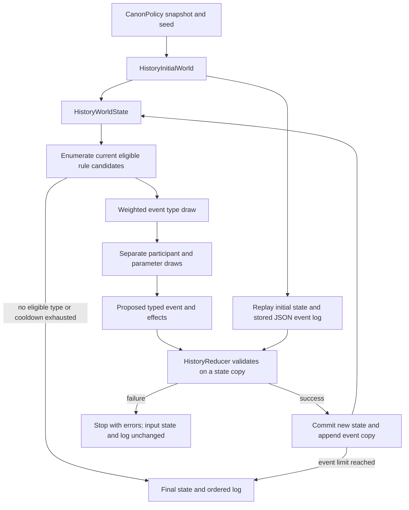
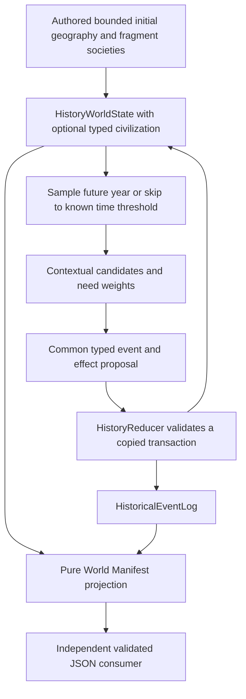

# History Generator v6 — Phase A and Phase B contracts

Phase A branch prototype `codex/history-generator-v6-core`, content `phase_a_3`.
The production default remains `HistoryGenerator.VERSION == 5`.



## Responsibilities and extension seam

Five core responsibilities: **WorldState, EventRule, EventSelector, Reducer,
EventLog**. Engine coordinates them; InitialWorld provides the bounded scenario.
That is seven behavioral concepts. `HistoryV6Event`, its `Effect`, and the four
entity row classes are typed records, not additional managers or inheritance layers.
Runtime: 14 GDScript files / 824 lines at first validated implementation.

Each rule directly extends `HistoryEventRule`, returns `Candidate` records, and
proposes an event without changing state. The selector reevaluates every rule at
every step. Inject a rule array into `HistoryEngine.generate`; adding a rule using
existing operations does not require engine/reducer changes. Shipping it in the
default set additionally changes the explicit registration list and content revision.
Adding a fundamentally new state capability requires a reviewed schema, reducer,
validation and replay change. Extensibility does not mean unrestricted fact writes.

## State and units

`HistoryWorldState` owns typed ID dictionaries for factions, populations, sites
and artifacts. It exposes independent `copy()`, `active_ids()`, `groups()`,
`residents()`, `contains()`, `errors()`, and canonical sorted JSON serialization.
Returned generated state is owned by the caller; it is not a global singleton.

- Faction: ID, political parent, active status, institutional split capacity,
  founding year. Parentage is political, never biological descent. The lineage
  is acyclic; active factions have population; retired factions do not.
- Population: persistent group ID, source ID, size, faction membership, site.
  Groups are indivisible in Phase A. Every source's total is exactly conserved.
  Two initial local human-derived sources do not introduce new species/lineages.
- Site: owner, `intact/damaged/ruined`, access, observed technology,
  understanding, operability. Site population denotes the surrounding locality,
  so people may remain outside an inaccessible ruined facility. No deaths,
  carrying capacity, geography or repaired technology are modeled.
- Artifact: owner, recorded site, `held/lost`, unknown Origin. Held custody needs
  a resident owning faction; loss removes custody but retains the last known
  physical site for later same-site recovery. Discovery is local recovery, not
  resolution of manufacture, maker or Origin.
- Relationships: canonical unordered faction-pair keys; -1/0/1 denotes
  hostility/neutrality/cooperation. Retired-faction relationships remain archival.
- `fact_events`: last writer of narrowly named objective facts, used only for
  explicit enabling references. This is provenance, not a second simulation cache.

Initial input: two factions, six groups of 20–45 people, five sites, two objects,
year 0. Three sites already have damaged inert remains. Population sizes use
per-group seed namespaces. There is no final-faction-count goal; the six indivisible
groups nevertheless impose an effective maximum of six active factions.

## Effects and transaction boundary

`Effect` fields are fixed: `(operation, subject, target, location, value, detail)`.
For relationship changes, `detail` records the previous -1/0/1 value as a string;
the reducer rejects it if stale, and `value` records the new value.
Unused nonempty fields are rejected. The enum supplies exactly eight operations:
create/retire faction, move population, set site owner, degrade site condition,
change relationship, move/lose artifact, spend institutional split capacity.
There is no arbitrary dictionary patch, DSL, message bus or generic entity factory.

`Reducer.apply(state, event, log)` validates incoming state, ID/time/reference/
enabling provenance, applies effects sequentially to a **new deep state copy**,
checks references/preconditions per operation, then validates final invariants and
capacity conservation. It returns a `Transition` containing either a new state or
errors. It never mutates the caller's state/log. A create/move/retire transaction
may be temporarily incomplete inside the copy; final state cannot contain orphaned
populations, owners or custodians. The engine stops on failure and never rerolls
or silently discards a rejected proposal. Only a successful transition is logged.

The log copies on append and read. JSON decoding checks exact fields, strings,
integer-valued numbers and effect tuple sizes. Replay decodes the stored log and
applies the **same reducer** to the independently recreated initial state. It
does not rerun event selection. Saved-game migration and hostile-code sandboxing
are not provided; GDScript underscore members are conventional encapsulation.

## Eligibility, selection and time

Default rule weights: split 0.4, migration 2, reoccupation 3, relationship 1,
incident 0.4, artifact transfer/loss 1. Each positive eligible type receives its
own exponential-race score `-log(U)/weight`; the minimum wins. The score is independent
of parameter count. Stable candidate keys are sorted before a separate uniform
participant draw. Rule weight must be finite and nonnegative; rule IDs are unique.

`SeedDeriver` streams separate `type/<rule>`, `participants/<rule>`,
`parameters/<rule>`, and time, qualified by seed, content version and step.
One type's candidate count/order does not consume another type's random draws.
An added ineligible rule or reordered entity/rule collection changes no output.
Adding an eligible rule can win the type race and cause legitimate downstream
state changes. There is no expression RNG because no narrative is generated.

One-step type cooldown forbids the immediately preceding type. If only that
type remains eligible, the run ends with `cooldown_exhausted`; there is no forced
replacement. An empty candidate universe ends with `no_eligible_rules`. Otherwise
the default budget is 36 events; every committed event advances year by 1–5.
This bounds work and prevents immediate repetition; it does **not** prevent
alternating relation/migration/custody cycles or solve long-horizon convergence.

## Rule conditions and real accumulation

| Rule | Condition | Objective transition |
| --- | --- | --- |
| Split | Active faction, at least two groups, positive institutional capacity | One child with surviving parent, or two children replacing parent; groups retain source/size, custody and ownership repaired transactionally |
| Migration | Existing group; different accessible destination | Group changes site; last custodian departure loses unattended object |
| Reoccupation | Unowned accessible site; resident active faction | Set use/ownership only; leave damage and technology unchanged |
| Relationship | Distinct active factions sharing a locality | Select a different -1/0/1 value; hostile residents may seize the shared site's use rights |
| Incident | Owned accessible site | Intact→damaged or damaged→ruined; abandon use, lose objects; ruined facilities remain inaccessible |
| Artifact | Held object or recoverable lost object; valid local custodian | Transfer/relocate, lose, or recover at recorded loss site; preserve unknown Origin |

## Canon and causality

Reuse only `CanonPolicy.snapshot()` and `SeedDeriver` from existing runtime.
No v4/v5 planner, compatibility migration, projection, claim or archaeology call
is made. CanonPolicy itself has legacy methods referencing older history classes;
v6 consumes its immutable snapshot and never invokes those methods. This is a
shared-policy source dependency, not a separately packaged standalone Godot project.

Exact Canon equality and the closed effect/state vocabulary prevent secret intent,
new lineages, successful off-world/Deep travel or unearned technology claims.
Understanding/operation remain false; observed inert remains never grant capacity.
Population Origin and artifact Origin cannot be rewritten by an operation.

`cause_ids` mean **explicit enabling/displacement provenance**, not inferred motives
or complete historical explanations. Examples: a resident group's recorded move
enables reoccupation; loss enables recovery; inaccessible incident site departure
records displacement; recorded creation enables later splitting of that faction.
The reducer requires earlier IDs and relevant enabling facts used by effects.
Ordinary relationship changes have no asserted motive. A group's earlier move is
not cited as a cause of later political secession; spending capacity does not
overwrite the faction's creation provenance. The immediately previous event is
never automatically attached. Observed multi-event sequences are reported separately
from explicit enabling edges.

## Reproduction

From this checkout, with Godot 4.7.2 on PATH:

```bash
godot --headless --editor --quit --path .
godot --headless --path . --script res://tests/test_history_v6.gd
godot --headless --path . --script res://tools/analyze_history_v6.gd -- --count=1000 --sample-seeds=1807263119,1521980171,1665175286,958857423,1977506391
godot --headless --path . --script res://tools/verify_history_v6_legacy.gd -- --check
bash tools/check_godot.sh
```

The repository's full-check script supplies its configured Windows Godot path
under WSL. The analyzer emits the event log and final state in `samples.json`,
readable histories in `samples.md`, and corpus statistics. Raw sample JSON is a
reproducible local artifact, excluded from Git; the ten readable histories and
the compact statistics are tracked. `HistoryReducer.replay(initial, log)` is the
independent reconstruction API. Both extension experiments remain test-only.

## Phase B: dynamic civilization (explicit opt-in)

`HistoryEngine.generate_civilization(seed, horizon=600, safety_limit=256)` uses
content `phase_b_1` on `codex/history-generator-v6-phase-b`, exactly based on M045
`c0f1f92`. `generate()` still defaults to the original Phase A experiment. Neither
path changes the production v5 default or calls v5 planners/topology/scaffolds.



### State and ownership

`HistoryCivilizationState` is a state record, not an additional generator. Its
nested typed rows and ID indexes are copied deeply by `HistoryWorldState.copy()`.
All writes run through the same `HistoryReducer`; the bounded civilization
operation helper implements domain validation, not scheduling or patches.

| Record | Meaning and invariants |
| --- | --- |
| Locality | Geographic population location, symmetric edges, capacity, debris hazard and entry/passages. Facility destruction does not erase a locality or its residents. |
| Site + Facility | Existing Site owns physical condition/access/owner and reserved technology flags. A matching typed Facility owns locality, authored kind, current local function, a real power dependency and finite inventory. |
| Population | Existing source/size/membership fields; `site_id` is a locality in Phase B. Partial division retains source and lineage; merging requires identical source, membership and locality. |
| Political provenance | Immutable creation parent plus formation predecessors; later absorbed contributors are separate, avoiding a false ancestry cycle when a parent reabsorbs a breakaway. |
| Project | Kind, initiator, current actor, site, goal, status, invested materials, actual attempt/outcome, dates and event references. Blockers are derived from the current physical/resource/crew state. |
| Scar | Actual source event, affected sites/locality, optional physically linked Project, current residue/hazard, recovery flag and later event references. |

Source accounting is `initial source mass = current groups + explicit losses`.
No membership, migration, split, absorption or repair changes biological Origin.
Retired population IDs cannot be recycled; their ancestry records remain archived.
The population quantities are a closed cohort abstraction, without birth rates,
aging or individual simulation; the millennial experiment is a stability stress
test, not a demographic forecast.

Initial conditions are 3–5 local fragments of a retired regional polity, 6–9
connected geographic localities, ordinary human facilities and observed inert
remains. A human-built Deep entry camp is present in some seeds; its crew comes
from an existing group. No initial Project or final faction-count target exists.
This bounded regional prototype does not model the whole planet's political map.

### Common effect families

The event format retains the fixed six-field Effect tuple and strict legacy
eight-field event schema. Phase B events have exactly eleven fields, adding
`reason`, `trigger_keys`, `association_ids`; the JSON decoder rejects surplus or
malformed fields. There is no dictionary patch, executable prose or DSL.

| Family | Operations and important gates |
| --- | --- |
| Population | Divide, compatible join, relocate/membership transfer, explicit loss. Moves require a real open edge; faction transfer requires succession or recorded cooperation. Migration candidates require improved safety/space and establishment time. |
| Politics | Existing create/spend/retire effects plus absorption and contextual custody. Splitting requires distributed communities and finite institutional capacity. Absorption requires shared geography and recorded cooperation; all groups/assets/sites redistribute. |
| Facilities | Build, acquire/abandon, damage, repair, repurpose, finite salvage, bounded outdoor gathering, actual record/sample transfer. Repair requires resources/local crew/custody and safe locality; ancient repairs are structural only. |
| Interaction | Shared maintenance performs an actual material-consuming repair. Disputes require a concrete owner, co-resident parties and crowding; takeover additionally requires the claimant's larger local population. No random relationship flip. |
| Project | Start, invest, pause/resume/abandon, change actor, physical attempt, resolve. Shared rules evaluate authored definitions, crew, function, access, stock, time and blockers. No mandatory project/stage sequence. |
| Scar | Observed impact, real dependency cascade, independent failed physical launch, recovery. Failed Ark attempts use the same persistent Scar record. No chronology-only cause or invented interceptor/operator intent. |

Local gathering represents bounded regional raw construction supplies, not ancient
technology or equipment. Storage is capped at six; the local labor/supply reserve
caps at eight and becomes available at one unit per forty years. Higher hazard
permits only one-unit collection. This prevents a zero-material recovery deadlock
without rebuilding the world after generation. Salvage and Scar residue are finite.
Structural repair never recreates destroyed equipment, genome samples or records.

Physical entry and functional use are separate queries. A standing entry building
does not reopen a closed descent; a standing launch/power facility without actual
equipment cannot operate. A dependent process needs its actual power supply.
Repurposing a former process as shelter releases its power dependency. Recoverable
inventory may remain physically accessible even when the old function is disabled.

The six new contextual rule families are population, facility, politics, Project,
Scar/incident and custody; the original six Phase A rules remain intact. Their
weights and weighted participant selection reflect actual needs. A one-event
cooldown is an additional scheduling aid, not the substantive reason for action.

### Authored Projects and Scars

| Project | Shared conditions | Bounded outcomes |
| --- | --- | --- |
| Genome Archive | Ordinary archive facility, actual genomic records/samples, crew, three invested material units, minimum 25 years | Preservation, partial records after sample loss, sustained obstruction/abandonment; no person resurrection/identity claims. |
| Deep Descent | Actual Innerworld entry, human survey camp/equipment, open passage, crew, four units, minimum 35 years | Limited field observations and crew return/loss; failure may close the passage. Survey records never become genomic records or a Deep conquest claim. |
| Ark | Local launch function, physical equipment/crew, six units, minimum 55 years | Actual attempt with failure or unknown external result; never stable orbit, confirmed escape or settlement. A failed physical attempt may damage the site and create Failed Exodus. |

Projects can outlive their initiator's custody, pause on loss, transfer to actual
new custodians, resume after obstruction changes, fail, complete locally or be
abandoned. Completed/failed/abandoned infrastructure can later become shelter;
the original Project retains its historical goal and outcome. Actual genomic
material can be distributed to other accessible, resident-controlled facilities.

Orbital Fall is independently observed descent/impact with unknown operator and
purpose. Infrastructure Cascade needs the authored local generator's actual
failure and a dependent facility; its effect includes physical damage and a route
closure. Failed Exodus needs an equipped launch facility, consumed resources and
actual failed attempt/loss, whether an Ark exists or not. Recovery removes actual
hazard, may gather residue and restore a cascade passage; it never erases history.

### Scheduling, reasons and provenance

The single engine samples a proposed event year on a defensive state view: 2–22
years ordinarily, with occasional 45–90-year gaps. Rules see that year's actual
time conditions; the reducer applies the event to the prior committed state at
the same year. When no candidate exists, it can skip to a known resource, Project,
maintenance or establishment threshold, with a bounded idle scan. It never logs
invented filler events. The final year is the last actual event, not automatically
the horizon. Horizon, quiescence and safety-cap exits are explicit and deterministic.

`cause_ids` remain relevant, earlier enabling facts checked against effects and
the log. `trigger_keys` record observed conditions without asserting a motive.
`association_ids` identify existing Projects without asserting causality. The
contextual `reason` is a rule's bounded decision explanation; it is neither a Claim
nor a Canon fact. Chronologically adjacent events are never automatically causes.

### World Manifest / independent consumer

`HistoryWorldManifest.build(result)` reads state/log only. It mutates neither and
creates no playable object, loot, map, Actor, UI or reward. The self-contained
JSON schema is `history_world_manifest/1` with exactly seventeen envelope fields:
schema/content_version/seed/year/canon; localities/facilities/factions/populations/
objects/projects/scars/events; relationships/source_totals/source_origins/losses.
Rows are named fixed-field records with exact shapes. Unknown schemas, bad types,
references, nonintegral numbers, impossible functions/assets, changed Canon,
future causes and conservation errors are rejected by the JSON reader.

The six ordered inventory kinds are materials, equipment, genomic_records,
samples, inert_salvage and survey_records. Historical existence is a monotone
ledger; known consumption/loss can leave actual quantity zero. Possible survival,
actual presence/quantity and current usable access remain separate fields. Lost
unknown objects are possible survivors, not confirmed current loot, and custody
never grants unknown-device operability. Historical provenance lists point to
the included event index; initial authored state is the explicit snapshot boundary.

`tools/consume_world_manifest.gd` demonstrates an independent JSON-only consumer:
it lists usable facilities and geographic regions without generating or replaying
history. Future gameplay must interpret access, custody and affordances itself.

### Phase B reproduction and evidence

```bash
godot --headless --path . --script tests/test_history_v6_civilization.gd
godot --headless --path . --script tools/analyze_history_v6_civilization.gd -- --count=1000 --samples
godot --headless --path . --script tools/analyze_history_v6_civilization.gd -- --count=100 --horizon=6000 --limit=1500
godot --headless --path . --script tools/consume_world_manifest.gd -- <world_sample.json>
bash tools/check_godot.sh
```

Use `--sample-seeds=<comma-separated sample_seeds.json values>` to reproduce the
same twenty random worlds. Seeds were drawn once with a nondeterministic review
RNG, recorded before sample export and retained through common-rule corrections.
Corpus generation, proposal RNG, timing, projection and replay remain deterministic.
See [Phase B review](../reviews/history_v6_phase_b/report.md) for measured results,
the twenty readable histories, architecture comparison and remaining limits.
