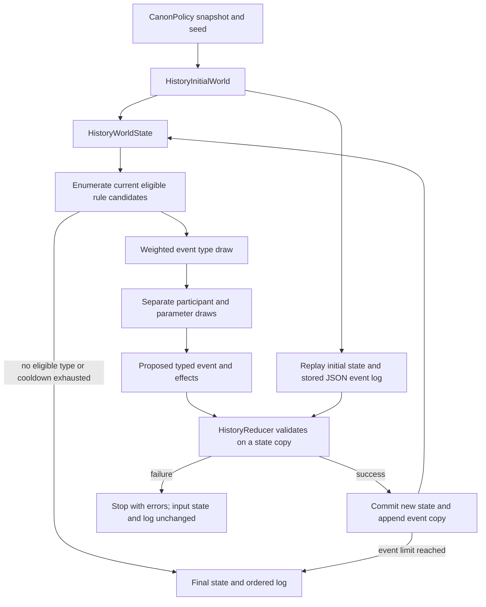

# History Generator v6 — Phase A contract

Branch prototype `codex/history-generator-v6-core`, content `phase_a_3`.
The production default remains `HistoryGenerator.VERSION == 5`.



## Responsibilities and extension seam

Five core responsibilities: **WorldState, EventRule, EventSelector, Reducer,
EventLog**. Engine coordinates them; InitialWorld provides the bounded scenario.
That is seven behavioral concepts. `HistoryV6Event`, its `Effect`, and the four
entity row classes are typed records, not additional managers or inheritance layers.
Runtime: 14 GDScript files / 824 lines at first validated implementation.

Each rule directly extends `HistoryEventRule`, returns `Candidate` records, and
proposes an event without changing state. The selector reevaluates every rule at
every step. Inject a rule array into `HistoryEngine.generate`; adding a rule using
existing operations does not require engine/reducer changes. Shipping it in the
default set additionally changes the explicit registration list and content revision.
Adding a fundamentally new state capability requires a reviewed schema, reducer,
validation and replay change. Extensibility does not mean unrestricted fact writes.

## State and units

`HistoryWorldState` owns typed ID dictionaries for factions, populations, sites
and artifacts. It exposes independent `copy()`, `active_ids()`, `groups()`,
`residents()`, `contains()`, `errors()`, and canonical sorted JSON serialization.
Returned generated state is owned by the caller; it is not a global singleton.

- Faction: ID, political parent, active status, institutional split capacity,
  founding year. Parentage is political, never biological descent. The lineage
  is acyclic; active factions have population; retired factions do not.
- Population: persistent group ID, source ID, size, faction membership, site.
  Groups are indivisible in Phase A. Every source's total is exactly conserved.
  Two initial local human-derived sources do not introduce new species/lineages.
- Site: owner, `intact/damaged/ruined`, access, observed technology,
  understanding, operability. Site population denotes the surrounding locality,
  so people may remain outside an inaccessible ruined facility. No deaths,
  carrying capacity, geography or repaired technology are modeled.
- Artifact: owner, recorded site, `held/lost`, unknown Origin. Held custody needs
  a resident owning faction; loss removes custody but retains the last known
  physical site for later same-site recovery. Discovery is local recovery, not
  resolution of manufacture, maker or Origin.
- Relationships: canonical unordered faction-pair keys; -1/0/1 denotes
  hostility/neutrality/cooperation. Retired-faction relationships remain archival.
- `fact_events`: last writer of narrowly named objective facts, used only for
  explicit enabling references. This is provenance, not a second simulation cache.

Initial input: two factions, six groups of 20–45 people, five sites, two objects,
year 0. Three sites already have damaged inert remains. Population sizes use
per-group seed namespaces. There is no final-faction-count goal; the six indivisible
groups nevertheless impose an effective maximum of six active factions.

## Effects and transaction boundary

`Effect` fields are fixed: `(operation, subject, target, location, value, detail)`.
For relationship changes, `detail` records the previous -1/0/1 value as a string;
the reducer rejects it if stale, and `value` records the new value.
Unused nonempty fields are rejected. The enum supplies exactly eight operations:
create/retire faction, move population, set site owner, degrade site condition,
change relationship, move/lose artifact, spend institutional split capacity.
There is no arbitrary dictionary patch, DSL, message bus or generic entity factory.

`Reducer.apply(state, event, log)` validates incoming state, ID/time/reference/
enabling provenance, applies effects sequentially to a **new deep state copy**,
checks references/preconditions per operation, then validates final invariants and
capacity conservation. It returns a `Transition` containing either a new state or
errors. It never mutates the caller's state/log. A create/move/retire transaction
may be temporarily incomplete inside the copy; final state cannot contain orphaned
populations, owners or custodians. The engine stops on failure and never rerolls
or silently discards a rejected proposal. Only a successful transition is logged.

The log copies on append and read. JSON decoding checks exact fields, strings,
integer-valued numbers and effect tuple sizes. Replay decodes the stored log and
applies the **same reducer** to the independently recreated initial state. It
does not rerun event selection. Saved-game migration and hostile-code sandboxing
are not provided; GDScript underscore members are conventional encapsulation.

## Eligibility, selection and time

Default rule weights: split 0.4, migration 2, reoccupation 3, relationship 1,
incident 0.4, artifact transfer/loss 1. Each positive eligible type receives its
own exponential-race score `-log(U)/weight`; the minimum wins. The score is independent
of parameter count. Stable candidate keys are sorted before a separate uniform
participant draw. Rule weight must be finite and nonnegative; rule IDs are unique.

`SeedDeriver` streams separate `type/<rule>`, `participants/<rule>`,
`parameters/<rule>`, and time, qualified by seed, content version and step.
One type's candidate count/order does not consume another type's random draws.
An added ineligible rule or reordered entity/rule collection changes no output.
Adding an eligible rule can win the type race and cause legitimate downstream
state changes. There is no expression RNG because no narrative is generated.

One-step type cooldown forbids the immediately preceding type. If only that
type remains eligible, the run ends with `cooldown_exhausted`; there is no forced
replacement. An empty candidate universe ends with `no_eligible_rules`. Otherwise
the default budget is 36 events; every committed event advances year by 1–5.
This bounds work and prevents immediate repetition; it does **not** prevent
alternating relation/migration/custody cycles or solve long-horizon convergence.

## Rule conditions and real accumulation

| Rule | Condition | Objective transition |
| --- | --- | --- |
| Split | Active faction, at least two groups, positive institutional capacity | One child with surviving parent, or two children replacing parent; groups retain source/size, custody and ownership repaired transactionally |
| Migration | Existing group; different accessible destination | Group changes site; last custodian departure loses unattended object |
| Reoccupation | Unowned accessible site; resident active faction | Set use/ownership only; leave damage and technology unchanged |
| Relationship | Distinct active factions sharing a locality | Select a different -1/0/1 value; hostile residents may seize the shared site's use rights |
| Incident | Owned accessible site | Intact→damaged or damaged→ruined; abandon use, lose objects; ruined facilities remain inaccessible |
| Artifact | Held object or recoverable lost object; valid local custodian | Transfer/relocate, lose, or recover at recorded loss site; preserve unknown Origin |

## Canon and causality

Reuse only `CanonPolicy.snapshot()` and `SeedDeriver` from existing runtime.
No v4/v5 planner, compatibility migration, projection, claim or archaeology call
is made. CanonPolicy itself has legacy methods referencing older history classes;
v6 consumes its immutable snapshot and never invokes those methods. This is a
shared-policy source dependency, not a separately packaged standalone Godot project.

Exact Canon equality and the closed effect/state vocabulary prevent secret intent,
new lineages, successful off-world/Deep travel or unearned technology claims.
Understanding/operation remain false; observed inert remains never grant capacity.
Population Origin and artifact Origin cannot be rewritten by an operation.

`cause_ids` mean **explicit enabling/displacement provenance**, not inferred motives
or complete historical explanations. Examples: a resident group's recorded move
enables reoccupation; loss enables recovery; inaccessible incident site departure
records displacement; recorded creation enables later splitting of that faction.
The reducer requires earlier IDs and relevant enabling facts used by effects.
Ordinary relationship changes have no asserted motive. A group's earlier move is
not cited as a cause of later political secession; spending capacity does not
overwrite the faction's creation provenance. The immediately previous event is
never automatically attached. Observed multi-event sequences are reported separately
from explicit enabling edges.

## Reproduction

From this checkout, with Godot 4.7.2 on PATH:

```bash
godot --headless --editor --quit --path .
godot --headless --path . --script res://tests/test_history_v6.gd
godot --headless --path . --script res://tools/analyze_history_v6.gd -- --count=1000 --sample-seeds=1807263119,1521980171,1665175286,958857423,1977506391
godot --headless --path . --script res://tools/verify_history_v6_legacy.gd -- --check
bash tools/check_godot.sh
```

The repository's full-check script supplies its configured Windows Godot path
under WSL. The analyzer emits the event log and final state in `samples.json`,
readable histories in `samples.md`, and corpus statistics. Raw sample JSON is a
reproducible local artifact, excluded from Git; the ten readable histories and
the compact statistics are tracked. `HistoryReducer.replay(initial, log)` is the
independent reconstruction API. Both extension experiments remain test-only.
