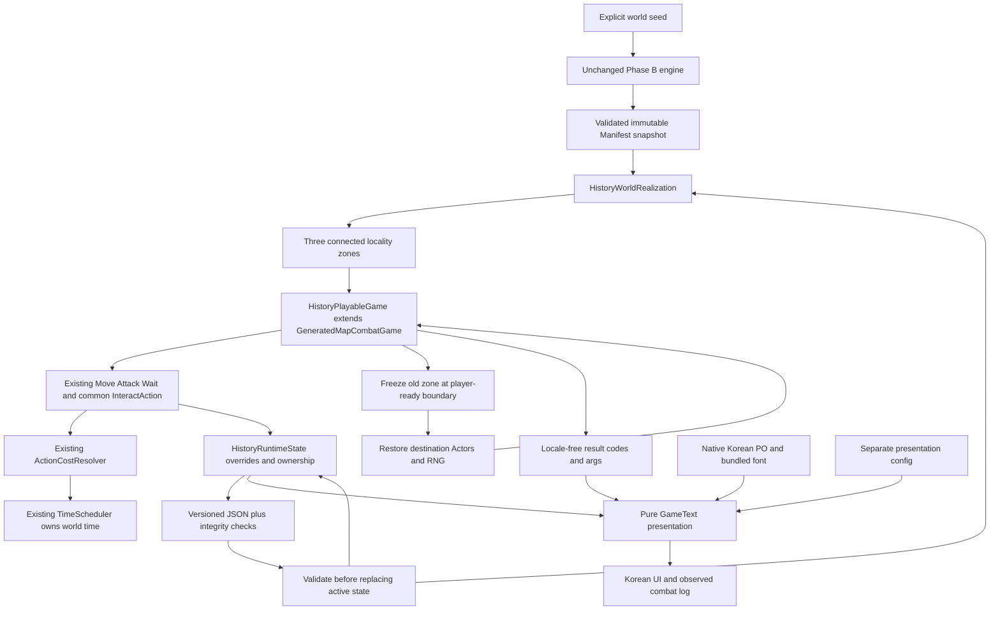

# History v6 Phase C — Playable World and Save Contract

M048 task branch `codex/history-v6-phase-c-playable-world`, exact Phase B base
`12f48ba`. Explicit scene opt-in; F5's production default remains the existing
generated combat playground. This consumer does not modify historical generation.



## Responsibilities and immutable boundary

- `HistoryWorldRealization`: defensive Manifest snapshot, normalized integrity
  hash, connected subgraph selection, deterministic terrain/placement and zone data.
- `HistoryRuntimeState`: current zone, object overrides, inventory, unique owners,
  acquired knowledge, custody violations, frozen Actors, RNG and committed times.
- `WorldActorState`: codec for the existing Actor's mutable abilities, absolute
  damage/death, body part health, weapon, effects/provenance and AI caution state.
- `HistoryPlayableGame`: small orchestration adapter over existing generated-map
  combat. It does not replace attack/body rules, AI policy, cost arithmetic or clock.
- `history_world_playground.tscn`: input and presentation only.

History is generated once when explicitly creating a new world. Load consumes the
embedded Manifest and rebuilds initial geometry; it never calls HistoryEngine or
changes an Event Log. Initial terrain/objects are read-only. Current objects are
baseline records plus runtime overrides. Active Actors live in the inherited
registry; frozen Actors live in runtime snapshots. Saving makes a checkpoint of
the active registry, not another simulation owner.

## Placement contract

The first currently confirmed unknown object's locality is preferred as the start
(otherwise the first locality). Stable BFS selects three actual connected nodes;
fewer than three or malformed/asymmetric edges fail explicitly. Reciprocal exit
objects use the original graph, with no invented connections. IDs are locality
IDs today; facility Site content is held separately so multi-zone expansion does
not require turning Site into a mandatory map-grid layer.

Each zone uses 40 columns and at least 25 rows (more rows for extra facility slots).
This is prototype presentation size, not a final world-map decision. Terrain uses
`SimpleMapGenerator.generate_environment()` and its existing forest/path streams,
without the generic historical `R` stamp. Original `generate()` remains unchanged.
Namespaces: `[history_zone/1, locality_id, terrain]` and a separate combat namespace.

Facility slots use stable facility-ID order: intact enclosed rooms and a real
door; damaged enclosed rooms with removable rubble; ruined broken wall shells,
rubble and lost original functions. Actual assets retain their quantities and
stable IDs, including unusable but physically recoverable material. All six stock
categories remain separate. Only `actually_present` unknown objects become loot;
all remain inert, with unknown origin/function.

Phase B marks a ruin inaccessible to its former function. Phase C permits limited
exploration of its broken shell and manual structural intervention, without
changing that historical fact. An inaccessible intact/damaged structure instead
has an explicit sealed entry and inaccessible interior objects; no automatic
opening or ordinary repair grants access to that intentional closure.

Current locality hazard supplies actual damaging cells. Unrecovered Scar traces
can explain those cells, but cannot reinstate a hazard removed by later history.
Orbital traces can breach damaged/ruined walls; cascade conditions constrain
passage/function/dependencies; actual failed-exodus launch structures and existing
stocks remain exploreable. Scar residue never creates duplicate salvage stock.
An active Project's work area blocks a cell and reserves facility use; a paused
Project's work area is traversable. Completed works remain represented by the
current facility/stock and optional surviving records, not a new dungeon.

Safe ordinary travel paths are environmental realization, not authored historic
cities. Current unsafe locality passages have a visible barrier; traversal to
another locality is denied until that barrier is cleared with one material unit.

## Shared Action and interaction contract

`InteractAction(cell, operation)` calls `interaction_unavailable_reason` then
`execute_interaction`. TimeCostGame's default implementation is its original
door toggle; old room and Rat door behavior remain valid. Phase C supplies object
implementations under the same `perform_action`, resolver, event and Scheduler.

| Verb | Base time | Actual condition/result |
| --- | --- | --- |
| interact | 500 | Cardinal adjacent door; occupied closure denied; toggle passability |
| recover | 500 | Actual resource/unique presence; remove source, transfer exact stock/owner |
| inspect | 500 | Observe on-site target; surviving physical record adds knowledge |
| clear | 1,500 | Rubble costs labor only; regional route also consumes one material |
| repair | 2,000 | One material; ruined→damaged→intact ordinary structure, no asset regeneration |
| stabilize | 1,500 | One material + optional actual on-site record; remove this facility's current footing hazard |
| use | 500 | Safe functioning shelter, permission, no active reserved work; once per shelter, heal up to four HP |
| offer | 500 | Real recovered materials settle one current custody violation |
| travel | 2,000 | Actual exit, open current passage, reciprocal unoccupied destination |

Structural repair changes current condition/function availability; it does not
rebuild every broken wall tile. Door/rubble/route interventions own the supported
physical passability changes in this slice.

Cost modifiers and body requirements come through existing Actor/TimeAction
queries. Structural/material verbs require a functional manipulation hand; inspect
does not. Invalid actions return an explanation and spend no time. Movement remains
eight-way with 1,000/1,400 healthy base costs, existing corner restrictions and
Actor collisions. Entering a current hazard damages the existing Actor HP model.
Rat encounters use authored Rat definitions/AI, never a population-count conversion
or a presumption that all historical people are hostile.

Recovery from a currently managed facility is knowingly unauthorized in this small
slice. Its present owner then denies managed doors/shelter use. Contributing one
material settles one violation, or two for an owner currently needing survival or
Project maintenance. Existing political relationships are retained as historical
context, not interpreted as personal player hostility. No diplomacy/social AI is
claimed. Current unknown machinery never becomes operable through generic repair.

## Zone handoff and one clock

The existing Scheduler owns canonical microtime. Travel first executes as an
ordinary scheduled player action; source-zone NPCs finish responses before the
player's next ready boundary. Then capture source Actors, remaining ready delays,
combat RNG and committed time, unregister source NPCs, and activate the destination.
The player Actor persists; the same scheduler clock continues. Frozen NPC ready
delays pause, rather than replaying missed tactical turns. On entry, delays are
relative to current world time and stable registration order retains NPC ties.

Only the active registry runs AI. Inactive state has no background combat, economy,
population evolution or resource regrowth in this slice. Vegetation is a renewable
environmental baseline but has no harvest verb yet; all manifested historical
stocks and unique entities have persistent non-renewing recovery records.

## Save schema and validation

`history_play_save/1` has 18 envelope fields: schema, seed, history_version,
generation_version, manifest_hash, manifest, world_time, player, current_zone,
overrides, unique_owners, inventory, knowledge, offenses, actors, rng_states,
last_updates and checksum. Generation version is `history_zone/1`; history is
the unchanged `phase_b_1`. JSON-normalized numbers prevent int/float roundtrip
hash drift. The checksum covers all other fields; the Manifest has a separate hash.
These detect corruption, not hostile-save authentication.

Validate shape/version/hash/Canon and Manifest first, then regenerate initial zones,
validate IDs, bounded quantity types, Actor prototypes/positions/overlap, persistent
Actor completeness, override fields, current clock/location and unique ownership.
Every unique instance has exactly one original zone-object or player holder;
its taken override must agree. Apply decoded state only after all validation passes.
Player abilities, body injuries, damage/death, equipped catalog weapon, active
effects and their sources, NPC AI caution and combat RNG persist.

Save is allowed at a completed player turn or terminal defeat, with no pending
transition. Defeat retains any remaining player-ready delay and never revives on
load. Write a
temporary file, flush/check it, then rename to the destination; failure returns an
error. Load failures preserve the active world. No migration from future or unknown
schemas is silently attempted. Save tile arrays are unnecessary: deterministic
baseline plus current overrides reconstructs them.

## Reproduction

```bash
godot --path . scenes/debug/history_world_playground.tscn
godot --headless --path . --script tests/test_history_playable_world.gd
godot --headless --path . --script tools/analyze_history_playable_world.gd -- --count=500
godot --path . --rendering-method gl_compatibility --script tools/capture_history_world.gd
bash tools/check_godot.sh
```

Exact Phase A/B/Manifest baselines were captured through their production API on
the previous Phase B checkout, whose code tree matches `12f48ba`, using
`tools/capture_history_phase_c_baseline.gd`. Do not recapture fixtures merely to
hide regressions. Corpus reports distinguish structural BFS (doors/rubble may be
opened/cleared) from scheduled scenario play and actual rendered input dispatch.
Measured results, controls and manual checklist: [report](../reviews/history_v6_phase_c/report.md).

## M048 localization follow-up

Task branch `codex/m048-korean-playtest-localization`, base 4856655: the same ordered predicates return structured interaction_failure. The legacy wrapper renders English diagnostics; no condition reads translated text. Transient notice is not saved. Interaction events retain result and add locale-free result_code, result_args, custody flags.

GameText consumes current objects and learned-only evidence; LocalizedCharacterText consumes existing queries. WorldActorState and RuntimeSave schemas are unchanged. Locale switching, real body combat, effects and complete saves/raw events are compared across en/ko. Invalid-save user text is localized while original decoder diagnostics remain in F3.

ConfigFile preferences are outside the world save. Native locale notifications refresh UI. No language menu. Current entities have no GeneratedName; stable ordinal labels are display placeholders. Actual canonical names delegate to M035 only when supplied.
