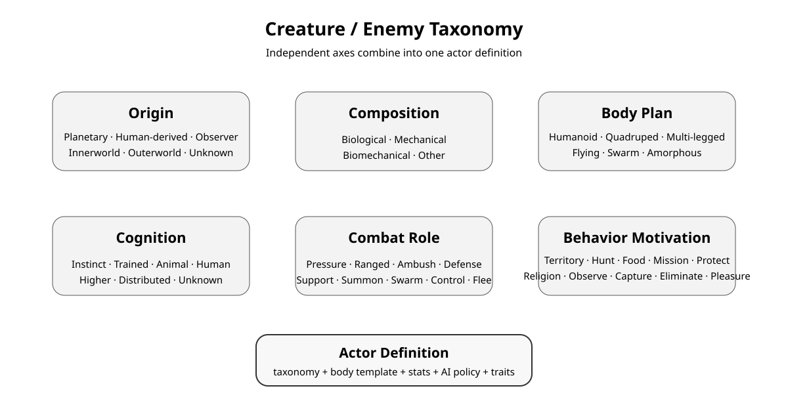

+++
status = "설계"
areas = ["전투", "AI"]
type = "데이터 모델"
systems = "몬스터 데이터 / 신체 템플릿 / 전술 AI"
milestones = ""
code_paths = ["docs/datasets/monsters.json", "tools/sync_notion_knowledge.py"]
diagram = "docs/diagrams/monster_taxonomy.svg"
+++
# 생명체 · 적 분류 체계

## 목적

몬스터를 하나의 단일 분류로 고정하지 않고, 서로 독립적인 축을 조합해 세계관·신체 시스템·전술 AI를 함께 표현한다.

## 1. 기원 · Origin

- **행성 / Planetary** — 행성 자체에 기원을 둔 존재.
- **인간 계통 / Human-derived** — 인간 원형에서 유래한 계통과 그 제작·개조 계열.
- **관찰자 / Observer** — 관찰자 문명에서 유래한 유산. 현재 살아 있는 관찰자 문명을 뜻하지 않는다.
- **심층 / Innerworld** — 미지 지저권에서 기원한 존재.
- **외우주 / Outerworld** — 행성 밖에서 유입된 존재. Observer와 별도 기원.
- **불명 / Unknown** — 기원을 특정할 수 없음.

M038과 함께 canonical vocabulary를 위 여섯 값으로 통일한다. 기존 Native / Human-made /
Observer Legacy는 각각 Planetary / Human-derived / Observer로 대응하며, Composite는
별도 Origin이 아니다. 여러 기원은 multi-origin profile로 보존한다. 정치적 합병·형성 사건은
생물학적 기원과 다르다. 몬스터의 현재 단일 Origin 속성은 미확정 null을 유지하며, population
profile은 복수값이다. 데이터의 알려지지 않은 기원을 문서 변경만으로 채우지 않는다.
파생은 Origin에서 제외한다. 장기간 자생화, 자기개조, 계통 분화처럼 원형에서 멀어진 정도는 향후 Trait로 표현한다.

## 2. 구성 · Composition

- 생체
- 기계
- 생체기계
- 기타

## 3. 신체 구조 · Body Plan

- 인간형
- 인간형(변형)
- 4족보행형
- 4족보행형(변형)
- 다족
- 비행
- 군집
- 비정형

신체 구조는 가능한 한 신체 템플릿에서 파생하며 기존 신체 부위 시스템과 연결한다.

## 4. 지능 · Cognition

- 본능형
- 훈련형
- 동물지능
- 인간급
- 고등지능
- 분산지능
- 미상

## 5. 전투 역할 · Combat Role

근접 압박 / 원거리 / 기습 / 방어 / 지원 / 소환 / 군집 / 제어 / 도주형 등을 사용한다.

하나의 개체가 여러 역할을 가질 수 있으므로 multi-select 성격의 데이터로 취급한다.

## 6. 행동 동기 · Behavior Motivation

영역 방어 / 사냥 / 먹이 / 임무 수행 / 개체 보호 / 집단 보호 / 종교적 행동 / 관찰 / 포획 / 제거 / **쾌락** 등을 사용한다.

행동 동기는 전술 AI의 선택 이유와 연결될 수 있으며, 플레이어가 로그·움직임·대사·행동 패턴을 통해 이유를 추론할 수 있어야 한다.

## 분리 원칙

- 조정·보존은 **기원**이 아니라 제작·개입의 **목적**이다.
- 실험은 기원이 아니라 **형성 이력**이다.
- 야생화·자기개조·계통 분화는 기원이 아니라 향후 **Trait** 후보다.
- 게임 내 인물의 통칭과 개발자 데이터의 실제 분류는 반드시 같을 필요가 없다.
- 아직 확정되지 않은 taxonomy 값은 임의로 채우지 않고 null 또는 빈 배열로 둔다.

## 세계관 용어

- **심층 / Innerworld** — 일정 심도 이하의 미지 지저권을 가리키는 공식/설정 용어.
- **the Deep** — 일반인·광부·탐험가 등이 심층을 부르는 현장 용어.
- **외우주 / Outerworld** — 행성 바깥의 외우주 영역.
- **관찰자 / the Observers** — 고대 성간 문명을 가리키는 개발상 편의명이며 일부 학자의 현대 분류명. 실제 자칭은 미정이고 일반 주민의 보편어가 아니다.
- 지저/외우주 존재 전체를 가리키는 별도 현장 속칭은 아직 미정이다.

## Notion 데이터 구조

몬스터 데이터는 다음 속성을 별도 축으로 가진다.

- 신체 구조: select
- 기원: select
- 구성: select
- 지능: select
- 전투 역할: multi-select
- 행동 동기: multi-select

기존 분류 필드는 신체 구조 역할을 하고 있으므로 과도기 동안 유지한 뒤, Git→Notion 동기화가 새 신체 구조 속성으로 전환된 이후 제거한다.
