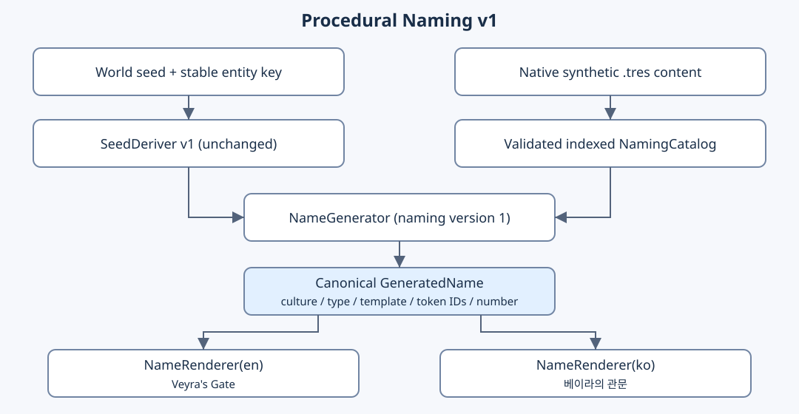
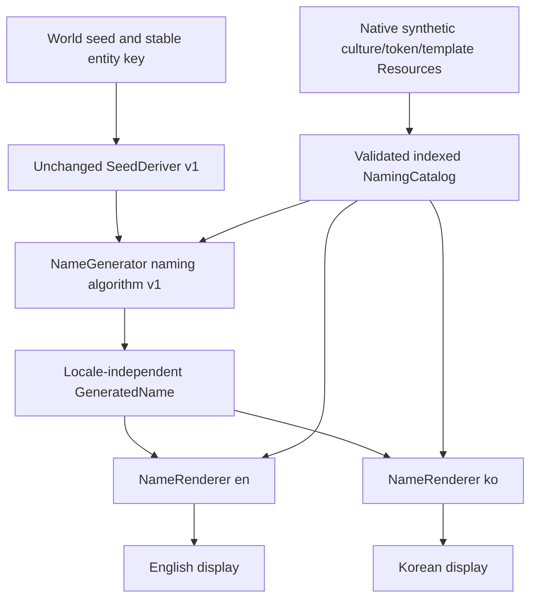
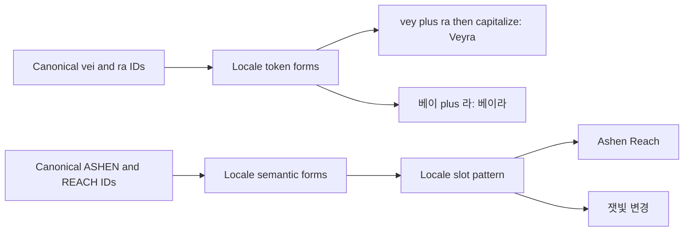

+++
status = "구현 완료"
areas = ["코어", "월드 생성"]
type = "데이터 모델"
systems = "NamingCatalog / NameGenerator / GeneratedName / NameRenderer"
milestones = "M035 — codex/procedural-naming-v1; not merged main"
code_paths = ["game/naming/name_generator.gd", "game/naming/generated_name.gd", "game/naming/name_renderer.gd", "game/naming/naming_catalog.gd", "content/naming/catalog.tres"]
diagram = "docs/diagrams/procedural_naming.svg"
+++
# Procedural Naming v1





## Canonical schema and API

```gdscript
var catalog := NamingCatalog.default_catalog()
var generator := NameGenerator.new(catalog)
var renderer := NameRenderer.new(catalog)
var generated := generator.generate(74, "npc/sector-3/entity-7", "prototype_surface", "person")
if generated != null:
    var english := renderer.render(generated, "en")
    var korean := renderer.render(generated, "ko")
    var serializable := generated.to_dict()
    var restored := GeneratedName.from_dict(serializable)
    assert(renderer.validation_errors(restored).is_empty())
else:
    print(generator.last_error)
```

One concrete canonical shape (no display string):

```json
{
  "naming_version": 1,
  "culture_id": "prototype_surface",
  "name_type": "mixed_possessive",
  "template_id": "possessive_feature",
  "components": {
    "proper": {"kind": "phonetic", "tokens": ["vei", "ra"]},
    "feature": {"kind": "semantic", "tokens": ["GATE"]}
  }
}
```

`to_dict()` deeply copies components; `from_dict()` structurally restores them
and normalizes integral JSON numbers in 0..2147483646 to ints. Renderer validation
is still required. ResourceSaver/ResourceLoader also serialize GeneratedName.
`canonical_key()` is sorted-key JSON of this data, suitable for blocked input
and test comparisons, not a globally unique NPC ID. Token array order is semantic.
World seed and entity identity remain the caller's inputs rather than display state.

## Phonetic and semantic pipelines



All these examples are explicit canonical fixtures, not promises that arbitrary
seeds select them and not finalized lore:

| Template / name type | Canonical components | EN | KO |
| --- | --- | --- | --- |
| proper_two / person or settlement | proper: phonetic `[vei, ra]` | Veyra | 베이라 |
| semantic_place / semantic_location | adjective: ASHEN; feature: REACH | Ashen Reach | 잿빛 변경 |
| semantic_place / semantic_location | adjective: RED; feature: WELL | Red Well | 붉은 우물 |
| mixed_place / mixed_location | proper: `[vei, ra]`; feature: GATE | Veyra Gate | 베이라 관문 |
| possessive_feature / mixed_possessive | proper: `[vei, ra]`; feature: GATE | Veyra's Gate | 베이라의 관문 |
| numbered_facility / facility | domain: BIOLOGICAL; purpose: PRESERVATION; feature: ARRAY; number: integer 74 | Biological Preservation Array 74 | 생물 보존 배열체 74 |

Construct the fixture through the public representation:

```gdscript
var fixture := GeneratedName.new()
fixture.culture_id = "prototype_surface"
fixture.name_type = "mixed_possessive"
fixture.template_id = "possessive_feature"
fixture.components = {
    "proper": {"kind": "phonetic", "tokens": ["vei", "ra"]},
    "feature": {"kind": "semantic", "tokens": ["GATE"]},
}
assert(NameRenderer.new().render(fixture, "en") == "Veyra's Gate")
assert(NameRenderer.new().render(fixture, "ko") == "베이라의 관문")
```

`prototype_surface` selects two/three-component proper names for person/settlement,
four adjectives × five features for semantic locations and proper + feature
for plain/possessive mixed locations. `administrator` selects Biological +
Preservation + Array/Annex/Node + integer 1..9999. Both cultures are prototype=true.
Templates are uniformly selected in authored culture order; each pool selection
is uniform. Phonetic pools have 12 initial/core choices and 12 ending choices.
Semantic forms include title case in their English data; phonetic English uppercases
the first character without changing internal spelling. Korean forms concatenate
directly. Templates add spaces/possessives/order independently per locale.

## Seed contract

For attempt `a`:

```text
base = ["naming-v1", "1", culture_id, entity_key, name_type, "attempt", str(a)]
template seed = SeedDeriver.derive(world_seed, base + ["template"])
token seed = SeedDeriver.derive(world_seed,
    base + [template_id, "slot", slot_id, "token", str(component_index)])
number seed = SeedDeriver.derive(world_seed,
    base + [template_id, "slot", slot_id, "number"])
```

Each seed initializes a private RandomNumberGenerator and performs one choice.
No stream is stored globally or shared with terrain/other entities. Existing
SeedDeriver folding/limitations and goldens remain unchanged. Determinism means
same inputs **and same algorithm/content**. No probability/selection sorting occurs.
Slot-ID streams preserve other slots when an unrelated slot is added/reordered;
pool indices remain part of a phonetic slot's ordered grammar.

## Reserved names, failures and performance

```gdscript
var name := NameGenerator.new().generate(74, "gate/7", "prototype_surface", "mixed_possessive", {
    "max_attempts": 8,
    "blocked_canonical_keys": [fixture.canonical_key()],
    "blocked_display_names": {"en": ["Veyra's Gate"], "ko": ["베이라의 관문"]},
})
```

Catalog `reserved_canonical_keys` and `reserved_display_names` are unioned with
these inputs. Compare exact canonical keys, or trimmed/lowercased display strings
in each supported locale; attempt indices make rerolls reproducible. Return null
on invalid inputs/catalog or exhaustion (default 8, hard bound 32), with
`last_error` and `last_attempt_count`. Rendering failures return `""` plus last_error.
No fallbacks, infinite retries or registry. Rendering validates canonical shape,
pool membership, version, culture/type/template, supported locale and numeric range.
Every rendered name must be nonempty. All authored patterns reference every slot
exactly once. Placeholder substitution cannot evaluate code or read files.

Catalog load/validation/index construction occurs once for the default instance.
No network or per-render file loading; indexed lookup avoids token/catalog scans.
Definitions are copied for API ownership; components and new local RNGs are small,
bounded allocations. No complex caching, global sorting or quality scoring.

## Verification and compatibility boundaries

`tests/test_procedural_naming.gd` covers pure locale rendering, all fixtures,
dictionary/JSON/native Resource roundtrips, SeedDeriver substreams, actual unrelated
map generation/RNG calls, stable slot additions/reordering, catalog isolation,
data-only third locale, malformed content/canonical/options, numeric failures,
reserved-result rerolls and bounded exhaustion. Six types × 1000 fixed seeds
check nonempty/valid unchanged canonical names and diagnostic variation. Tiny
semantic vocabulary intentionally has only 20 results; no global uniqueness or
linguistic/lore quality claim. `tools/preview_names.gd` prints 18 fixed-seed pairs.

Future saves should store canonical data or pin naming version and exact content.
Old token IDs/templates must remain available or be explicitly migrated. Full
save compatibility, linguistic quality, Inspector/manual/exported-package checks,
UI localization and runtime game integration are not covered by this milestone.
See [decision](../decisions/procedural_naming.md) and [M035](../milestones/M035_procedural_naming_v1.md).
