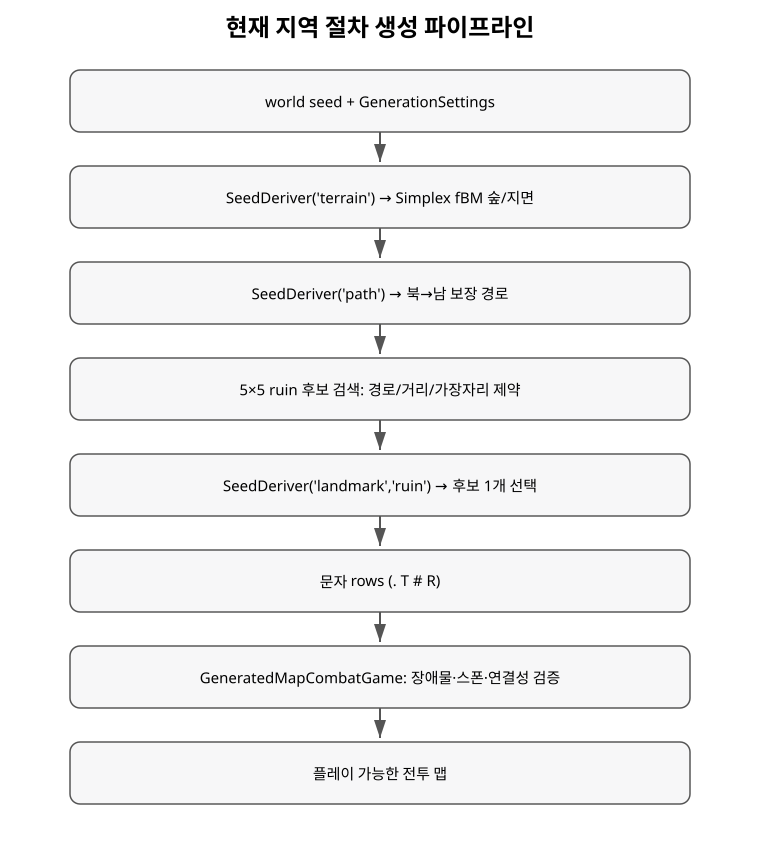

+++
status = "구현 완료"
areas = ["월드 생성"]
type = "파이프라인"
systems = "SimpleMapGenerator / SeedDeriver / GeneratedMapCombatGame"
milestones = "M003–M009, M016"
code_paths = ["procgen/simple_map_generator.gd", "procgen/seed_deriver.gd", "procgen/generation_settings.gd", "time_cost/generated_map_combat_game.gd"]
diagram = "docs/diagrams/procgen_pipeline.svg"
+++
# 현재 지역 절차 생성 파이프라인 상세

## 범위

현재 main의 local map 생성기를 설명한다. 별도 브랜치의 worldgen-v2는 아직 main이 아니다.

## Seed namespace

하나의 world seed에서 `SeedDeriver.derive(seed, parts)`로 terrain, path, landmark RNG를 분리한다. 현재 알고리즘 버전은 1이며 terrain RNG 소비 변화가 ruin 선택 RNG를 직접 밀어내지 않는 구조다.

## Base terrain

FastNoiseLite Simplex Smooth + fBM을 쓴다. 기본값은 40×30, forest threshold 0.08, frequency 0.09, octave 3이다. noise > threshold면 Tree(T), 아니면 Ground(.)다.

## 북→남 보장 경로

path namespace RNG가 시작 x와 목표 x를 고른다. 각 row에서 목표까지 남은 거리와 남은 row 수를 비교해 필요하면 강제로 목표 쪽으로 한 칸 이동하고, 아니면 기본 0.45 확률로 -1/0/+1 wander를 한다. 이전 x와 새 x 사이를 모두 Path(#)로 carve하며 마지막 row에서 목표 x까지 연결한다.

## Ruin

고정 5×5 stamp의 모든 origin을 검사한다. 경로를 덮으면 제외하고, edge margin 3과 가장 가까운 Path까지 거리 3..8을 만족하는 후보만 남긴다. `["landmark","ruin"]` sub-seed로 후보 하나를 결정론적으로 선택한다.

## 플레이 맵 변환

Tree/Ruin은 blocking, Ground/Path는 통과 가능이다. GeneratedMapCombatGame은 player와 첫 NPC spawn의 cardinal BFS 연결성을 검증하고, 추가 NPC는 상대 spawn에서 deterministic cardinal BFS 순으로 distinct cell을 사용한다.

## 현재 한계

전역 geography, biome/climate, river, region→zone 경계, persistence, generator migration은 이 local generator의 범위 밖이다.
