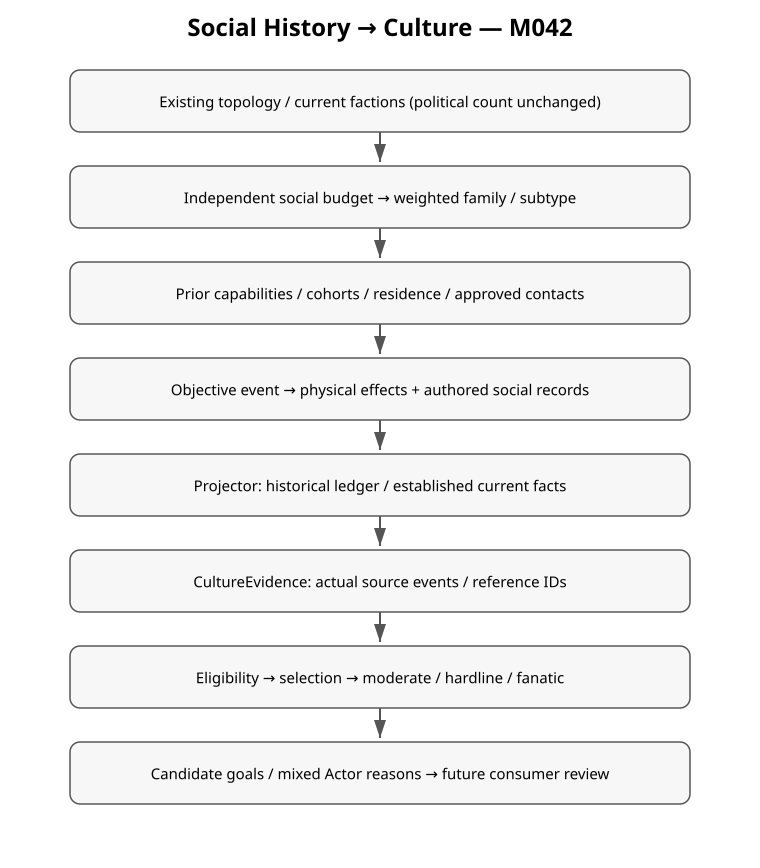

+++
status = "구현 완료"
areas = ["코어", "월드 생성"]
type = "알고리즘 / 데이터 모델"
systems = "SocialIncidentCatalog / SocialIncidentPlanner / SocialIncidentValidator / HistoryProjector / CultureEvidence"
milestones = "M042 — codex/history-social-incidents-v1; 5000 histories / 29 source reviews / full37 scripts PASS; main 미병합"
code_paths = ["content/history/social_incidents_v1.json", "content/history/social_contacts_v1.json", "game/history/social_incident_catalog.gd", "game/history/social_incident_planner.gd", "game/history/social_incident_validator.gd", "game/history/culture_evidence.gd", "tools/analyze_social_incidents.gd"]
diagram = "docs/diagrams/social_historical_incidents.svg"
+++
# Social & Cultural Historical Incidents v1 — M042



Canon constrains what can be true. History generation decides what happened.
Cultures decide what it means. Simulation decides what happens next.

## Pipeline and scope

Exact base `ef18814f34abfa7ab278c0914ae289806b22dc12`, isolated task branch
`codex/history-social-incidents-v1`; main is not merged.

Canon → precursor → pressure → response → local collapse → successor topology →
faction formation → **social incidents** → recent relations → present → identity →
culture. Political faction count/formation ancestry remain the existing topology's
responsibility. Social incidents add no political faction and retire none.

All topology transformations end by -48. Social events run from -47 forward,
with strictly earlier cause-event sources and a bounded window before -28's
diplomatic encounters. Existing optional reuse at -37 remains on its own stream;
social ruins are excluded from its candidate pool to preserve that stream's result.
Existing entity names are assigned first in their original stable ID order, then
new social entities, preserving collision blocking for preexisting names.
Generation **3 / architecture2**, legacy **2 / architecture1** remain.
History revision advances to `history-v3-authored-4`.

## Authored catalog and bounded planner

`content/history/social_incidents_v1.json` is the small native-runtime-readable
JSON authority, consistent with existing authored population/culture catalogs.
It defines stable families, selection weights, event narrative, prerequisite
record keys, consequences and content gates. It defines facts, never Doctrines.
`SocialIncidentPlanner` supplies a few concrete adapters for physical changes,
clone cohorts, site loss/residence and approved contacts. This is not a universal
event scripting language. `SocialIncidentCatalog` caches immutable shipping content
only; generated histories and resolved cultures are never globally cached.

`SeedDeriver(seed, ["history", "3", "social_incidents", axis])` isolates budget,
each slot's family/subtype/participant, and dependent clone choices. Stable sorted
family/definition IDs make catalog order irrelevant. Adding content can change
social choices, but consumes no precursor/pressure/topology/formation/naming or
preexisting relationship draws. Identity and Culture RNG remain their own streams.

World budget: 15% zero, 45% one, 30% two, 10% three **family episodes**; selection
without replacement. Family weights: machine26, biotechnology18, cloning22,
homeland12, deep12, stewardship10. Gated lineage12/personhood10 join the pool only
when approved content exists. The planner never retries seeds or pads factions.
An episode includes any necessary preparation and dependent consequences. The
analysis reports both episode count and the complete objective social-event count,
as well as unconditional exposure of every individual event, including support.
All episodes together are bounded to12 objective social events; validator rejects
any overrun. Conditional rarity lives inside the selected family, especially cloning.

**Rarity should create different combinations, not hide expensive content from
players who may see only one or two worlds.** This target is measured over worlds,
not inferred from a developer seeing thousands of seeds.

## Event families and prerequisites

| Family | Objective path / subtype | Required facts and lasting consequence |
| --- | --- | --- |
| Machine conflict | autonomous_machine_conflict / defense_network_hostility | Actual harm, one damaged infrastructure site, machine-war scar; later safety review cites the harm |
| Machine failure | machine_control_failure | Actual control-failure harm and damage; no machine-war scar |
| Machine cooperation | machine_aid_compact / machine_maintenance_cooperation | Recorded years of mutual duties with autonomous machines; accommodation institution; later renewed compact |
| Automation authority | automation_oversight_compact / autonomous_authority_dispute | Automation capability and human oversight are distinct current records; later oversight review |
| Biotechnology | bodily_adaptation_program | Prior recovered workshop, capability and testing; actual bodily modification/adaptation program and institutions; no invented phenotype/lineage identity |
| Biotechnology | lineage_preservation_program | Prior biological capability; documented local family-stock loss/bottleneck and genome-preservation institution |
| Biotechnology | designed_descent_program | Prior biological capability; explicit intentional hereditary-design institution, not ordinary reproduction |
| Clone roots | emergency_reconstitution / clone_settlement / founder_replication / military_batch | Prior cloning equipment/stored genomes; documented demographic decline for emergency; actual separate human-derived cohort entity and explicit initial dependent status |
| Clone consequences | clone_integration / clone_emancipation / clone_bottleneck / clone_divergence / clone_caste | Prior cohort; emancipation/caste additionally need recorded dependent legal status; emancipation abolishes dependent/caste institutions |
| Clone replacement | replacement_crisis | Prior founder-template replication **and separately recorded death**; same genome does not mean same person |
| Homeland | homeland_displacement / ancestral_site_loss / forced_evacuation | Actual previously owned home, abandonment/retirement, damage, new local settlement for survivors; later memory register references the same lost home |
| Deep | deep_settlement_evacuation | Two existing human communities actually reside at a shared Deep settlement; settlement failure/evacuation retires it; surface homes survive; later register preserves the same site's provenance |
| Stewardship | rotating_office_compact / anti_entrenchment_reform | Actual rotation-of-office institution, followed by recorded execution/review; council lifestyle alone is insufficient |
| Gated lineage | lineage_coexistence_compact / lineage_exclusion_dispute | At least two approved human-derived authored lineage records; concrete resident identities and integration or exclusion institution |
| Gated personhood | personhood_dispute / protection_compact / exploitation_conflict | Prior contact with an approved historical contact subject; threshold/protection institutions or actual conflict record |

Clone chain: equipment recovery → population decline → root production/cohort →
one eligible follow-up, optionally a different second follow-up (45% conditional).
Founder roots additionally record the template person's death before a replacement
claim can enter the follow-up pool. All causes precede effects. Neither cohort nor
cloning changes Origin or automatically adds biotechnology, designed heredity,
plural lineage or person identity. Divergence here is accumulated environmental
variation, not an assertion of intentional genetic modification.

Machine manufacture remains unclassified. These local machine episodes are not
classified as Observer or Preservator/Planetary Regulation Network acts and do not enter their separate rarity
budgets. Primary pressure remains45% natural/45% human/8% Preservator-network/2% Observer, with
the existing optional3%/2% legacy policy. No RESERVED motive, command hierarchy,
orbital targeting, collapse cause, civilization or species is resolved.

## Objective effects and projection

Physical effects reuse activate/retire/settlement/ruin. A small closed record effect:

```text
kind: social_record
entity_id: participating current faction
record_type: capability | institution | cohort | scar | practice |
             machine_contact | bodily_change | site_history |
             lineage_contact | personhood_contact
record_id: authored objective fact, e.g. cloning or human_oversight
reference_id: existing faction/cohort/settlement object
content_id: authorized population/contact identity, or empty for local records
operation: establish | observe | abolish
```

Records are not culture tags. The catalog defines their concrete event consequences;
the validator rejects missing/extra/unreviewed records, missing physical harm,
unauthored actors, nonexistent cohort creation, residence without a settlement,
loss of a different home and unsupported contact identities. The ordinary lifecycle
validator still checks born/living actors, unique objects and projection equality.

`HistoryState.social_history` is the complete chronological ledger with event/year
and referenced object/content IDs. `social_facts` contains established current facts;
abolition removes matching current institutions while retaining historical records.
Historical observations do not become standing current capabilities. An emancipation
therefore cannot leave a current dependent/caste institution by projection accident.
These records are bounded generation output, not post-start population simulation.

## Evidence and content gates

`CultureEvidence` reads the projected ledger/current facts and retains exact source
event IDs, source path, detail, reference IDs and content IDs. Current capability and
institution tags come from current facts; past hostility/loss/testing/residence come
from actual historical observations. No arbitrary evidence injection occurs.

Important new vocabulary:

- machine: `scar:machine_war`, `history:autonomous_machine_harm`,
  `history:recent_machine_hostility`, `content:machine_contact`, `history:machine_aid`,
  `institution:machine_accommodation`, `capability:automation`, `institution:human_oversight`
- biotechnology: `capability:biotechnology`, `history:recorded_testing`,
  `history:bodily_modification`, `history:biological_adaptation`, `history:lineage_loss`,
  `institution:genetic_preservation`, `institution:heredity_design`
- clone: `population:clone_born`, `history:clone_repopulation/clone_settlement/
  clone_integration/clone_emancipation/clone_divergence/founder_replication`,
  `scar:clone_bottleneck`, `institution:clone_caste`
- homeland/Deep: `scar:lost_homeland`, `history:homeland_displacement`,
  `site:ancestral_homeland`, `institution:homeland_memory`, `history:deep_residence`,
  `history:deep_exile`, `site:lost_deep_settlement`, `institution:deep_memory`
- approved content: `population:mixed_lineages`, `history:lineage_integration`,
  `history:lineage_exclusion`, `content:local_adapted_lineage`,
  `content:semi_sapient_contact`, `history:personhood_conflict`, `institution:protection_compact`
- governance: `institution:rotating_office`

Shipping `social_contacts_v1.json` deliberately contains no approved distinct
lineages or historical semi-sapient contacts. No arbitrary species/physiology is
added. Baseline residents and clone cohorts remain authorized `human_derived`.
An adapted lineage additionally requires explicit `adaptation_authorized` content,
not just a workshop or modified-human lifestyle. Test-only injected content lives
in `tests/fixtures/social_incident_contacts.json`; its distinct content ID is rejected
by the default shipping validator. It has no shipping import/preload route.
Actual content-gated histories, rather than free tags alone, verify all five paths.

## Doctrine mapping

| Previously dormant Doctrine | Required objective/evidence path | Shipping status |
| --- | --- | --- |
| Pure Flesh | Actual machine war/harm; war scar; repeated harm record + oversight for fanatic | Reachable |
| Machine Kinship | Actual cooperative machine contact + accommodation; renewed compact for fanatic | Reachable |
| Silent Circuit | Actual autonomous harm; oversight + harm memory for fanatic | Reachable |
| Bounded Automation | Actual automation + human oversight; later review for fanatic | Reachable |
| The Mutable Human | Prior local biotechnology + actual bodily modification program | Reachable |
| Ancestral Genome | Local family-stock loss; genome-preservation institution | Reachable |
| Designed Kinship | Biotechnology + intentional hereditary design | Reachable |
| Ecological Communion | Biological adaptation + explicitly approved adapted resident lineage | Dormant: approved adapted content absent |
| Last Human Measure | Local benchmark/exclusion institution involving approved authored lineages | Dormant: approved distinct lineages absent |
| Many Bodies, One People | Actual approved resident lineage plurality | Dormant: approved distinct lineages absent |
| The Thinking Threshold | Approved historical semi-sapient contact | Dormant: contact content absent |
| Kin Beyond Thought | Approved contact + possible protection compact | Dormant: contact content absent |
| The Reclamation | Actual lost identifiable home + historical association | Reachable |
| Return to the Deep | Actual **human** Deep residence + lost settlement; Origin is unchanged | Reachable |

Rotating Stewardship is reachable through the new office institution. Many Forms,
One Hearth remains content-gated. The same shared Deep evacuation can yield Return
to the Deep or Depth Taboo in different residents; history prescribes neither.

Modified humans ≠ local biotechnology; clones ≠ engineered descendants ≠ different
lineages ≠ same person; political merger ≠ biological fusion; generic machine
malfunction ≠ machine war; presence ≠ kinship; tunnel ≠ ancestry; migration ≠ loss.

## Future consumers and validation

CultureGoalQuery remains candidate-only. Historical reference IDs permit a future
consumer to verify the lost site, but do not acquire a target, territory, action,
capacity, quest or simulation fact. Role/dialogue/access policy, Actor Traits,
AI/economy/war/migration/reproduction/genealogy, save migration, UI/player knowledge
and post-start culture evolution are outside scope.

`tests/test_social_incidents.gd` covers shipping replay/order, negative prerequisites,
damage/cohort/residence consequences, five actual gated fixture paths, intensity,
mixed Actor reasons, candidates, exact M041 topology/formation/name/relations and
legacy v2 hashes. The old v3 full hash is intentionally replaced by component
regression; existing settlement retirement can change for legitimate homeland loss.
The complete preexisting entity names and political metadata remain compared.

Reproduce: `tools/analyze_social_incidents.gd -- 5000 OUTPUT_DIRECTORY`, then
`bash tools/check_godot.sh`. [Statistics and raw-source index](../reviews/social_incidents_v1/samples.md),
[work log](../reviews/social_incidents_v1/WORK_LOG.md). Qualitative review and final
frequency audit are required in addition to automated invariants.

## M043 v4 integration

M042 social incidents retain historical generation3 behavior and authored gates.
Generation4 reuses their objective records through the explicit compatibility
boundary, then adds long-duration projects and independent scars. Canonical
`human_authority_reaffirmed` and `office_rotation_charter` replace the legacy
social IDs only in v4 output. Clone remains an actual cohort of authorized humans,
never a separate Origin.

The v4 ledger distinguishes social assimilation of practices/institutions,
biological trait convergence, irreversible mechanogenic coupling, cognitive-pattern
convergence and network integration. Each has distinct physical/contextual
prerequisites. None automatically authorizes a species, political machine faction
or philosophical account of who survives.

Revision2 imposed regression uses an actual registered baseline-human target,
responsible authority, explicit biological policy/intervention and measured
generational change. It is shipping-active. M042 contact/lineage permissions remain
unchanged and do not replace this causal chain. Targeted Extermination can concern an actual registered
baseline-human resident group without inventing a distinct persecuted lineage;
lineage_persecution specifically remains gated on recorded approved lineage context.
