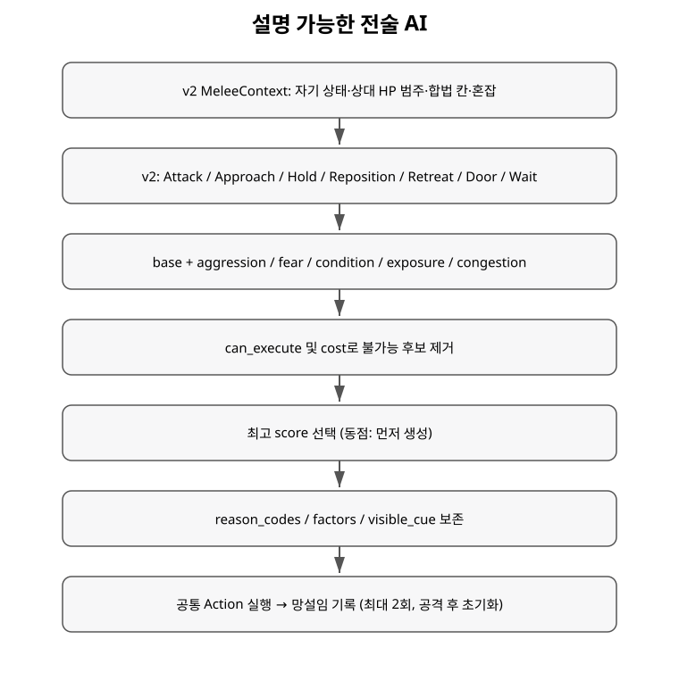

+++
status = "구현 완료"
areas = ["AI", "전투"]
type = "알고리즘"
systems = "MeleeContext / MeleeAttackOption / BasicMeleeTactics / RatTactics / TacticalPlanner"
milestones = "M015, M018, M019, M028"
code_paths = ["time_cost/ai/melee_context.gd", "time_cost/ai/melee_attack_option.gd", "time_cost/ai/basic_melee_tactics.gd", "time_cost/ai/rat_tactics.gd", "time_cost/ai/tactical_choice.gd", "time_cost/ai/tactical_planner.gd"]
diagram = "docs/diagrams/tactical_ai.svg"
+++
# 설명 가능한 전술 AI 알고리즘 상세

## 구조와 정보 경계

`basic_melee` runtime policy는 M028에서 `basic_melee_v3` revision으로 구현된다. RatTactics는 기존 별도 정책이다.

`MeleeContext.capture()`만 Game/Actor를 읽고, scoring 단계에는 snapshot만 전달한다. snapshot은 exact target HP/armor value/ability/damage/RNG/ready-time/future action을 보관하지 않는다.

관찰값:

- self condition: healthy / wounded / critical
- target condition: healthy / wounded / critical
- aggression A: 0..180
- fear F: 0..120
- attack / locomotion capability
- Chebyshev distance
- target reach exposure 0/1
- local congestion 0..3
- dominant visible armor profile
- coarse armor coverage: none / partial / substantial
- route Action
- legal one-step moves
- current melee attack options

HP category는 `hp * 3 <= max_hp`이면 critical, `hp * 3 <= max_hp * 2`이면 wounded, 나머지는 healthy다.

대표 Armor Profile은 armor>0인 body part의 hit weight를 profile별로 합산하여 가장 큰 profile을 택한다. exact armor magnitude는 사용하지 않는다. 동률은 profile ID 문자열 순으로 결정한다.

Armor coverage는 전체 hit weight 중 armor>0인 part의 비율로만 관찰한다.

- none: 0%
- partial: 0% 초과, 35% 미만
- substantial: 35% 이상

이 값은 피격 확률 분포의 거친 범주일 뿐 exact armor value나 effective armor가 아니다.

## MeleeAttackOption

`MeleeAttackOption.capture()`은 Actor의 basic attack과 `available_weapon_actions()`를 다음 공통 관찰 형태로 변환한다.

- 실행할 `AttackAction`
- option ID / label
- damage type
- resolved penetration
- base penetration
- flat damage modifier
- situation modifier
- action cost
- cost ratio

구체적인 weapon ID 분기는 없다. 새 Weapon Action은 유효한 content data이면 자동으로 후보가 된다.

Cost ratio band:

- quick: <= 0.8
- normal: <= 1.1
- committed: <= 1.5
- heavy: > 1.5

## 공격 후보 점수

모든 공격 옵션은 같은 pressure base에서 시작한다.

`60 + A/2 - F/2 - injury + healthy_bonus + target_vulnerability`

- injury: healthy 0 / wounded 10 / critical 20
- healthy bonus: self healthy +10
- target vulnerability: wounded +10 / critical +20

여기에 option별 질적 factor를 더한다.

### Armor matchup

대표 profile의 `ArmorProfileCatalog.multiplier_for(profile, damage_type)`만 읽는다.

- substantial coverage: favorable +14 / poor -14
- partial coverage: favorable +6 / poor -6
- none: profile factor 없음

Armor 절대값은 읽지 않는다.

### Penetration option

target armor coverage가 substantial이고 option penetration이 base보다 증가할 때만 적용한다. partial coverage에는 penetration 전용 보너스를 주지 않는다.

- gain >= 10: +8
- gain >= 20: +12

정확한 target effective armor나 block probability는 계산하지 않는다.

### Authored tradeoff

- flat damage modifier: modifier ×4, -12..+12 clamp
- situation modifier: modifier ×4, -12..+12 clamp

### Tempo / commitment

quick:
`4 + target_critical?6 + self_wounded?2 + self_critical?4`

committed:
`-5 + round(A/30) - round(F/20) - injury/2`

heavy:
`-12 + round(A/15) - round(F/8) - injury`

normal은 별도 factor가 없다.

이 수치는 authored heuristic이며 기대 피해/시간, 승률, 최적 정책을 직접 계산하지 않는다. 동점에서는 candidate 생성 순서상 basic attack이 먼저이므로 기본 행동이 유지된다.

## 비공격 후보

M026의 유용한 local tactical 구조를 main 기반으로 재구성했다.

- Approach / Interact: base 35 + A/2 - F/2 - injury
- Hold: base 40 - A/2 + F/4 + injury
- Retreat: survival pressure가 임계값을 넘을 때만 생성. score는 base 0 + F - A/2 + injury + 작은 distance/exposure factors
- Reposition: base 30 + congestion relief - A/4 + F/4 + exposure factor
- Wait: base 0 fallback

Route/Move legality는 common Action의 `can_execute()`를 그대로 사용한다.

Retreat eligibility는 `survival_pressure = fear + injury - aggression/2`로 본다. attack capability를 잃은 경우는 항상 retreat가 의미 있는 것으로 취급하고, 그 외에는 survival pressure >= 60일 때만 Retreat 후보를 만든다. 따라서 보통 aggression의 wounded 적은 계속 싸울 수 있고, critical/고 fear 상태에서야 후퇴가 경쟁력을 얻는다. 높은 aggression은 같은 부상에서도 Retreat을 억제한다.

## 방어 행동 제한

Actor는 `melee_caution_target`, `melee_caution_spent`를 가진다.

상태 의미:

1. spent 0..1: Hold/Retreat/Reposition 허용
2. spent 2: 일반 신중 행동은 종료. 위 retreat eligibility를 여전히 만족하면 emergency Retreat 1회 허용
3. spent 3: 추가 defensive action 생성 안 함
4. successful Attack: spent=0
5. target 변경: 새 target 기준으로 0

Approach/Interact는 spent를 증가시키거나 초기화하지 않는다. selection query와 rejected action도 상태를 바꾸지 않는다.

초기 구현에서 emergency Retreat을 제한 없이 허용했을 때 batch stall이 재발했기 때문에 1회 allowance로 제한했다.

## Planner / trace

`TacticalPlanner`는 null, illegal, cost<=0 후보를 제거하고 최고 score를 선택한다. 동점은 먼저 생성된 후보를 사용하여 deterministic하다.

`TacticalChoice`는 기존 goal/reasons/factors 외에 optional `option_id`, `option_label`을 제공한다. 따라서 같은 `AttackAction` 클래스의 basic/special 후보도 debug trace에서 구분된다.

선택 결과는 기존 `TimeAction -> perform_action -> CombatEvent -> scheduler` 경로를 그대로 사용한다. `basic_melee` 실행 이벤트는 `ai_policy_revision=basic_melee_v3`를 기록한다.

## 검증 경계

M028은 exact DPS optimization, target selection, perception ownership, faction/ally logic, multi-enemy threat inference, cooldown/resource utility, generic skill system, cost-aware pathfinding, final Threat Rating을 구현하지 않는다.
