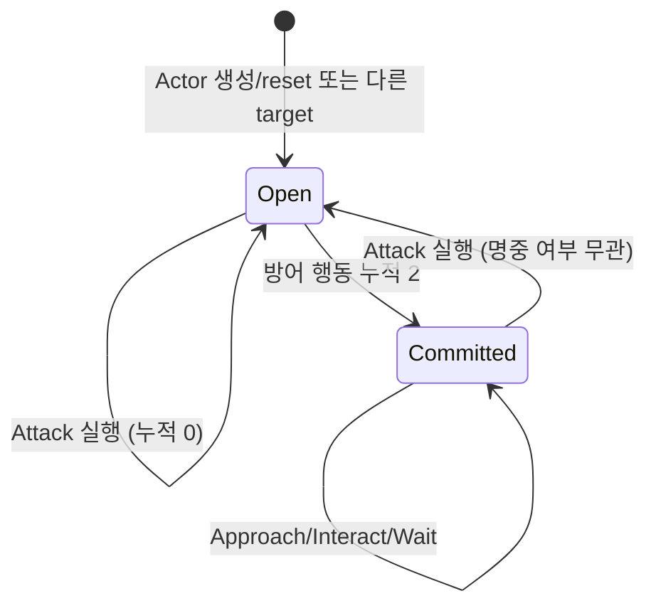

+++
status = "구현 완료"
areas = ["AI", "전투"]
type = "알고리즘"
systems = "MeleeContext / BasicMeleeTactics / RatTactics / TacticalPlanner"
milestones = "M015, M018, M019, M026"
code_paths = ["time_cost/ai/melee_context.gd", "time_cost/ai/basic_melee_tactics.gd", "time_cost/ai/rat_tactics.gd", "time_cost/ai/tactical_choice.gd", "time_cost/ai/tactical_planner.gd"]
diagram = "docs/diagrams/tactical_ai.svg"
+++
# 설명 가능한 전술 AI 알고리즘 상세

## 범위와 정보 경계

M026은 `codex/basic-melee-v2`의 Phase A 구현이다. `choose_ai_action()`은 기존 `basic_melee` 식별자를 유지하며 새 정책을 호출한다. RatTactics는 이전 정책 그대로다.

`MeleeContext.capture()`만 실제 game/Actor를 읽어 자기 상태, target의 coarse condition, 최대 8개 합법 이동, 기존 BFS route Action을 담는다. snapshot은 game/Actor 참조를 보관하지 않는다. `BasicMeleeTactics.candidates(context)`는 game을 받지 않으며 context만 점수화한다. generic planner가 common Action의 `can_execute`와 양수 cost를 다시 검사한다.

- HP 범주: `hp * 3 <= max_hp`는 critical, `hp * 3 <= max_hp * 2`는 wounded, 나머지는 healthy.
- 자기 injury 가중치 I: healthy=0, wounded=10, critical=20. 공격/이동 기능 상실은 별도 capability 검사.
- A: 자신의 aggression을 0..180으로 제한. F: 자신의 `fear()`를 0..120으로 제한.
- 기존 fear: `max(0, round((max_hp - hp) * 120 / max_hp) + fear_bonus)`.
- 거리: Chebyshev 거리. 벽/닫힌 문/대각 코너/점유는 common Action과 같은 규칙.
- 노출 E: target 위치에서 해당 칸에 근접 도달 가능한지 0/1. target 이외의 actor에 적대 관계를 추론하지 않는다.
- 혼잡 C: self/target 이외의 살아 있는 actor가 해당 칸의 8방향 한 칸 내에 몇 명 있는지, 최대 3. 세력·공격 가능성·target_id는 읽지 않는다.
- 상대 HP 원값은 capture에서 범주화할 때만 사용한다. utility에는 상대 armor, ability, damage, hit probability, RNG, ready times, future actions가 들어가지 않는다.

## v2 후보 점수

정수 나눗셈은 GDScript의 0 방향 절삭이다. 아래 숫자는 authored 초기 가중치이며 승률 탐색으로 튜닝하지 않았다.

| 후보 | 생성 조건 | 점수 |
| --- | --- | --- |
| Attack | 살아 있는 현재 target, 자기 공격 가능, 합법 근접 범위 | `60 + A/2 - F/2 - I + healthy_bonus + vulnerability` |
| Approach / Interact | 근접 범위 밖, 자기 공격/이동 가능, 기존 BFS가 합법 다음 Action을 제공 | `35 + A/2 - F/2 - I` |
| Hold | 접근/문 열기가 가능하고 근접 범위 밖, 망설임 예산 남음 | `40 - A/2 + F/4 + I` |
| Retreat | 예산 남음, 현재 거리 <= 2, 합법 이동으로 거리가 증가 | `10 + F - A/2 + I + 8 + 8*(E_current-E_next) + attack_lost` |
| Reposition | 예산 남음, 합법 이동, 거리 유지, C 감소 | `30 + 20*(C_current-C_next) - A/4 + F/4 + 8*(E_current-E_next)` |
| Wait | 항상 fallback 제출; planner가 생존/비용 검사 | `0` |

Attack의 healthy_bonus는 자기 healthy일 때 10. target vulnerability는 healthy=0, wounded=10, critical=20. Retreat의 attack_lost는 자기 공격 기능 상실일 때 60.

Attack/Approach/Interact 점수가 1보다 작으면 `maintain_pressure` factor로 1까지 올린다. 합법적인 교전이 아무 이유 없는 fallback보다 낮아져 무한 Wait가 되는 것을 막는다. 낮은 공격성은 여전히 Hold/Retreat 등의 점수에 영향을 준다.

후보 순서는 pressure → Hold → MOVE_DIRECTIONS 순서의 Retreat/Reposition → Wait다. 최대 11개다. 동점은 기존 planner의 먼저 생성된 후보 우선 규칙을 따른다. Reposition과 Retreat은 같은 이동에 중복 생성하지 않는다. route 이동은 우회 때문에 직선 거리가 늘어날 수 있지만 기존 BFS 의미를 보존한다.

## 제한된 망설임 상태

Actor의 `melee_caution_target`, `melee_caution_spent`가 성공한 Action 실행에서만 갱신된다.

`spent >= 2`면 Hold/Retreat/Reposition 생성 중단, 가능한 pressure 후보에 `commit_to_engagement` reason 추가. target 이동이나 우회 경로 이동으로 spent를 초기화하지 않는다. 선택 조회는 spent를 변경하지 않으며, 다른 target은 context에서 0으로 해석하고 다음 실행에서 기록한다. 정책 스스로 target_id를 바꾸지 않는다.

이 제한은 회피만으로 발생하는 무한 왕복/대기를 억제한다. 기능 상실, 영구 경로 차단, 무피해 전투, 움직이는 상대에 대한 모든 종료를 보장하지는 않는다. 이런 경우는 기존 batch cap과 stalled 결과로 남긴다.

## 기존 RatTactics

기존 Rat 점수와 동작은 변경하지 않았다.

- Attack: `100 + aggression/2 - fear`.
- Approach: `70 + aggression/2 - fear`.
- Door: `80 + aggression/2 - fear`.
- Retreat: `15 + fear*2 - aggression/2`; fear>0, squared distance를 늘리는 유효 칸.
- Wait: 0.

Rat의 retreat helper는 가장 먼 한 칸만 고른다. v2는 각 합법 한 칸을 비교하고 Chebyshev 거리 증가를 요구하므로 이를 억지로 공통화하지 않았다. 공통화는 이동 legality와 Action 실행 경계에서 유지한다.

## Trace, 실행, 비용

선택된 goal, score, reasons, factors, 고려한 후보의 action/goal/score, visible_cue는 기존 planner → Action → CombatEvent 경로로 전달된다. Hold는 `hold_position`, fallback은 `wait`, retreat는 `survive`, reposition은 `reposition`으로 구별한다. 모든 basic_melee AI 실행 이벤트는 `ai_policy_revision=basic_melee_v2`를 기록한다.

Action 실행 후 로그 기록 전에 정책 상태만 갱신한다. scheduler 시간, 전투 RNG, damage, movement cost는 기존 실행 경로가 관리한다. 선택 과정은 시간을 소비하지 않는다. 플레이어 필터와 retreat cue는 변경하지 않았다.

계산량은 기존 BFS 비용 + 최대 9칸에 대한 O(actor 수) 점유 혼잡 평가 + 최대 11개 후보 평가다. 영향력 지도나 여러 턴 탐색은 없다. 대규모 roster 성능 검증은 후속이다.

## 미구현

Perception/기억, ally support, 다수 enemy exposure, archetype profile, action-efficiency scoring, jitter, formation, target selection, cost-aware routing, TR recalibration. 수동 플레이와 전체 조합 균형 검증도 별도다.
