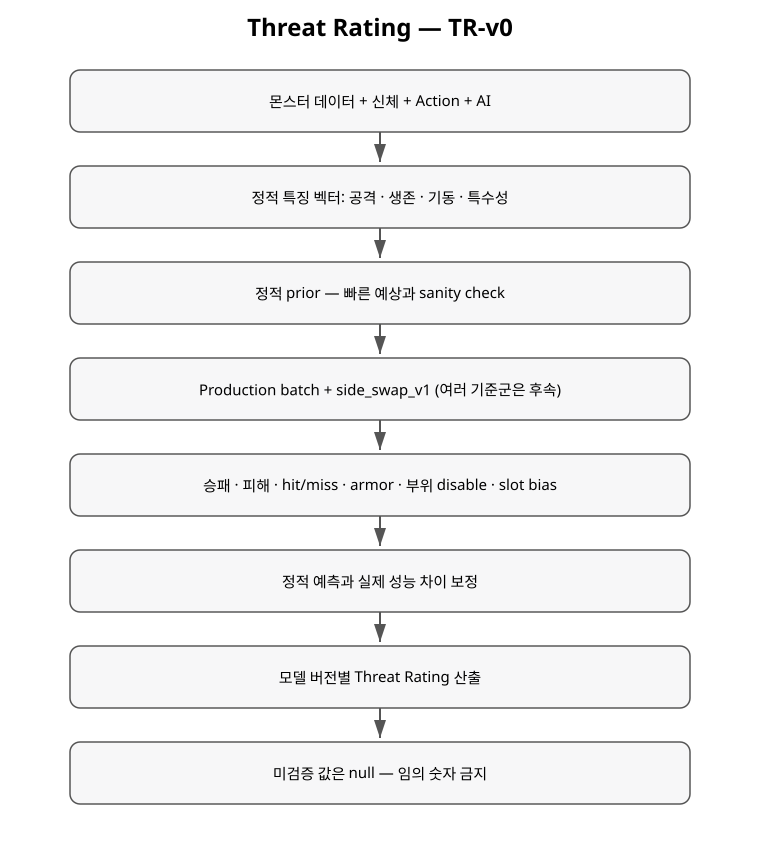

+++
status = "설계"
areas = ["시뮬레이션", "전투", "AI"]
type = "알고리즘"
systems = "Threat Rating / CombatBatchRunner"
milestones = "M022 후속"
code_paths = ["time_cost/simulation/combat_batch_runner.gd", "time_cost/combat/combat_rules.gd", "time_cost/ai/rat_tactics.gd"]
diagram = "docs/diagrams/threat_rating.svg"
+++
# 몬스터 Threat Rating 모델 — TR-v0

## 목적

플레이어 레벨에 맞춰 몬스터를 자동 스케일하지 않고, 각 몬스터가 **자기 데이터와 실제 전투 성능에 기반한 내부 위협도**를 갖게 한다.

TR-v0는 아직 최종 점수 공식이 아니라 **측정 계약**이다. 몬스터 종류가 충분히 늘어나기 전에 임의 가중치를 고정하면 잘못된 척도가 굳어질 수 있으므로 현재 Rat의 최종 Threat Rating은 비워 둔다.

## 1. 정적 특징 벡터

각 몬스터에서 최소 다음 특징을 추출한다.

### 공격
- 기준 상대에 대한 D20 명중 확률.
- 명중 시 방어구 결과를 반영한 기대 피해.
- `attack_cost`에 따른 공격 템포.
- 관통과 피해 유형.

개념적으로:

`expected_damage_per_attack = hit_probability × expected_damage_after_armor`

`offense_rate = expected_damage_per_attack × reference_time / attack_cost`

단, 기준 상대의 DV/방어구가 정해져야 실제 비교값이 되므로 현재는 원시 특징을 먼저 저장한다.

### 생존
- global HP.
- 피격 부위 weight와 integrity.
- 방어구에 따른 기대 피해 감소.
- 중요한 기능 부위가 손상/disabled될 때 전투력이 얼마나 빨리 떨어지는지.
- 신체 구조가 제공하는 기능 중복성.

### 기동성
- 직선/대각선 이동 비용.
- 부상 후 locomotion 저하.
- 실제 경로 접근성과 특수 이동 능력.

### 행동 · 특수성
- 공격 이외의 Action 후보.
- 제어, 회복, 소환, 상태이상 같은 비선형 효과.
- AI 정책이 성능에 미치는 영향.
- aggression/fear 같은 동적 성향.

## 2. 정적 점수는 prior이지 최종값이 아니다

정적 특징은 빠른 sanity check와 새 몬스터의 초기 예상값에 쓴다. 그러나 서로 다른 신체 구조, 특수 행동, AI가 결합되면 단순 합산으로 실제 난이도를 설명하기 어렵다.

따라서 **정적 점수만으로 Threat Rating을 확정하지 않는다.**

## 3. Production 시뮬레이션 보정

M022의 원칙을 유지한다.

- 실제 `TimeAction`, AI, `TimeScheduler`, `CombatRules`를 사용한다.
- 별도 간이 전투 규칙을 만들지 않는다.
- simulation error와 stalled를 승패에서 분리한다.

Threat 측정에서는 여기에 추가로 다음이 필요하다.

1. **Side swap** 또는 동등한 대칭화를 수행한다.
2. 하나의 상대가 아니라 여러 기준 상대/구성을 사용한다.
3. 동일한 seed 집합을 비교군에 재사용한다.
4. 승패뿐 아니라 실제 피해, 행동 수, world time, 기능 상실 등을 함께 기록한다.
5. 지형·거리·장비 조건을 모델 버전과 함께 고정한다.

## 4. Rating 스케일

최종 숫자 스케일과 component weight는 아직 미정이다.

후속 보정에서는 다음 순서를 권장한다.

1. 몇 개의 의미 있는 기준 몬스터를 구현한다.
2. 대칭 batch를 돌려 pairwise 성능 행렬을 얻는다.
3. 정적 특징이 실제 성능을 얼마나 설명하는지 비교한다.
4. 설명되지 않는 차이를 신체/특수 행동/AI component로 추적한다.
5. 그 후에만 baseline과 최종 Threat scale을 고정한다.

즉 **Threat Rating은 게임 디자인 입력값이 아니라, 데이터 + 측정에서 파생되는 버전된 값**으로 취급한다.

## 5. 기록 계약

각 Threat 기록은 최소한 다음을 남긴다.

- monster ID.
- model version.
- static score.
- simulation score.
- final rating.
- baseline.
- run count와 seed 범위.
- 공격/생존/행동 근거.
- 측정상의 주의점.

숫자가 아직 검증되지 않았다면 0을 쓰지 않고 **null**로 둔다. 0은 실제로 위협이 없다는 의미가 될 수 있기 때문이다.

## 현재 Rat

Rat은 TR-v0 record를 가지지만 최종 Threat Rating은 아직 null이다. 현재 M022의 rat-vs-rat 결과는 측정기 검증에는 유용하지만 시나리오 비대칭 때문에 Threat Rating 보정 근거로 단독 사용하지 않는다.

## 현재 한계

다수의 몬스터 표본, side-swap batch, 다양한 장비/지형 기준군, 통계적 불확실성 계산과 최종 scale calibration은 아직 구현되지 않았다.
