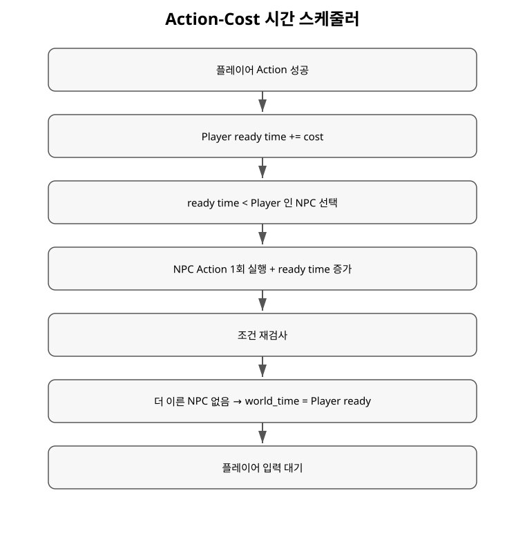

+++
status = "구현 완료"
areas = ["시간/액션", "코어"]
type = "알고리즘"
systems = "Action-Cost Time / TimeScheduler"
milestones = "M011, M013"
code_paths = ["game/time/time_scheduler.gd", "game/time_cost_game.gd"]
diagram = "docs/diagrams/time_scheduler.svg"
+++
# Action-Cost 시간 스케줄러 상세

## 목적

겉으로는 플레이어가 한 행동씩 입력하지만 내부에서는 Actor별 `ready time`과 Action 비용으로 행동 순서를 계산한다. 비용이 작은 행동을 쓰는 Actor는 같은 세계 시간 안에서 더 자주 행동할 수 있다.

## 핵심 상태와 책임

- `world_time`: 현재 처리 시각.
- `ready_time[actor]`: 다음 행동 가능 시각.
- `registration_order`: NPC 동률의 결정적 tie-break.
- Player ready time: NPC 응답 처리를 멈추는 경계.
- `TimeScheduler`는 Action을 실행하지 않고 시간과 순서만 소유한다.

## 알고리즘

1. 성공한 Action의 비용을 해당 Actor ready time에 더한다.
2. 플레이어 Action 뒤에는 `ready_time < player_ready_time`인 NPC를 찾는다.
3. 가장 이른 NPC를 고르고, 동률이면 먼저 등록된 NPC를 고른다.
4. NPC Action을 정확히 하나 실행하고 그 NPC의 ready time을 증가시킨다.
5. 다시 2번부터 반복한다.
6. 더 이른 NPC가 없으면 `world_time = player_ready_time`으로 이동하고 플레이어에게 입력권을 돌린다.

NPC ready time이 플레이어와 **정확히 같으면 플레이어가 우선**한다.

## 예시

초기 Player=0, Rat=0에서 Player가 직선 이동 1000을 사용하면 Player=1000이다. Rat 이동 비용은 750이므로 시각 0에 행동해 Rat=750이 된다. 아직 750 < 1000이므로 Rat은 한 번 더 행동할 수 있고, 두 번째 750 행동 뒤 Rat=1500이 되면 루프가 멈춘다. 세계 시간은 1000으로 이동해 다시 Player 차례가 된다.

## 현재 기본 비용

- Human: 직선 1000 / 대각선 1400 / Normal Melee 1000 / 상호작용 500 / 대기 1000.
- Rat: 직선 750 / 대각선 1050 / 공격 1000 / 상호작용 500 / 대기 1000.
- `AttackAction`이 공통 Normal Melee 비용을 소유하며 무기에는 speed/time 필드가 없다.
- M031 task branch: `ceil(standard_base / resolved_movement_speed / locomotion_efficiency)`에 외부 Action Cost Modifier를 최종 ceil 전에 적용하고 최소 1을 보장한다.
- 비용은 공통 resolver가 계산한다. Scheduler의 양수 정수 비용/tie 규칙은 유지한다. [비용 상세](action_cost_resolution.md).

## 불변 조건

- 유효하지 않거나 비용이 0 이하인 Action은 시간과 이벤트를 소비하지 않는다.
- 스케줄러는 Action 종류와 AI 정책을 모른다.
- tie-break가 결정적이므로 같은 입력/seed에서 처리 순서를 재현할 수 있다.

## 구현 위치

`game/time/time_scheduler.gd`, `TimeCostGame.perform_action()`, `TimeCostGame._run_until_player_ready()`.

## 현재 한계

반응 행동, interrupt, wind-up, 지속 행동, 상태효과 tick은 아직 별도 계약이 없다.
